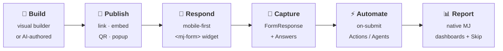
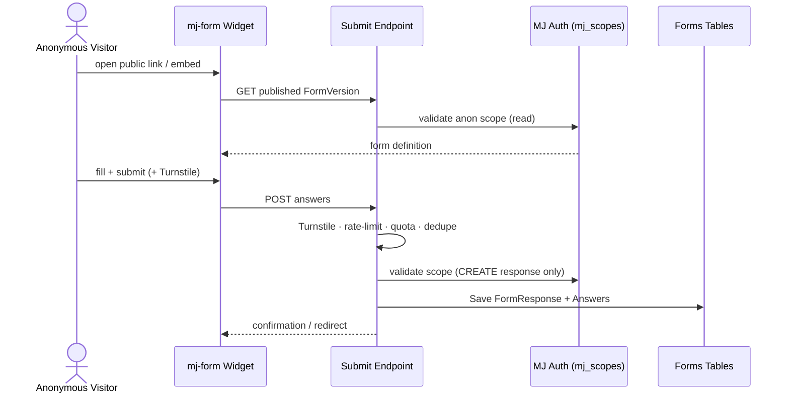

<div align="center">

<br/>

# 📋 &nbsp; MJ Forms

### Forms, surveys &amp; intake — beautiful, free, and built on _your_ data.

**A free, open-source [MemberJunction](https://github.com/MemberJunction/MJ) Open App.**
Anonymous-friendly public links. Gorgeous on mobile. Set up in two minutes by a human _or_ an AI agent.
And every response is a **first-class record in your MemberJunction database** — not an export trapped in someone else's silo.

<br/>

[](https://memberjunction.github.io/bizapps-forms/)
[](https://github.com/MemberJunction/MJ)
[](https://www.npmjs.com/package/@memberjunction/core)
[](#-license)
[](plans/FORMS_BUILD_PLAN.md)

**🎨 Live design explorations →** [**memberjunction.github.io/bizapps-forms**](https://memberjunction.github.io/bizapps-forms/) — three contemporary UX directions (Aurora · Editorial · Warm) across the respondent form, builder, and analytics dashboard.

<br/>

[**What it is**](#-what-it-is) · [**The moat**](#-why-its-different-the-moat) · [**Anonymous by default**](#-anonymous-by-default) · [**Architecture**](#%EF%B8%8F-architecture) · [**Quick start**](#-quick-start) · [**Roadmap**](#%EF%B8%8F-roadmap) · [📚 **The full plan**](plans/FORMS_BUILD_PLAN.md)

</div>

---

## 🧭 What it is

The **80–90% of form/survey usage is simple** — contact forms, RSVPs, feedback/NPS, lead capture,
applications, registrations, quizzes — and it maps almost perfectly onto things **MemberJunction
already does well**. Standalone tools charge a recurring premium for capabilities that, on top of MJ,
are largely **reuse, not new build**.

So MJ Forms ships the simple 80% **beautifully and for free**, and makes the powerful 20% _possible_
by leaning on MJ infrastructure — **Actions, Agents, AI Prompts, RSU** — instead of a bespoke
workflow engine. It's deliberately **free and open source (ISC)**, with a soft spot for the audiences
MJ already serves best: **nonprofits and associations**, for whom per-response metered survey tools
are a real, recurring budget pain.



---

## ✨ Why it's different (the moat)

A standalone survey tool traps responses in a silo. MJ Forms inverts that — responses are
**operational data the moment they land.**

|   | Capability | What it means |
|---|---|---|
| 🧩 | **Responses are records, not exports** | A submission can _become_ (or link to) a [bizapps-common](https://github.com/MemberJunction/bizapps-common) **Person / Organization / ContactMethod** — instantly actionable in the same system that runs the org's CRM, committees, and tasks. No CSV round-trip, no Zapier tax. |
| ⚡ | **On-submit automation — free** | Send an email, create a Task, upsert a Person, route to an agent, run an LLM-judge on a free-text answer. The "integrations + logic + AI" that incumbents charge the most for, MJ already has. |
| 🧬 | **Promote responses to first-class entities** | A recurring instrument can be projected — via a live SQL view, or an opt-in **RSU-materialized table** — into something the whole MJ toolchain (viewing system, query builder, dashboards, **Skip**) treats natively. _No form tool on the market does this._ |
| 🎙️ | **Optional conversational upgrade** | When text + uploads aren't enough, a question can hand off to a voice agent via the sibling [Caliber](https://github.com/MemberJunction/bizapps-caliber) app. |

> **Philosophy:** _beat the meter_ — free and unlimited at the core — and differentiate on **native
> data integration**, not on out-feature-ing the long tail.

---

## 🔐 Anonymous by default

The scary part of public surveys — anonymous identity with server-side scope that can't be escalated —
is **already solved by MJ.**

- Public submissions ride **anonymous magic-link sessions**: `IdentityMode='anonymous'`, authorization
  enforced server-side from the JWT's `mj_scopes` claims — **never DB roles**, so there's no privilege
  accretion. Two anonymous visitors share one identity but hold different scopes.
- A **`FormDistribution`** record wraps a multi-use, scoped link as a first-class "public form URL,"
  with its own quota, expiry, open/close window, and per-link analytics.
- The one deliberate exception to magic-link read-only convention is a restricted **"Form Respondent"**
  role with **CanCreate on response entities only** — authored as metadata.
- The only meaningful net-new server surface is a public-write **hardening layer**: Cloudflare
  Turnstile (per-form toggle) + rate-limit + quota + dedupe + IP-hash/UA capture.



---

## 🏗️ Architecture

Two surfaces, one definition:

| Surface | What it is |
|---|---|
| 📱 **Respondent widget** | An Angular **custom element** (`<mj-form id="…">`) published to a CDN. Tiny, no Explorer shell — embed via `<script>`, iframe, popup, full-page, or QR. Two render modes (classic scroll **and** Typeform-style one-question-at-a-time) from the same definition. The public-facing ticket. |
| 🖥️ **Builder / Admin** | Runs in **MJExplorer**: visual form builder, response management, reporting dashboards. Internal staff only; full reuse of MJ dashboard / grid / query infrastructure. |

<details>
<summary><b>Repo layout</b> (mirrors the bizapps-common Open App skeleton)</summary>

```
bizapps-forms/
├─ mj-app.json            # OpenApp manifest
├─ mj.config.cjs          # schema + entity prefix + CodeGen output paths
├─ package.json           # npm workspace (apps/* + packages/*), turbo
├─ turbo.json
├─ migrations/            # VYYYYMMDDHHMM__v*__*.sql  (skyway)  ·  migrations-pg/
├─ metadata/              # mj-sync seed data (categories, styles, roles, perms)
├─ packages/
│  ├─ Entities/             @mj-biz-apps/forms-entities              (CodeGen entity subclasses)
│  ├─ Actions/              @mj-biz-apps/forms-actions               (CodeGen + hand-written actions)
│  ├─ CoreEntitiesServer/   @mj-biz-apps/forms-core-entities-server  (server-side lifecycle hooks)
│  ├─ Server/               @mj-biz-apps/forms-server                (bootstrap + resolvers + submit endpoint)
│  └─ Angular/              @mj-biz-apps/forms-ng                    (Explorer builder/admin + <mj-form> widget)
└─ apps/
   ├─ MJAPI/               GraphQL API server      (port 4121)
   └─ MJExplorer/          Builder / admin UI      (port 4321)
```

</details>

### 📐 Data model (Phase 1)

`FormCategory` (hierarchical) · `FormStyle` (themeable CSS) · **`Form`** · `FormVersion` (immutable
snapshots) · `FormPage` · `FormQuestion` · `FormQuestionOption` · **`FormResponse`** (identified
respondents link to a `bizapps-common` Person via `RespondentPersonID`) · `FormResponseAnswer`
(typed columns + JSON fallback) · `FormDistribution`. _Phase 2 adds `FormGroup` carrying the optional
`MaterializedEntityID` RSU bridge._

> **Hard dependencies:** MJ Forms builds on two sibling Open Apps —
> [`bizapps-common`](https://github.com/MemberJunction/bizapps-common) (identity) and
> [`bizapps-tasks`](https://github.com/MemberJunction/bizapps-tasks) (review/approve-before-publish
> routing). Both are free OSS and **auto-install** with MJ Forms (declared in `mj-app.json`).

### 🧱 ~70% is reuse, not new build

Anonymous magic-link `mj_scopes` · API-key scopes · Actions / Agents / AI Prompts · RunView / RunQuery /
dashboards · RSU (`RuntimeSchemaManager` + `SchemaEvolution`) · bizapps-common identity. **All present in
published MJ 5.43.0** — see the [reuse map](plans/FORMS_BUILD_PLAN.md#33-reuse-map--what-mj-already-gives-us-the-heart-of-this-plan).

---

## 🚀 Quick start

```bash
npm install                 # repo root only — never inside a package dir
npm run mj:migrate          # apply migrations to the __mj_BizAppsForms schema
npm run mj:codegen          # generate entity / action / resolver / Angular subclasses
npm run build               # build all packages + apps (turbo)
npm run start:api           # MJAPI         → http://localhost:4121
npm run start:explorer      # MJExplorer    → http://localhost:4321
```

| | |
|---|---|
| **Database schema** | `__mj_BizAppsForms` |
| **Entity prefix** | `MJ_BizApps_Forms: ` |
| **npm scope** | `@mj-biz-apps/forms-*` |
| **MJ version** | pinned to exactly **`5.43.0`** — the earliest published version carrying anonymous magic-link `mj_scopes` enforcement **and** the RSU pipeline MJ Forms depends on |
| **Ports** | MJAPI `4121` · MJExplorer `4321` |

---

## 🗺️ Roadmap

<table>
<tr><th>Phase 1 — MVP (the differentiating slice)</th><th>Phase 2 — Power</th></tr>
<tr valign="top"><td>

- Schema + entities, migrate + CodeGen
- **Public submit endpoint** (anon scope · Turnstile · rate-limit · quota)
- **Mobile-first `<mj-form>` widget** (both render modes, a11y, file upload)
- Visual **builder / admin** in MJExplorer + publish → `FormVersion`
- **AI authoring** action/agent + template gallery
- **Reporting dashboard** (summaries · funnel · export)
- On-submit hooks (link Person · email · create Task)

</td><td>

- `FormGroup` + **view-projection** & opt-in **RSU materialization**
- Advanced question types (Matrix, Ranking, Address, Signature, Payment)
- **LLM-judge** scoring on free-text answers
- **Caliber** conversational hand-off
- Partial-response resume · advanced quotas · richer logic

</td></tr>
</table>

---

## 📚 The plan is the source of truth

Everything above is distilled from **[`plans/FORMS_BUILD_PLAN.md`](plans/FORMS_BUILD_PLAN.md)** — the
durable, byte-for-byte build plan and business case. It holds the full entity model, the
anonymous-submission design, the dual-persistence / RSU approach, the phasing, and the decision gates
(DG-1…DG-6). **Read its Status Snapshot + Progress Log before starting any session.**

> The competitive-pricing section in the plan (§1.3) is from model knowledge and is flagged for live
> re-verification — it is not load-bearing and should not be quoted as fact.

---

## 🌿 Branching

`next` (integration — feature PRs land here) → `main` (release — publishes on push). Cut feature
branches **from `next`**; they must track the same-named remote. Never commit directly to `main`.

## 📄 License

[ISC](https://opensource.org/license/isc-license-txt) © [MemberJunction](https://memberjunction.com).
Free and open source, forever.
