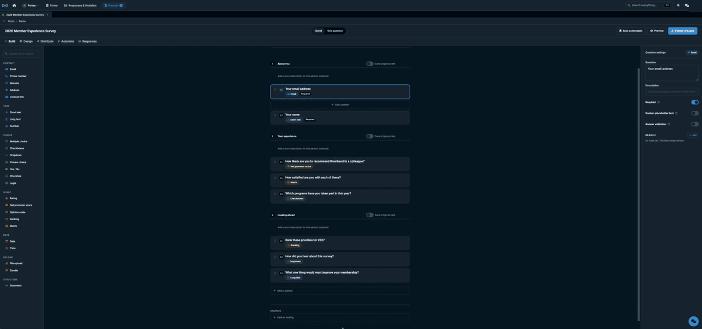
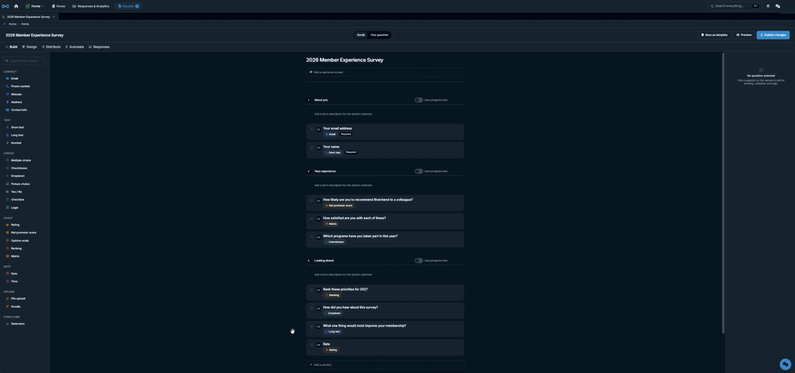
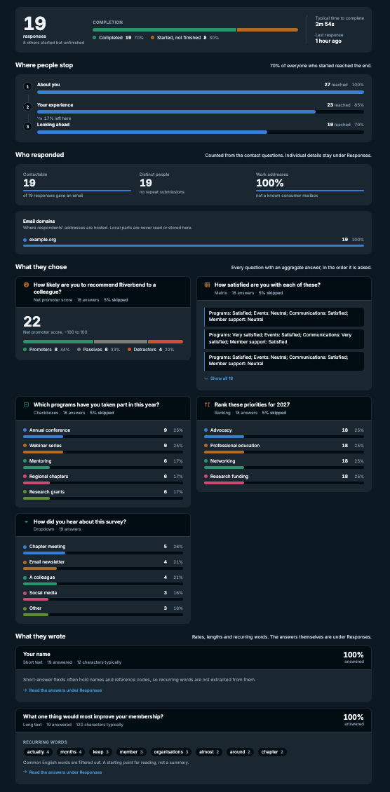

<div align="center">

<br/>

# 📝 &nbsp; MJ Forms

### Forms, surveys &amp; intake — beautiful, free, and built on _your_ data.

Anonymous public links · mobile-first · built in minutes.<br/>
Every response lands as a **first-class record in your MemberJunction database** —
not an export trapped in someone else's silo.

[](https://memberjunction.github.io/bizapps-forms/)
[](https://github.com/MemberJunction/MJ)
[](#-license)

<br/>



</div>

---

## Why it's different

A standalone survey tool traps responses in a silo. MJ Forms inverts that — responses are
operational data the moment they land.

- 🧩 &nbsp;**Responses are records, not exports.** A submission can _become_ a **Person**,
  an **Organization**, a **ContactMethod** — actionable in the same system that runs your
  CRM, committees and tasks. No CSV round-trip, no Zapier tax.
- ⚙️ &nbsp;**On-submit automation, free.** Send an email, create a Task, upsert a Person,
  route to an agent, run an LLM judge over a free-text answer. What incumbents charge the
  most for, MemberJunction already has.
- 🧬 &nbsp;**Promote responses to first-class entities.** A recurring instrument can be
  projected — via a live SQL view or an opt-in materialized table — into something the whole
  toolchain (dashboards, query builder, **Skip**) treats natively. _No form tool on the
  market does this._

> **Philosophy: _beat the meter._** Free and unlimited at the core; differentiate on native
> data integration, not on out-feature-ing the long tail.

---

## 🛠️ &nbsp;Build

Drag questions onto the canvas, set logic and validation inline, and preview at every screen
size before you publish.

**25 question types** — short &amp; long text · email · phone · website · number · yes/no ·
single choice · multiple choice · dropdown · picture choice · rating · NPS · opinion scale ·
ranking · matrix · checkbox · legal · date · time · address · contact info · file upload ·
doodle · statement.

**Theme it without writing CSS.** The Design tab edits _this form's_ look directly —
background colour and image, button colours, corner radius, fonts, logo, and the sizing and
alignment of titles and questions — with a live preview beside it. There is no theme gallery
to wade through: every control writes a `--mjf-*` token the widget honours, so what you see
is what publishes.



---

## 🔗 &nbsp;Publish — a link, an embed, a QR code

Public submissions ride **anonymous magic-link sessions** — `IdentityMode='anonymous'`, with
authorization enforced server-side from the JWT's `mj_scopes` claims, **never DB roles**, so
there is no privilege accretion.

- A **`FormDistribution`** record wraps a multi-use scoped link as a first-class public URL,
  with its own response quota, open/close window, live response count and captcha toggle.
- The one deliberate exception to magic-link read-only convention is a restricted
  **"Form Respondent"** role with **CanCreate on response entities only**.
- Public writes are hardened: rate limit, quota, dedupe, IP-hash and UA capture, with
  Cloudflare Turnstile verification server-side.

---

## 📱 &nbsp;Respond — on any screen

Two render modes from one definition — classic scroll, or one-question-at-a-time. Mobile-first,
WCAG AA, with the right keyboard for every field. Preview at **desktop, tablet and phone**
before you publish.

The respondent surface is an Angular **custom element** — `<mj-form slug="…">` — published as
a standalone bundle. Embed it with a `<script>` tag, an iframe, a popup, a full page or a QR
code. No Explorer shell, nothing to log into.

---

## 📊 &nbsp;Report — the moment they land

<p align="center">

</p>

Summaries, a completion funnel, per-question breakdowns and export ship with the app — no
separate BI step, because responses are already queryable MJ entities.

Four hooks run on every submit: **upsert the respondent as a Person · send a confirmation
email · create a follow-up Task · analyze written responses with an LLM judge.** The judge
writes its score and rationale onto the answer record, where any RunView or Skip question can
read it.

> What runs after Submit, how to configure or decline each hook, and which record owns
> respondent identity → **[docs/on-submit-automations.md](docs/on-submit-automations.md)**

---

## ⚡ &nbsp;Quick start

MJ Forms is an Open App: it installs **into** an existing MemberJunction database, alongside
its two required siblings.

```bash
# 1. Configure — there is no default connection
pnpm install                       # repo root only, never inside a package dir
cp .env.example .env               # then fill in the placeholders
ln -sf ../../.env apps/MJAPI/.env

# 2. Lay down MJ core (from a MemberJunction checkout — Forms' migrations assume __mj exists)
npm run mj:migrate --prefix /path/to/MJ

# 3. Install the siblings, leaf-first
npx mj migrate --schema __mj_BizAppsCommon --dir /path/to/bizapps-common/migrations
npx mj migrate --schema __mj_BizAppsTasks  --dir /path/to/bizapps-tasks/migrations

# 4. Install Forms — schema, tables and the metadata seed
npm run mj:migrate
npm run mj:codegen

# 5. Build and run
pnpm run build                     # all packages, including the <mj-form> bundle
cd apps/MJAPI && node server.mjs   # API harness → http://localhost:4121
```

A published form is then reachable anonymously at `http://localhost:4121/f/<distribution-slug>`.
Verify the whole public path — host page, session token, widget bundle, published definition,
anonymous submit — with:

```bash
npm run smoke:respondent -- <distribution-slug>
```

> **`apps/MJAPI` is an API-only harness — there is no Explorer in this repo.** It serves the
> respondent path and the smoke suites. For the **builder and admin UI**, run MJ's own host
> with this repo linked in. Full procedure: **[docs/local-host.md](docs/local-host.md)** ·
> deeper install notes, environment knobs and the metadata-seeding rules:
> **[docs/install.md](docs/install.md)** ·
> running `mj migrate` / `mj codegen`, or upgrading MJ →
> **[docs/database-operations.md](docs/database-operations.md)**

---

## 🔌 &nbsp;Install into a host app

`mj app install` handles schema, migrations and package wiring from `mj-app.json`. One thing
it cannot wire for you, because it lives in the host's own server config:

```js
// <host>/apps/MJAPI/mj.config.cjs
module.exports = {
  magicLink: {
    enabled: true,
    restrictedRoleName: 'Form Respondent',   // created by Forms' seed migration
    grantableRoleNames: ['Form Respondent'],
    explorerUrl: process.env.MJ_EXPLORER_BASE_URL,
  },
};
```

Without it forms still publish, but every public link answers **409** — no anonymous session
can be minted. Forms checks this at startup and logs
`[Forms] Anonymous respondent path is NOT ready: …` naming the exact setting.

| Host requirement | Why |
|---|---|
| **MemberJunction**, the range in `mj-app.json` | `node -p "require('./mj-app.json').mjVersionRange"` — read it rather than trusting a number written here |
| **`bizapps-common` + `bizapps-tasks`** installed | Hard dependencies; the on-submit hooks write a Person and a Task across schema boundaries |
| **Their entity subclasses registered** | The hooks call `GetEntityObject` for both siblings; unregistered, MJ returns a bare `BaseEntity` and every assignment is silently lost |
| **`magicLink` configured** | As above — the anonymous respondent path depends on it entirely |

---

## 📐 &nbsp;Architecture

Two surfaces, one definition:

| Surface | What it is |
|---|---|
| 📱 **Respondent widget** | An Angular custom element (`<mj-form>`) published to a CDN. Tiny, no Explorer shell, both render modes from the same definition. The public-facing ticket. |
| 🖥️ **Builder / admin** | Runs in MJExplorer: visual builder, response management, reporting dashboards. Internal staff only; full reuse of MJ dashboard, grid and query infrastructure. |

<details>
<summary><b>Data model, repo layout &amp; what's reused from MJ</b></summary>

<br/>

| | |
|---|---|
| **Database schema** | `__mj_BizAppsForms` |
| **Entity prefix** | `MJ_BizApps_Forms: ` |
| **npm scope** | `@mj-biz-apps/forms-*` |
| **Ports** | MJAPI `4121` · MJExplorer `4321` |

**Entities.** Authoring — `FormCategory` (hierarchical) · `FormStyle` · **`Form`** ·
`FormVersion` (immutable snapshots) · `FormPage` · `FormScreen` · `FormQuestion` ·
`FormQuestionOption`. Responses — **`FormResponse`** (identified respondents link to a
`bizapps-common` Person via `RespondentPersonID`) · `FormResponseAnswer` (typed columns +
JSON fallback) · `FormUpload`. Delivery and automation — `FormDistribution` ·
`FormAutomation` · `FormAutomationRun` · `FormEntityBinding` · `FormEntityBindingRecord`.
Phase 2 adds `FormGroup` and the materialization bridge.

**Hard dependencies.** [`bizapps-common`](https://github.com/MemberJunction/bizapps-common)
(identity) and [`bizapps-tasks`](https://github.com/MemberJunction/bizapps-tasks)
(review/approve routing). Both are free OSS and auto-install with MJ Forms.

**~70% is reuse, not new build.** Anonymous magic-link `mj_scopes` · API-key scopes ·
Actions / Agents / AI Prompts · RunView / RunQuery / dashboards · runtime schema evolution ·
bizapps-common identity — all present in published MJ on the line this app pins.

```
bizapps-forms/
├─ mj-app.json            # OpenApp manifest
├─ mj.config.cjs          # schema + entity prefix + CodeGen output paths
├─ migrations/            # skyway SQL  ·  migrations-pg/
├─ metadata/              # mj-sync seed data (categories, styles, roles, perms)
├─ packages/
│  ├─ Entities/             @mj-biz-apps/forms-entities
│  ├─ Actions/              @mj-biz-apps/forms-actions
│  ├─ CoreEntitiesServer/   @mj-biz-apps/forms-core-entities-server
│  ├─ Server/               @mj-biz-apps/forms-server
│  └─ Angular/              @mj-biz-apps/forms-ng
└─ apps/
   └─ MJAPI/               API-only dev harness (no Explorer — see docs/local-host.md)
```

</details>

---

## 🗺️ &nbsp;What's next

- **Author with AI** — draft a whole form from a one-sentence brief
- **AI answer scores in the UI** — the LLM judge already writes them; nothing displays them yet
- **Per-form captcha toggle** — Turnstile verifies server-side, but nothing switches it on
- **Payment** question type
- `FormGroup` + view projection and opt-in RSU materialization
- Review/approve-before-publish routing via bizapps-tasks
- **Cross-session** resume — in-session autosave already ships
- Advanced quotas and richer conditional logic

---

## 📖 &nbsp;The plan is the source of truth

Everything here is distilled from **[`plans/FORMS_BUILD_PLAN.md`](plans/FORMS_BUILD_PLAN.md)** —
the durable build plan and business case, holding the full entity model, the
anonymous-submission design, the phasing and the decision gates.

Contributing? Branching model, build commands and conventions are in
**[CONTRIBUTING.md](CONTRIBUTING.md)**.

## ⚖️ &nbsp;License

[Business Source License 1.1](LICENSE) © [MemberJunction](https://memberjunction.com).
Source-available, and free for nonprofits.
