# MJ Forms (`bizapps-forms`) — Build Plan & Business Case

> **Status:** Plan / pre-build. This document lives in the **MJ repo** only as a portable
> seed. The actual product is built in a **separate repo `MemberJunction/bizapps-forms`**.
> A fresh session should pull this file byte-for-byte into that repo (e.g. as
> `plans/FORMS_BUILD_PLAN.md`) and treat it as the durable task state — read the Status
> Snapshot + Progress Log at the start of every session, pick up the first unfinished task
> in dependency order, and update task state here as you work.

---

## Status Snapshot

**Phase 0 — ✅ COMPLETE.** Repo scaffolded from the bizapps-common Open App skeleton
(5 packages: `forms-{entities,actions,core-entities-server,server,ng}`; 2 apps: MJAPI/MJExplorer),
pinned to MJ **`5.43.0`** (`mjVersionRange >=5.43.0 <6.0.0`), schema `__mj_BizAppsForms`, entity
prefix `MJ_BizApps_Forms: ` (matches the `MJ_BizApps_Common:` / `MJ_BizApps_Tasks:` siblings), ports
**4121 / 4321**. `npm install --ignore-scripts && npm run build` is green for all 5 packages **and**
MJAPI; the only failure is the MJExplorer *production* `ng build` font-inline step, which needs
internet (`fonts.googleapis.com`) and is an environment-only issue. Scaffold is on **`main`**.

**Hard Open-App dependencies.** MJ Forms **requires** and auto-installs two sibling apps (declared in
`mj-app.json` `dependencies`; `mj app install` resolves leaf-first **common → tasks → forms**):
**`bizapps-common`** (`>=5.31.0 <6.0.0`) for identity — `FormResponse.RespondentPersonID` is a hard
cross-schema FK to `MJ_BizApps_Common: People`; and **`bizapps-tasks`** (`>=1.1.0 <2.0.0`) for the
review/approve-before-publish routing (its v1.1.x `Task Decisions` model). The polymorphic
`FormResponse` subject seam was **removed** in favour of hard FKs (we build directly on common/tasks
as part of the stack).

**Phase 1 — 🟡 IN PROGRESS.** Schema + Phase-1 tables migration **authored**:
`migrations/B202606281200__v0.1.x_Schema_and_Tables.sql` (all 10 tables, value-list CHECKs,
extended-property descriptions, the hard `FormResponse.RespondentPersonID` FK to
`__mj_BizAppsCommon.Person`, cross-schema FKs to `__mj.[User]` / `__mj.[File]`).

### 🎨 Design system & themeable prototypes (live on GitHub Pages)

All three looks are now **one MemberJunction-token-driven design system**
([`docs/app/design-system.css`](../docs/app/design-system.css)): the base layer mirrors MJ's real
`--mj-*` semantic tokens, a new `--mjf-*` layer adds form-specific concepts (question card, choice
option, progress, rating, app chrome), and **each theme is just a `[data-theme]` block overriding
~25 tokens** — the same mechanism as MJ dark mode, and exactly what a `FormStyle.CSSVariables` row will
store. **Editorial is the default**; Aurora and Warm flip live via an in-page switcher (or a `?theme=`
deep-link). The HTML is identical across all three — only tokens change, and the prototypes carry
**zero hardcoded colors** below the token layer. Three surfaces (respondent form, builder, dashboard)
live under [`docs/app/`](../docs/app/); visual only (no backend), no CodeGen dependency.

➡️ **Live gallery: https://memberjunction.github.io/bizapps-forms/**

> One HTML, three themes — proof the token system re-skins every surface (chrome, cards, even chart
> fills). Click any image to open the live, switchable page.

#### 📱 Respondent form — Editorial · Aurora · Warm
<table><tr>
<td width="33%"><a href="https://memberjunction.github.io/bizapps-forms/app/respondent.html?theme=editorial">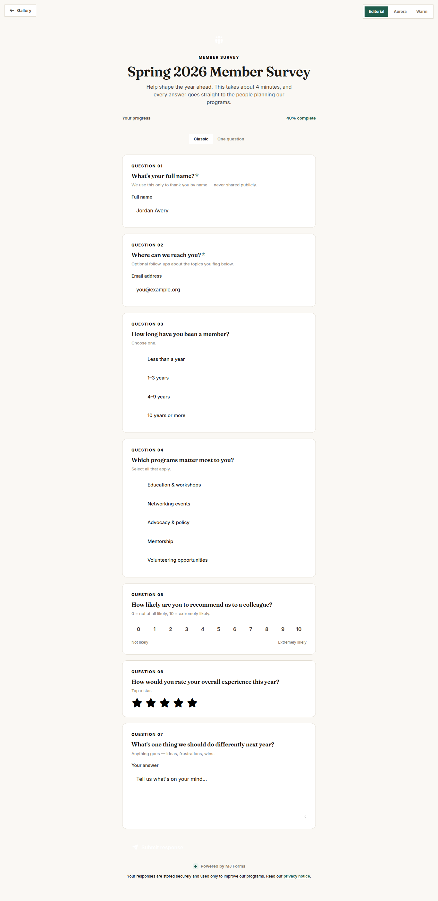</a></td>
<td width="33%"><a href="https://memberjunction.github.io/bizapps-forms/app/respondent.html?theme=aurora">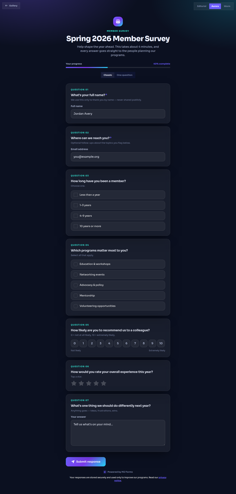</a></td>
<td width="33%"><a href="https://memberjunction.github.io/bizapps-forms/app/respondent.html?theme=warm">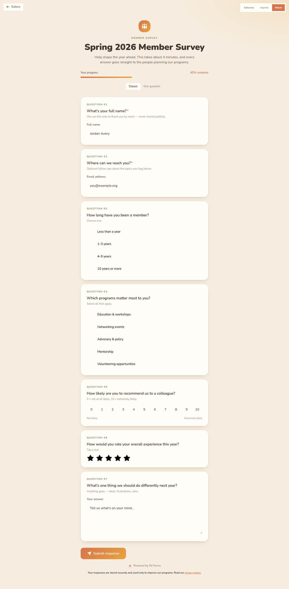</a></td>
</tr></table>

#### 🛠️ Form builder — Editorial · Aurora · Warm
<table><tr>
<td width="33%"><a href="https://memberjunction.github.io/bizapps-forms/app/builder.html?theme=editorial">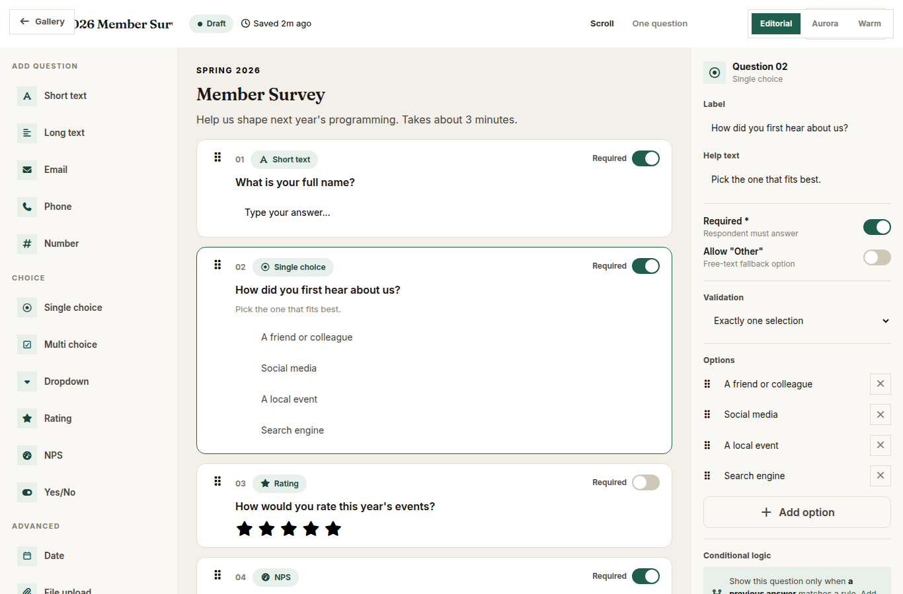</a></td>
<td width="33%"><a href="https://memberjunction.github.io/bizapps-forms/app/builder.html?theme=aurora">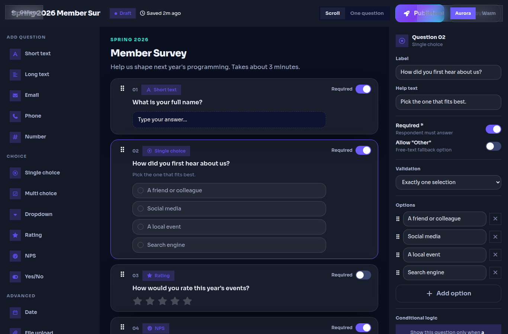</a></td>
<td width="33%"><a href="https://memberjunction.github.io/bizapps-forms/app/builder.html?theme=warm">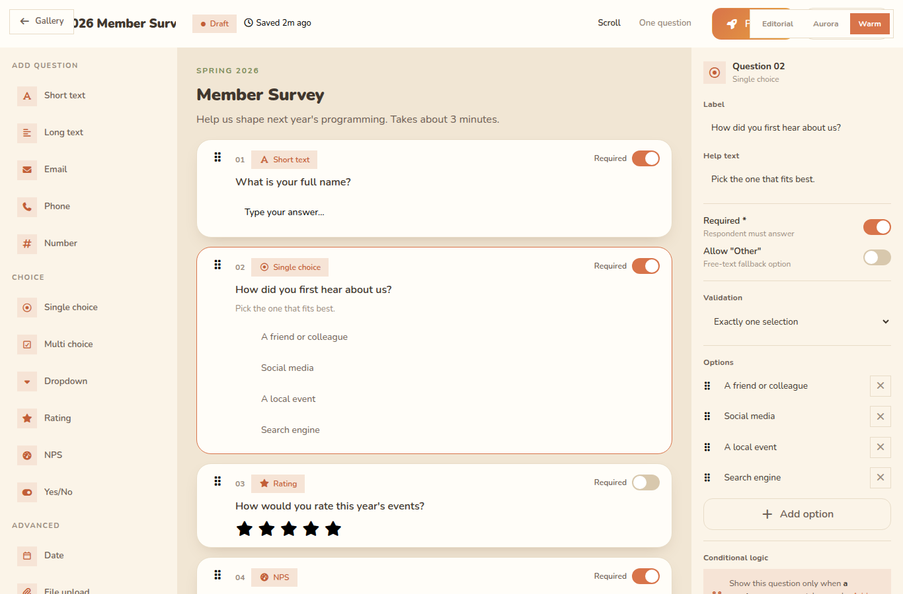</a></td>
</tr></table>

#### 📊 Analytics dashboard — Editorial · Aurora · Warm
<table><tr>
<td width="33%"><a href="https://memberjunction.github.io/bizapps-forms/app/dashboard.html?theme=editorial">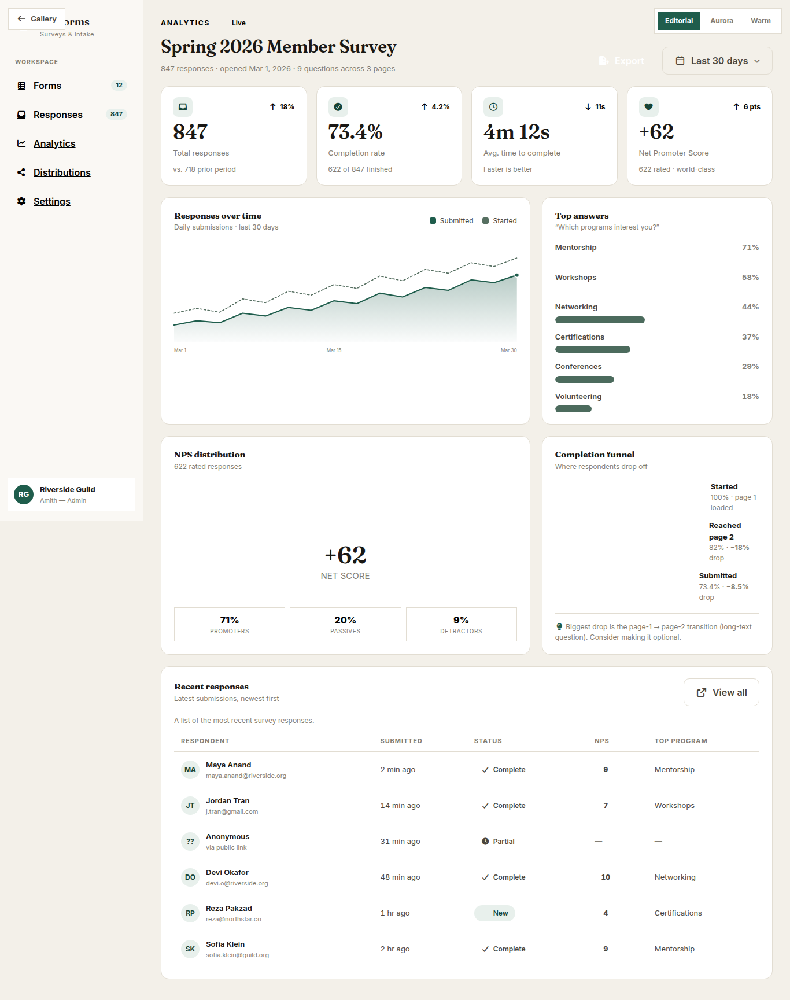</a></td>
<td width="33%"><a href="https://memberjunction.github.io/bizapps-forms/app/dashboard.html?theme=aurora">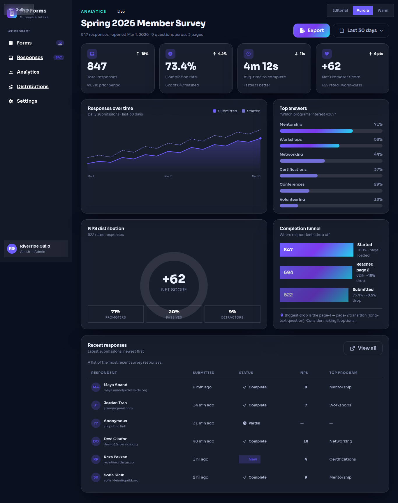</a></td>
<td width="33%"><a href="https://memberjunction.github.io/bizapps-forms/app/dashboard.html?theme=warm">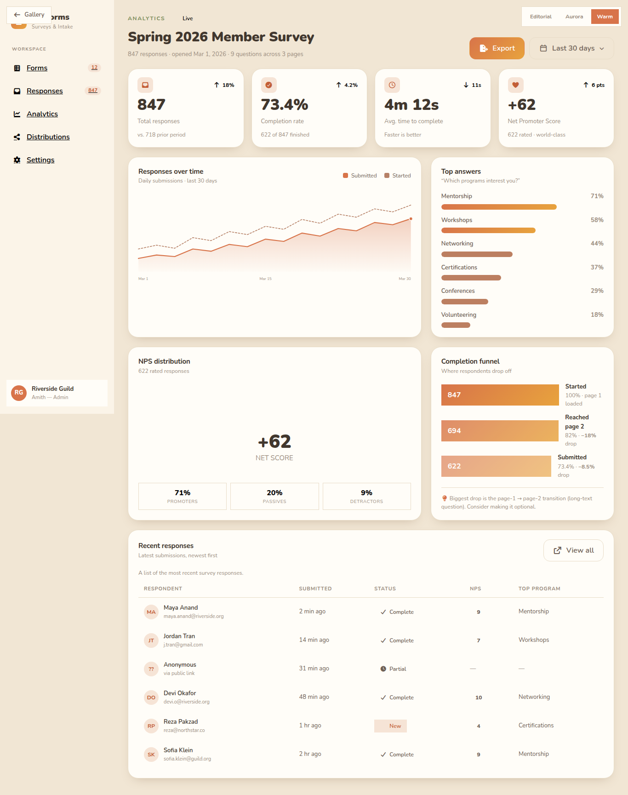</a></td>
</tr></table>

When Phase 1 builds the real Angular respondent widget + Explorer builder/dashboards, they consume the
same `--mj-*`/`--mjf-*` tokens, so these themes drop in as `FormStyle` rows with no component changes.
*(The original per-direction explorations remain under `docs/{aurora,editorial,warm}/` and are linked
from the gallery as "v1".)*

### ▶ NEXT — blocking gate (requires a SQL Server database)

1. **`npm run mj:migrate`** — apply the migration to a SQL Server instance (creates the
   `__mj_BizAppsForms` schema + the 10 Phase-1 tables).
2. **`npm run mj:codegen`** — generate the `MJ_BizApps_Forms: …` entity / action / GraphQL-resolver /
   Angular-form subclasses into `packages/*/src/generated/`, plus the SQL views & SPs.
3. **`npm run build`** — verify the generated entity types compile end-to-end.

> **Do NOT write entity-dependent code before CodeGen runs.** With no generated types yet, it would
> produce nothing but TypeScript errors and tempt `any`/`unknown` casting — an explicit MJ
> antipattern (see CLAUDE.md rules 2 / 2b). Everything else in Phase 1 (the public submit endpoint
> + anti-abuse hardening layer, the mobile-first `<mj-form>` widget, the builder/admin app, AI
> authoring, reporting, on-submit hooks) depends on this gate.

Once CodeGen has run and the build is green, resume Phase 1 in the **§9** dependency order — the
first code task is the **public submit endpoint** (forms-server) with its anonymous-scope check +
Turnstile / rate-limit / quota hardening (§4), followed by the **respondent widget** (forms-ng).

---

## 0. What this is

**MJ Forms** is a free, open-source MemberJunction **Open App** for **forms, surveys, and
intake** that:

- works for **anonymous internet users** (no account, public links / embeds),
- is **gorgeous on mobile** (published as an Angular **custom element** widget, not the
  Explorer shell),
- is **super easy to set up** — by a human in a visual builder, or by an **AI agent** from a
  natural-language description,
- has **great reporting** built on native MJ tooling, and
- makes responses **first-class records in your MemberJunction database** — optionally
  projected into real, query-able, Skip-accessible entities.

The thesis: the **80–90% of form/survey usage is simple** (contact forms, RSVPs,
feedback/NPS, lead capture, applications, registrations, quizzes) and maps almost perfectly
onto things **MJ already does well**. Commercial tools (Typeform, SurveyMonkey, JotForm)
charge hundreds of dollars a month for capabilities that, on top of MJ, are largely **reuse,
not new build**. So we ship the simple 80% beautifully and free, and make the powerful 20%
*possible* by leaning on MJ infrastructure (Actions, Agents, Prompts, RSU) rather than a
bespoke workflow engine.

---

## 1. Business Case

### 1.1 Why build this (and why free)

This is **not** a customer-acquisition land-grab against Typeform. The goal is to **add
value to existing MemberJunction installs** and to give organizations **a concrete reason to
adopt MJ beyond the "AI data platform" story.** Everyone needs forms; few people go looking
for an agent framework. A first-class, beautiful, free forms app is a tangible, universally
understood capability that makes an MJ instance immediately more useful.

It is deliberately **free and open source (ISC, like bizapps-common)**, with a special focus
on the audiences MJ already serves well — **nonprofits and associations** — for whom
per-response metered survey tools (Typeform-style) are a real, recurring budget pain.

### 1.2 The differentiation (the moat incumbents cannot copy)

A standalone survey tool traps responses in a silo. MJ Forms inverts that:

1. **Responses are operational records, not survey exports.** A submission can *become* (or
   link to) a `bizapps-common` **Person / Organization / ContactMethod**, instantly
   actionable in the same system that runs the org's CRM/committees/tasks. No CSV round-trip,
   no Zapier tax.
2. **On-submit automation via MJ Actions & Agents — free.** Send an email, create a Task,
   upsert a Person, route to an agent, run an LLM-judge on a free-text answer. Incumbents
   charge the most for "integrations + logic + AI analysis"; MJ already has all three.
3. **Responses can be promoted to first-class entities (RSU).** A recurring instrument
   (e.g. "Annual Meeting Survey") can be projected into a real, evolving table that the whole
   MJ toolchain — viewing system, query builder, dashboards, **Skip** — treats natively. No
   form tool on the market does this.

### 1.3 Competitive landscape (summary — VERIFY PRICING before any customer-facing use)

> The numbers below are from model knowledge (~Jan 2026) and **must be re-verified** with
> live web research before publication. They are directionally correct as of writing.

| Tool | Position | Monetization pain (the gouge) |
|---|---|---|
| **Google / MS Forms** | Free, ubiquitous, bland | Shallow logic, weak reporting, ecosystem-locked. The "good enough & free" floor. |
| **Typeform** | Gorgeous, conversational one-question-at-a-time | Brutal **per-response caps**; free tier ~10 responses/mo; paid tiers meter on volume. |
| **SurveyMonkey** | Incumbent, deep survey features | **Per-seat pricing + upsell dark patterns.** |
| **JotForm** | Feature/widget-rich | Submission-capped tiers; can feel cluttered. |
| **Tally** | Free **unlimited** forms & responses; Notion-style | Proof that free-core + paid-polish wins; charges (~$29/mo class) for branding removal / advanced logic. |
| **Fillout** | Generous free, strong logic/integrations | — |
| **Formbricks** | OSS experience-mgmt, self-host + cloud | Cleanest OSS+SaaS model to study. |
| **LimeSurvey / SurveyJS / Tripetto** | OSS (powerful/dated · dev-embeddable lib · logic-first) | — |

**Where they gouge:** response/submission caps, branding removal, conditional logic,
integrations, extra seats — all cheap-to-build, priced as willingness-to-pay levers. **All
free or near-free on MJ.**

**Lesson:** beat the meter (Tally model — free, unlimited) and differentiate on *native data
integration*, not on out-feature-ing the long tail.

### 1.4 What we deliberately DON'T build

- No heavy visual **workflow/branching engine** (flow-graphs, calculated-field expression
  languages, complex quotas/panels). Basic conditional show/hide + skip-to-page only (§6).
- No payment processing in v1 (revisit later via an Action).
- No statistical analysis suite (significance testing, weighting). Reporting is solid, not
  SPSS.
- No multi-tenant SaaS billing. This is an installable open app; any hosted offering is a
  separate concern (out of scope here).

---

## 2. Product Principles / UX Quality Bar

1. **Mobile-first or it doesn't ship.** The respondent widget must feel premium on a phone:
   correct mobile keyboards per field type, large tap targets, smooth transitions, a clear
   progress signal, instant load, resilience on flaky networks.
2. **Two render modes:** classic scroll form **and** Typeform-style one-question-at-a-time
   (a per-form setting). Both from the same definition.
3. **Anonymous by default for public links;** identified when the respondent is known
   (prefill via signed token, or authenticated Explorer user).
4. **Setup in under 2 minutes** for the 80% case — template or AI-generated, then tweak.
5. **Every color a design token** (`--mj-*`); themeable via FormStyle (§5). No hardcoded
   colors (MJ CI gate).
6. **Accessibility:** WCAG AA, full keyboard nav, screen-reader labels, visible focus.

---

## 3. Architecture Overview

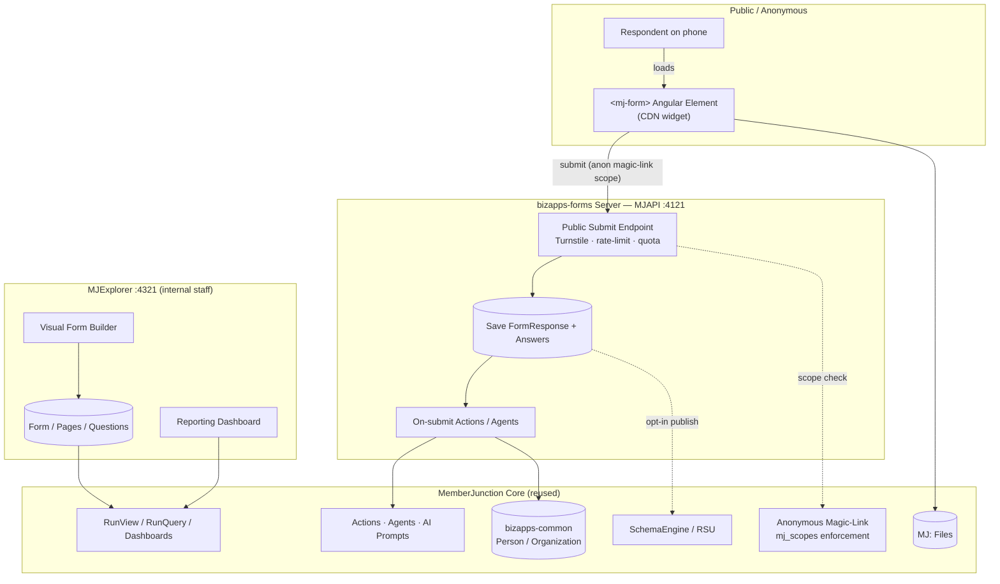

### 3.1 Repo skeleton (mirror of `bizapps-common`, verified against that repo)

```
bizapps-forms/
  mj-app.json            # OpenApp manifest (see §11)
  mj.config.cjs          # schema + entity prefix + CodeGen output paths
  package.json           # npm workspace (apps/* + packages/*), turbo
  turbo.json
  migrations/            # VYYYYMMDDHHMM__v*__*.sql  (skyway engine)
  metadata/              # mj-sync seed data (categories, styles, roles, perms)
  packages/
    Entities/            # @mj-biz-apps/forms-entities  (CodeGen entity subclasses)
    Actions/             # @mj-biz-apps/forms-actions    (CodeGen + hand-written actions)
    Server/              # @mj-biz-apps/forms-server     (bootstrap + resolvers + public submit endpoint)
    Angular/             # @mj-biz-apps/forms-ng         (Explorer builder/admin forms + widget)
  apps/
    MJAPI/               # GraphQL API server (port 4121)
    MJExplorer/          # Builder/admin UI (port 4321)
```

Evidence for the template: `bizapps-common/mj-app.json`, `bizapps-common/mj.config.cjs`
(`entityPackageName`, `output[]` for SQL/Angular/GraphQLServer/ActionSubclasses/EntitySubclasses),
`bizapps-common/package.json` (`mj:migrate --schema … --dir ./migrations`, `mj:codegen`,
turbo filters), and `bizapps-common/migrations/B…__Schema_and_Tables.sql`
(`IF NOT EXISTS … CREATE SCHEMA`, then plain `CREATE TABLE` with no `__mj_*` timestamp cols
and no FK indexes — CodeGen adds those).

### 3.2 The two surfaces

- **Respondent widget** — `@mj-biz-apps/forms-ng` builds an **Angular custom element**
  (`<mj-form id="…">`), published to a CDN. Tiny, no Explorer shell, embeddable via a
  `<script>` tag, iframe, popup/slider, full-page, or QR. This is the public-facing ticket.
- **Builder/Admin app** — runs in **MJExplorer**: visual form builder, response management,
  reporting dashboards. Internal staff only; full reuse of MJ dashboard/grid/query infra.

### 3.3 Reuse map — what MJ already gives us (the heart of this plan)

| Need | MJ capability to reuse | Evidence (MJ repo) |
|---|---|---|
| Anonymous internet users | **Anonymous magic-link sessions** — `IdentityMode='anonymous'`, shared Anonymous principal, scope enforced server-side from JWT `mj_scopes` claims (never DB roles → no privilege accretion) | `packages/MJServer/src/auth/magicLink/MagicLinkService.ts`, `types.ts` (`MagicLinkScopeEntry`, `MagicLinkJWTClaims.mj_scopes/mj_anon`), `magicLinkCore.ts` |
| Scoped programmatic access | **API-key scopes** (user ∩ app-ceiling ∩ key) | `packages/MJServer/src/auth/APIKeyScopeAuth.ts` |
| Known-respondent identity | **bizapps-common** Person/Organization/ContactMethod | `bizapps-common/migrations/B…__Schema_and_Tables.sql` |
| AI authoring of forms | Patterns from the **Form Builder agent** + deterministic `Create/Modify Interactive Form` actions | `packages/MJCoreEntities/src/engines/interactive-forms.ts` |
| Promote responses → first-class entity | **Runtime Schema Update (RSU)** pipeline: `SchemaEngine.generateDDL()` → migration → CodeGen → restart; `SchemaEvolution` adds columns over time | `packages/SchemaEngine/src/RuntimeSchemaManager.ts`, `SchemaEvolution.ts`, `MJServer/src/resolvers/RSUResolver.ts` |
| On-submit automation | **Actions / Agents / AI Prompts** | core framework |
| Reporting | RunView/RunViews, RunQuery, BaseDashboard + AG Grid | core framework |

> **NOTE — do NOT reuse MJ Interactive Forms as the survey schema.** Interactive Forms
> (`Type='Form'` Components + `Entity Form Overrides`) are **entity-bound** — they override
> the edit experience of an existing DB record. A survey is a free-standing instrument whose
> shape *is* the data. We build greenfield entities (§5) and only borrow the *patterns*
> (AI-authoring path, runtime resolver shape) from that subsystem.

---

## 4. Anonymous Access Design (the crux)

A public survey must accept submissions from people who have **no account and were never
individually invited**. The scary part — anonymous identity with server-side scope that
cannot be escalated — is **already solved by MJ**. The remaining gap is small and well-defined.

**Mechanism (existing):** MJ magic links support `IdentityMode='anonymous'`. An anonymous
redemption resolves to one **shared Anonymous principal** (seeded UUID
`273910DF-28F1-45C1-A8F8-6E9AD8E5F008`) that holds **no DB roles**; authorization is enforced
against the per-session JWT's `mj_scopes` union (Application + optional `resourceType/resourceId`).
Two anonymous visitors share the identity but hold **different scopes** — no accretion.
Invites carry **`maxUses`**, so a long-lived, high-`maxUses`, anonymous link scoped to one
form = effectively a **public form URL**.

**What we must add (small):**

1. **A `CanCreate` respondent scenario (metadata).** A restricted **"Form Respondent"**
   role with **CanCreate on `FormResponse` / `FormResponseAnswer` only** (and read on the
   published form definition it's scoped to) — nothing else. This is the one deliberate
   exception to the magic-link "read-only" convention. Authored as mj-sync metadata
   (roles + entity-permissions), exactly like the Magic Link recipe in
   `MJ/guides/MAGIC_LINK_GUIDE.md` §4.
2. **A public-write hardening layer (new server code).** Rate limiting, bot/abuse defense
   (**Cloudflare Turnstile** / honeypot, per-form toggle), response-quota enforcement,
   duplicate handling, IP-hash + UA capture. This is the main net-new server work.
3. **A `FormDistribution` object (entity, §5).** "Publish public URL" is a first-class
   record wrapping an anonymous, multi-use, scoped link — with its own quota, expiry,
   open/close window, and per-link analytics.
4. **Provisioning the distribution's magic-link invite (new server code).** When a
   `FormDistribution` is created/activated, mint the anonymous, multi-use, scoped magic-link
   invite — carrying `mj_scopes` that grant the **Form Respondent** role, scoped to the
   distribution, with configurable `maxUses`/expiry — via MJ core's `MagicLinkService`, and
   store its `MagicLinkInviteID` on the record. Implemented as a server-side `FormDistribution`
   entity lifecycle hook so it fires however the distribution is created (builder, AI, import).
   **Install prerequisite:** the host MJ instance must enable core `magicLink` and allow the
   Form Respondent role to be granted (`restrictedRoleName`/`grantableRoleNames`); MJ
   auto-generates its signing keys. _(Added 2026-06-30 — the original plan named
   `MagicLinkInviteID` but never assigned who mints it; this closes that gap.)_

**Submission path:** anonymous multi-use magic link scoped to a `FormDistribution`
→ widget loads published `FormVersion` (read) → respondent answers → public submit endpoint
(Turnstile + rate-limit + quota check) → Save `FormResponse` + `FormResponseAnswer` rows
→ fire on-submit Actions/Agents.

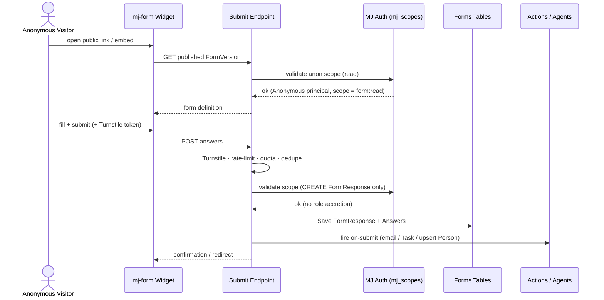

**Open follow-up:** confirm the **minimum MJ version** that includes (a) anonymous
magic-link `mj_scopes` enforcement and (b) RSU — pin `mjVersionRange` accordingly (default
assumption: `>=5.44.0`).

---

## 5. Data Model

Schema **`__mj_BizAppsForms`**, entity prefix **`Forms:`** (decision DG-2 — note the
`Forms: Forms` stutter on the root table; alternative is to name the root table
`FormDefinition` → `Forms: Definitions`). No `__mj_*` timestamp cols, no FK indexes
(CodeGen adds them). `sp_addextendedproperty` on every business column.

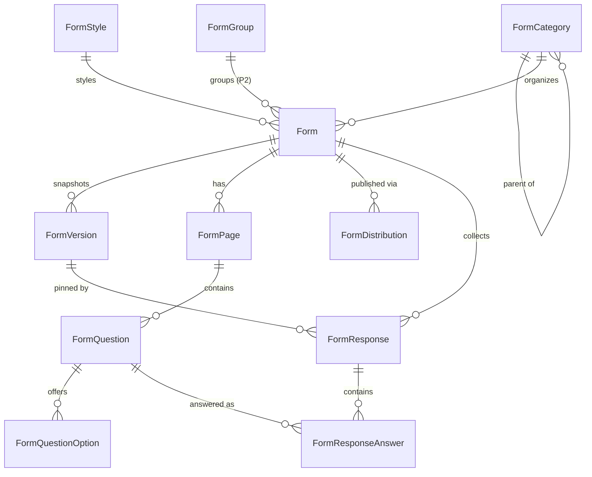

### 5.1 Phase 1 entities (MVP)

- **FormCategory** — `Name, Description, ParentID (self-FK, hierarchy), IconClass,
  DisplayRank, IsActive`. Organizes forms in a tree.
- **FormStyle** — master list of reusable themes/CSS sets for departments/brands.
  `Name, Description, CSSVariables (JSON of --mj-* token overrides), CustomCSS (NVARCHAR MAX),
  LogoURL, IsActive, DisplayRank`. A Form links to one for styling.
- **Form** — `Name, Description, CategoryID (FK), StyleID (FK, nullable), Status
  (Draft|Published|Closed), OwnerUserID, RenderMode (Scroll|OneQuestion), Settings (JSON:
  anon-allowed, captcha-on, quota, open/close dates, confirmation message/redirect),
  FormGroupID (nullable, Phase 2 — see §5.2)`.
- **FormVersion** — immutable published snapshots. `FormID, VersionNumber, Status
  (Draft|Published|Retired), PublishedAt, DefinitionSnapshot (JSON — the full
  pages/questions/options/logic as-published)`. Responses pin a `FormVersionID` so a form can
  evolve without corrupting historical data.
- **FormPage** — `FormID, Title, Description, DisplayOrder, ConditionalRule (JSON,
  show-if logic — §6)`.
- **FormQuestion** — `FormID, PageID, QuestionType (value-list — §5.3), Prompt, HelpText,
  IsRequired, DisplayOrder, ValidationRule (JSON), ConditionalRule (JSON),
  ScoringConfig (JSON, nullable — e.g. "LLM-judge with prompt X" or numeric weights),
  Settings (JSON, per-type)`.
- **FormQuestionOption** — `QuestionID, Label, Value, DisplayOrder, IsDefault`.
- **FormResponse** — `FormID, FormVersionID, Status (Partial|Complete), AnonymousSessionID
  (mj_sid), RespondentPersonID (nullable FK → `MJ_BizApps_Common` Person, for identified
  respondents), StartedAt, SubmittedAt, SourceMetadata (JSON: ip-hash,
  ua, distribution id, referrer)`.
- **FormResponseAnswer** — `ResponseID, QuestionID, TextValue, NumericValue, DateValue,
  BooleanValue, JSONValue (for multi/complex), FileID (→ MJ: Files), Score (nullable),
  ScoreRationale (nullable — LLM-judge output)`. The query-able EAV-ish store; typed columns
  + JSON fallback.
- **FormDistribution** — `FormID, Name, Slug, ChannelType (PublicLink|Embed|QR|Email),
  Status, OpenAt, CloseAt, MaxResponses, ResponseCount, MagicLinkInviteID (the anonymous
  multi-use scoped link), CaptchaRequired, IsActive`. One Form can have many distributions.

### 5.2 Phase 2 entities / extensions

- **FormGroup** — `Name, Description, MaterializedEntityID (nullable — the RSU bridge)`.
  `Form.FormGroupID` is a nullable FK. When a Form belongs to a FormGroup that has a
  `MaterializedEntityID`, responses for the whole group are projected into that single
  first-class entity (e.g. all yearly "Annual Meeting Survey" forms → one
  `AnnualMeetingSurvey` table, column-evolved across years via SchemaEvolution).
- **Materialization / RSU** (§8.2), advanced conditional logic & scoring beyond §6 basics,
  payment question type, partial-response resume, advanced quotas.

### 5.3 Question type taxonomy (value-list on FormQuestion.QuestionType)

**Table-stakes (Phase 1):** ShortText, LongText, Email, Phone, Number, SingleChoice
(radio), MultiChoice (checkbox), Dropdown, Rating (stars/scale), NPS, YesNo, Date, Time,
FileUpload, Statement (display-only/section header).
**Advanced (Phase 2):** Matrix/Grid, Ranking, Address (→ bizapps-common), Signature,
Payment, Calculated.

### 5.4 Dual persistence (the design you locked)

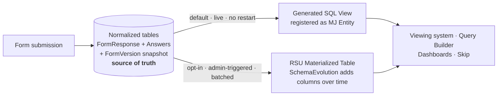

- **Generic normalized tables are ALWAYS the source of truth** (`FormResponse` +
  `FormResponseAnswer` + the `FormVersion` snapshot). Every submission lands here, fast, no
  restart.
- **Reporting projection (two tiers, Phase 2):**
  1. **View-projection (default, lightweight):** a generated denormalized SQL **view** per
     form/group, registered as an MJ entity → Skip / query-builder / dashboards work, **no
     MJAPI restart**, live. Column set fixed at generation.
  2. **RSU-materialized table (heavyweight, opt-in):** for the "first-class evolving table
     users will extend themselves" case — full table via the RSU pipeline
     (`RuntimeSchemaManager`), columns evolved over time via `SchemaEvolution`.
- **CRITICAL operational constraint:** RSU **commits a migration, runs CodeGen, and restarts
  MJAPI** (gated by `ALLOW_RUNTIME_SCHEMA_UPDATE=1`, serialized by a mutex, blocks `__mj`).
  Therefore materialization is an **explicit, admin-triggered, batched "Publish to Entity"
  action — NEVER a per-submission hot path.** Default to view-projection; let users "promote"
  to a materialized table deliberately.

---

## 6. Conditional Logic (Phase 1 basics only)

Stored as **declarative JSON `ConditionalRule`** on FormPage and FormQuestion. Phase 1
supports show/hide and skip-to-page based on prior answers:

```jsonc
{ "show": { "all": [ { "questionId": "<q>", "op": "equals", "value": "Other" } ] } }
```

Operators: `equals, notEquals, in, notIn, isAnswered, greaterThan, lessThan, contains`.
Combinators: `all` / `any`. Evaluated client-side in the widget and re-validated server-side
on submit. **Out of scope for P1:** calculated fields, expression language, quotas, visual
flow-graph. Anything heavier is a Phase-2 candidate or an MJ Action.

---

## 7. AI Authoring ("super easy setup")

An **MJ AI Agent / Action** authors form metadata from a natural-language brief
("a 5-question event RSVP with dietary restrictions and a +1 count"). It writes the
`Form / FormPage / FormQuestion / FormQuestionOption` rows via entity `Save()` (or mj-sync),
reusing the deterministic-builder pattern proven by the **Form Builder agent**
(`packages/MJCoreEntities/src/engines/interactive-forms.ts`). Round-trip: agent drafts →
human tweaks in the builder → publish. This is the headline "easy setup" story; pair it with
a starter template gallery for the no-AI path.

---

## 8. Reporting

### 8.1 Core (Phase 1)
A BaseDashboard in the Explorer admin app: summary stats, per-question breakdowns (charts via
AG Grid / chart components), filtering/cross-tab, completion & drop-off funnel, individual
response view, CSV/Excel export. Built on RunView/RunViews + RunQuery — no new infra.

### 8.2 First-class projection (Phase 2)
View-projection (default) and RSU-materialization (opt-in) per §5.4, unlocking the full MJ
toolchain — viewing system, query builder, dashboards, and **Skip** — over survey data as
native entities. This is the reporting differentiator no incumbent has.

---

## 9. Phases & Tasks

### Phase 0 — Repo bootstrap ✅ COMPLETE
- [x] Create `bizapps-forms` repo from the bizapps-common skeleton (mj-app.json, mj.config.cjs,
      package.json workspace, turbo.json, packages/{Entities,Actions,**CoreEntitiesServer**,Server,Angular},
      apps/{MJAPI,MJExplorer}). _Built from a fresh-scaffold variant of the bizapps-common Open App
      skeleton, then `CoreEntitiesServer` added to fully mirror bizapps-common's package set._
- [x] Set schema `__mj_BizAppsForms`, scope `@mj-biz-apps/forms-*`, prefix `MJ_BizApps_Forms:` (DG-2),
      ports 4121/4321, `mjVersionRange >=5.43.0 <6.0.0` (DG-1 — see Progress Log).
- [x] Pull this plan into `plans/FORMS_BUILD_PLAN.md` (byte-for-byte from MJ PR #2971).

### Phase 1 — MVP (the differentiating slice) — ✅ BUILD COMPLETE (2026-06-30)
- [x] Migration: schema + Phase-1 tables (§5.1) applied to `MJ_Forms` (localhost:1456); all 10 tables live.
- [x] `MJ_BizApps_Forms: …` entity subclasses generated (CodeGen) + verified (build green).
- [x] mj-sync seed: FormCategory starter tree (9), FormStyle defaults (3 — Editorial/Aurora/Warm),
      **Form Respondent role + 9 entity permissions** (CanCreate on Form Responses/Answers only),
      Application + nav + reporting Dashboard record. **Pushed to DB: 33 records, 0 errors.**
- [x] **Public submit endpoint** (forms-server): `PublishedForm` + `SubmitFormResponse` custom
      resolvers — anon mj_scopes/CanCreate check + Turnstile (fail-closed) + rate-limit + dual quota
      + dedupe + IP-hash(session) → Save response/answers → fire on-submit Actions by name. In schema. 33 tests.
- [x] **Respondent widget** (forms-ng → Angular element): both render modes, mobile-first/WCAG-AA,
      FormStyle token theming, §6 conditional logic (shared evaluator), file upload, partial save. 18 tests.
- [x] **Builder/admin app** (MJExplorer): visual builder (registers as Forms entity-form override),
      publish→FormVersion snapshot, FormDistribution management (public link/embed/QR). 40 tests.
- [x] **AI authoring** action (`Forms: Generate Form From Brief`, highest-power Claude, zod-validated
      blueprint) + 5 starter templates. 31 tests (with on-submit actions).
- [x] **Reporting dashboard** (§8.1): summaries, per-question breakdowns, NPS, funnel, response view,
      CSV/Excel export — RunView/RunQuery only, registered as `FormsReportingDashboard`. 12 tests.
- [x] On-submit hooks (forms-actions, seam S3): `Forms: Upsert Respondent Person`,
      `Forms: Send Confirmation Email` (pluggable sender), `Forms: Create Followup Task`.
- [ ] **Distribution magic-link provisioning** (§4 item 4): server-side `FormDistribution`
      lifecycle hook that mints the anonymous, scoped, multi-use magic-link invite via MJ core
      `MagicLinkService` and stores `MagicLinkInviteID`. Configurable; gated on host `magicLink` config.
      Unblocks the full anonymous-submit e2e.
- [~] Tests: **158 Vitest passing** across all packages. CI gates (UI tokens, mj-btn) still TODO.
- **Remaining for Phase 1 close:** full anonymous-submit headless e2e (mint magic link → PublishedForm
      → SubmitFormResponse → verify saved + hooks); push not yet to org remote (read-only access);
      real Turnstile/email/file-upload provider wiring; CI token/mj-btn gate.

### Phase 2 — Power
- [ ] FormGroup + MaterializedEntityID; **view-projection** (default) and **RSU
      materialization** (opt-in, admin-triggered, batched) — §5.4 / §8.2.
- [ ] Advanced question types (Matrix, Ranking, Address→bizapps-common, Signature, Payment).
- [ ] LLM-judge scoring pipeline on free-text answers (ScoringConfig).
- [ ] Review/approve-before-publish routing via **bizapps-tasks** (FormVersion status state machine + a "Form Approval" TaskType whose OnComplete/OnReject hooks call Forms actions).
- [ ] Partial-response resume, advanced quotas, richer conditional logic.

---

## 10. Decision Gates / Open Questions

- **DG-1 — Min MJ version.** Confirm earliest version with anonymous magic-link `mj_scopes`
  enforcement **and** RSU; pin `mjVersionRange`. (Default `>=5.44.0 <6.0.0`.)
- **DG-2 — Entity prefix/naming.** `Forms:` prefix (accept `Forms: Forms` stutter) vs. rename
  root table `FormDefinition`. (Default: `Forms:` prefix.)
- **DG-3 — Repo/scope name.** Repo `bizapps-forms`; product/display name **MJ Forms**; npm
  scope `@mj-biz-apps/forms-*` (consistent with `@mj-biz-apps/common-*`). (Locked by owner.)
- **DG-4 — Anti-abuse provider.** Cloudflare Turnstile (recommended, free, privacy-friendly)
  vs. hCaptcha vs. honeypot-only default. Per-form toggle either way.
- **DG-5 — Widget hosting/distribution.** CDN host for the Angular element; versioning &
  cache strategy; iframe vs. direct-element embed default.
- **DG-6 — Response store shape.** Confirm typed-columns + JSON-fallback on
  `FormResponseAnswer` (recommended) vs. pure-JSON. Affects query/projection ergonomics.

---

## 11. Repo Bootstrap Specifics (defaults for the build session)

`mj-app.json` (mirroring `bizapps-common/mj-app.json`):

```jsonc
{
  "$schema": "https://schema.memberjunction.org/mj-app/v1.json",
  "manifestVersion": 1,
  "name": "mj-bizapps-forms",
  "displayName": "MJ Forms",
  "description": "Forms, surveys & intake for MemberJunction — anonymous-friendly, mobile-first, responses as first-class records.",
  "version": "0.1.0",
  "license": "ISC",
  "icon": "fa-solid fa-list-check",
  "publisher": { "name": "MemberJunction", "url": "https://memberjunction.com" },
  "repository": "https://github.com/MemberJunction/bizapps-forms",
  "mjVersionRange": ">=5.44.0 <6.0.0",
  "schema": { "name": "__mj_BizAppsForms", "createIfNotExists": true },
  "migrations": { "directory": "migrations", "engine": "skyway" },
  "metadata": { "directory": "metadata" },
  "packages": {
    "server": [{ "name": "@mj-biz-apps/forms-server", "role": "bootstrap", "startupExport": "LoadBizAppsFormsServer" }],
    "client": [{ "name": "@mj-biz-apps/forms-ng", "role": "bootstrap", "startupExport": "LoadBizAppsFormsClient" }],
    "shared": [
      { "name": "@mj-biz-apps/forms-entities", "role": "library" },
      { "name": "@mj-biz-apps/forms-actions", "role": "library" }
    ]
  },
  "code": { "visibility": "public", "sourceDirectory": "packages" },
  "categories": ["Forms", "Surveys", "Productivity"],
  "tags": ["forms", "surveys", "intake", "feedback", "nps"]
}
```

- `mj.config.cjs`: `entityPackageName: '@mj-biz-apps/forms-entities'`, the same `output[]`
  block as bizapps-common (SQL / Angular / GraphQLServer / ActionSubclasses /
  EntitySubclasses / DBSchemaJSON), entity name prefix `MJ_BizApps_Forms:`, post-codegen build commands.
- `package.json`: workspaces `apps/*` + `packages/*`; `mj:migrate --schema __mj_BizAppsForms
  --dir ./migrations`; `mj:codegen`; turbo build/start filters for `mj_api` / `mj_explorer`.
- Ports: MJAPI **4121**, MJExplorer **4321** (common=4101/4301).
- Branching: `next` (integration) → `main` (release), feature branches track same-named
  remote (bizapps convention).

---

## 12. Progress Log

- *(pre-build)* Plan authored in MJ repo as portable seed. Competitive pricing (§1.3) flagged
  for live re-verification. Next: pull into `bizapps-forms`, execute Phase 0.
- **2026-06-28 — Phase 0 complete; Phase 1 started.** Scaffolded `bizapps-forms` from the
  bizapps-common Open App skeleton (used a fresh-scaffold variant of the bizapps-common skeleton as the concrete
  base, then added `packages/CoreEntitiesServer` = `@mj-biz-apps/forms-core-entities-server`, wired
  into the Server bootstrap, to fully mirror common's 5-package set). All scaffold identifiers,
  semantics, branding, ports, and version pins set to Forms. Authored `mj-app.json`, a
  world-class root `README.md`, and a Forms-specific `CLAUDE.md`.
    - **DG-1 (min MJ version) resolved → pin `5.43.0`.** Verified directly: `@memberjunction/*@5.44.0`
      is NOT published to npm (404); latest published is `5.43.0`. The two capabilities Forms depends
      on — anonymous magic-link `mj_scopes` enforcement (`@memberjunction/server`) and the RSU pipeline
      (`@memberjunction/schema-engine`: `RuntimeSchemaManager`, `SchemaEvolution`, `RSUResolver`) — are
      both present in published `5.43.0`. The 5.44 realtime/media work (MJ PR #2941) is not a Forms
      dependency. So `mjVersionRange = >=5.43.0 <6.0.0`, npm deps pinned to `5.43.0`.
    - **DG-2 (naming) resolved →** schema `__mj_BizAppsForms` (PascalCase `__mj_BizApps*` convention,
      confirmed against common + tasks), entity prefix `MJ_BizApps_Forms:` (aligned to the
      MJ_BizApps_Common: / MJ_BizApps_Tasks: sibling convention), root table `Form`.
    - **Build status:** `npm install` (with `--ignore-scripts` to skip `sharp`'s blocked libvips
      binary download in this sandbox) + `npm run build` → all 5 packages **and** MJAPI build green
      after one fix (gave `forms-server` `"types": ["node"]` for its `node:url`/`node:path` imports —
      a latent bug inherited from the fresh scaffold (never built before this)). The only remaining failure is the
      MJExplorer **production** `ng build` trying to inline an external Google Font over the internet
      (no `fonts.googleapis.com` access in this sandbox) — an environment/network limitation, not a
      code defect; it will build locally with internet, and `ng serve` is unaffected.
    - **Phase 1 kickoff:** authored the schema + Phase-1 tables migration
      (`migrations/B202606281200__v0.1.x_Schema_and_Tables.sql`). Remaining Phase-1 work (run
      migrate + CodeGen, public submit endpoint, `<mj-form>` widget, builder/admin, AI authoring,
      reporting) needs a live DB and is the next session's work after a local pull.
    - **Not committed** — awaiting explicit approval (per CLAUDE.md rule 1).
- **2026-06-29 — Design system tokenized + hard Open-App dependencies adopted.** (a) The three
  design directions (Editorial default · Aurora · Warm) were rebuilt as one MJ-token-driven design
  system (`docs/app/design-system.css`) where each theme is a `[data-theme]` token-override block =
  a `FormStyle.CSSVariables` row; live at the GitHub Pages gallery. (b) Owner decided MJ Forms
  **hard-depends** on `bizapps-common` + `bizapps-tasks` (free OSS, auto-installed). Research
  confirmed app-to-app deps are first-class (`mj-app.json` `dependencies`, transitive topological
  install, proven by `bizapps-tasks → bizapps-common`) and that `bizapps-tasks` v1.1.x already ships
  an approval/decision model (Task Decisions/Outcomes, polymorphic Task Links + Assignments, TaskType
  `OnComplete`/`OnReject` action hooks) — so approve-before-publish is wiring, not building. Changes
  landed: entity prefix `MJ Forms:` → **`MJ_BizApps_Forms:`** (sibling convention; set before first
  CodeGen); `mj-app.json` `dependencies` on common (`>=5.31.0`) + tasks (`>=1.1.0`); the polymorphic
  `FormResponse` subject seam **removed** and replaced by a hard `RespondentPersonID` FK →
  `__mj_BizAppsCommon.Person`. Consequence: the forms migration now requires `bizapps-common`'s schema
  present first (install order / local-dev ordering). The bizapps-tasks approval routing is **Phase 2**
  (FormVersion status state machine + 3 Forms actions + a "Form Approval" TaskType).
- **2026-06-30 — Phase 1 built end-to-end via parallel multi-agent orchestration.** Ran migrate +
  CodeGen against the live `MJ_Forms` DB (localhost:1456) and committed the generated gate
  (`feature/phase1-foundation`). A supervisor decomposed Phase 1 into a shared **contract** (Wave 0)
  + **6 work packages** built concurrently in isolated git worktrees:
  - **Contract** (forms-entities): `PublishedFormDefinition` snapshot model, `ConditionalRule`/`ValidationRule`
    + pure `evaluateConditionalRule`, submit transport types, zod parse helpers — the seam all packages import.
  - **WP-A** metadata, **WP-B** submit endpoint + anti-abuse, **WP-C** `<mj-form>` widget, **WP-D** builder,
    **WP-E** AI authoring + on-submit actions, **WP-F** reporting dashboard. Three seams (S1 submit/read API,
    S2 conditional JSON, S3 action names) kept them coherent. All 6 merged into the foundation; two seam
    reconciliations applied (C's GraphQL field names → B's real SDL; A's nav → builder-as-entity-form-override
    + `FormsReportingDashboard`). **Full build green; 158 Vitest tests pass.**
  - **e2e validation:** MJAPI boots clean against the live DB; emitted `schema.graphql` confirms
    `PublishedForm`/`SubmitFormResponse` + types + all 10 Forms entities. **mj sync push → 33 records created**
    (Form Respondent role + 9 permissions, 9 categories, 3 styles, Forms app + nav, dashboard), 0 errors.
  - **Branch reality:** `next`/`main` realigned locally; all work local (account has read-only on the org remote —
    nothing pushed). Worktree agents based off the contract-equipped foundation (verified codegen+contract present).
  - **Not yet:** full anonymous-submit headless e2e (needs a published form + minted magic link — best driven
    through the builder UI), real Turnstile/email/MJ:Files provider wiring, CI token/mj-btn gate, push to remote.
  - See `plans/PHASE1_DECOMPOSITION.md` for the work-package boundaries, seams, and per-branch commits.
