# MJ Forms (`bizapps-forms`) — Build Plan & Business Case

> **Status:** Plan / pre-build. This document lives in the **MJ repo** only as a portable
> seed. The actual product is built in a **separate repo `MemberJunction/bizapps-forms`**.
> A fresh session should pull this file byte-for-byte into that repo (e.g. as
> `plans/FORMS_BUILD_PLAN.md`) and treat it as the durable task state — read the Status
> Snapshot + Progress Log at the start of every session, pick up the first unfinished task
> in dependency order, and update task state here as you work.

---

## Status Snapshot

**Phase 0 — ✅ COMPLETE.** Repo scaffolded from the bizapps-common Open App skeleton
(5 packages: `forms-{entities,actions,core-entities-server,server,ng}`; 2 apps: MJAPI/MJExplorer),
pinned to MJ **`5.50.0`** (`mjVersionRange >=5.50.0 <6.0.0` — raised from `5.43.0` on 2026-07-30,
because a floor below `5.44.0` was never satisfiable; see the Progress Log), schema `__mj_BizAppsForms`, entity
prefix `MJ_BizApps_Forms: ` (matches the `MJ_BizApps_Common:` / `MJ_BizApps_Tasks:` siblings), ports
**4121 / 4321**. `npm install --ignore-scripts && npm run build` is green for all 5 packages **and**
MJAPI; the only failure is the MJExplorer *production* `ng build` font-inline step, which needs
internet (`fonts.googleapis.com`) and is an environment-only issue. Scaffold is on **`main`**.

**Hard Open-App dependencies.** MJ Forms **requires** and auto-installs two sibling apps (declared in
`mj-app.json` `dependencies`; `mj app install` resolves leaf-first **common → tasks → forms**):
**`bizapps-common`** (`>=5.31.0 <6.0.0`) for identity — `FormResponse.RespondentPersonID` is a hard
cross-schema FK to `MJ_BizApps_Common: People`; and **`bizapps-tasks`** (`>=1.1.0 <2.0.0`) for the
review/approve-before-publish routing (its v1.1.x `Task Decisions` model). The polymorphic
`FormResponse` subject seam was **removed** in favour of hard FKs (we build directly on common/tasks
as part of the stack).

**Phase 1 — ✅ CLOSED (verified end to end on 2026-07-30/31; ships as 0.3.0).** Every §9 slice is built, wired to
real MJ infrastructure, and green: **434 Vitest passing** (Entities 24 · Actions 61 · Server 159 ·
Angular 162 · CoreEntitiesServer 26 · MJAPI 2 — run them with `npm test`, which is the only command
that covers all six; a per-package loop reports 432 and looks complete). A 4-agent, code-grounded audit (2026-07-01) confirmed each item is genuinely
implemented — *not* stubbed — and corrected several the log had **understated**:
- **Cloudflare Turnstile is a REAL `siteverify` fetch** (per-form toggle, fail-closed), not the "stub"
  earlier log lines claimed; the confirmation-email sender is **CommunicationEngine-backed**; file
  upload writes real **`MJ: Files`** via `@memberjunction/storage`.
- **AI authoring is a metadata-driven `Forms: Form Designer` AIPrompt** (Gemini, model pinned in
  metadata not code) with a zod-validated blueprint + 5 starter templates — the earlier "highest-power
  Claude in code" description is obsolete.
- There are **4** on-submit hooks, not 3: Upsert Respondent Person · Send Confirmation Email · Create
  Followup Task · **Analyze Written Responses** (the last **confirmed running live** — writes
  `Score`/`ScoreRationale` to real responses).

Live DB **`MJ_Forms_Dev`** (localhost:1456 — the earlier `MJ_Forms` server is gone; older Progress Log
entries name it and were accurate when written): all `__mj_BizAppsForms` tables present plus
`flyway_schema_history`, all migrations applied, metadata seeded. All work is on the org remote; the
branching model is `feature → next → main`.

**⚠️ That "metadata seeded" line was true of ONE DATABASE and nowhere else, until 2026-08-08.**
`mj-app.json` names a `metadata/` directory, but MJ's manifest schema is explicit that
`metadata.directory` is a dev-time pointer the install engine **never reads** — seeding happens
exclusively through `migrations/`. MJ Forms shipped no seed migration for any release, so every
`mj sync push` wrote to this one database and left no artifact. A clean `mj app install` produced a
Forms deployment with no Form Respondent role, no `CanCreate` grant on the response entities, no
styles, categories, application, nav, dashboards or AI authoring — the anonymous submit path could
not run, and every step reported success. Fixed by
`migrations/V202608081700__v0.8.x__Metadata_Sync.sql` (84 records) plus a teardown, a
`SchemaInfo.EntityNamePrefix` migration and a CI gate. Full account:
[`DISTRIBUTION_SEED_PLAN.md`](DISTRIBUTION_SEED_PLAN.md). **The rule this leaves behind: a
`mj sync push` whose result exists only in your dev DB is an unshipped change.**

**⚠️ The anonymous submit path did not work in any published 0.2.x.** Standing the product up for the
first time (2026-07-30) found two independent defects, either alone fatal — a case-sensitive GUID
comparison and a `<form>` running the browser's native submit. Both are fixed and now covered by
`npm run smoke:respondent`, which drives the real public surface and is the only check that would have
caught either. **A green `npm test` is necessary and not sufficient for anything touching the public
path** — the full suite was green the entire time the product could not accept a single response.

**Closed on 2026-07-30/31 — what the Phase 1 close-out list asked for:**
1. ~~Full anonymous-submit e2e against the live wire~~ **done** — mint link → `GET /f/:slug` redeem →
   `PublishedForm` → `SubmitFormResponse` persists under anon scope, in a real browser; response +
   answers written and all 4 on-submit hooks fired.
2. ~~Re-verify `Upsert Respondent Person` links a `People` row live~~ **done** — writes to
   `__mj_BizAppsCommon`, with `Create Followup Task` writing Task + TaskLink to `__mj_BizAppsTasks`.
3. ~~Push to the org remote~~ **done.**
4. ~~Orphaned `migrations/codegen/` CodeGen SQL~~ **done** — the directory is `.gitignore`d, so no
   generated SQL is tracked.
5. ~~`Forms: Create Followup Task` unit test~~ **done** —
   `packages/Actions/src/custom/on-submit/create-followup-task.action.spec.ts`.

**Still open — deploy/verify and one real gap:**
1. **Deploy-time provider config** (code-complete, unconfigured): `FORMS_TURNSTILE_SECRET`, an email
   `CommunicationProvider` + `FORMS_EMAIL_FROM`, a storage account for uploads. `.env.example`
   documents every knob.
2. **The Explorer surfaces (studio / builder / dashboard) have not been exercised by a human.** They
   need an interactive host login, which the e2e above deliberately does not. The anonymous respondent
   path is the part that is verified.
3. **mj-btn CI gate** still disabled (color-token gate enforced + passing at 0 violations).
4. Widget §2 **flaky-network resilience is thin** (no offline detection / autosave-retry / submit
   auto-retry) — the one real UX-bar shortfall left.

Gemini output-token truncation on long forms is an **upstream limitation** (MJ runner/driver never
sends `maxOutputTokens` to Gemini), mitigated by the analyzer's truncated-JSON salvage.

### 🎨 Design system & themeable prototypes (live on GitHub Pages)

All three looks are now **one MemberJunction-token-driven design system**
([`docs/app/design-system.css`](../docs/app/design-system.css)): the base layer mirrors MJ's real
`--mj-*` semantic tokens, a new `--mjf-*` layer adds form-specific concepts (question card, choice
option, progress, rating, app chrome), and **each theme is just a `[data-theme]` block overriding
~25 tokens** — the same mechanism as MJ dark mode, and exactly what a `FormStyle.CSSVariables` row will
store. **Editorial is the default**; Aurora and Warm flip live via an in-page switcher (or a `?theme=`
deep-link). The HTML is identical across all three — only tokens change, and the prototypes carry
**zero hardcoded colors** below the token layer. Three surfaces (respondent form, builder, dashboard)
live under [`docs/app/`](../docs/app/); visual only (no backend), no CodeGen dependency.

➡️ **Live gallery: https://memberjunction.github.io/bizapps-forms/**

> One HTML, three themes — proof the token system re-skins every surface (chrome, cards, even chart
> fills). Click any image to open the live, switchable page.

#### 📱 Respondent form — Editorial · Aurora · Warm
<table><tr>
<td width="33%"><a href="https://memberjunction.github.io/bizapps-forms/app/respondent.html?theme=editorial">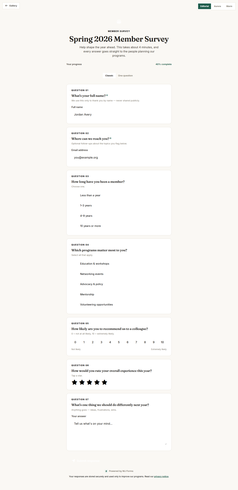</a></td>
<td width="33%"><a href="https://memberjunction.github.io/bizapps-forms/app/respondent.html?theme=aurora">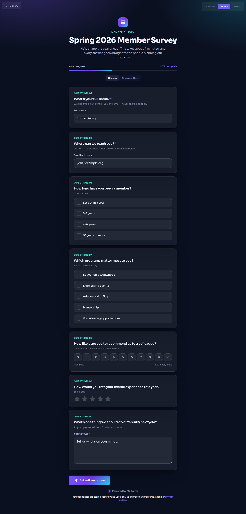</a></td>
<td width="33%"><a href="https://memberjunction.github.io/bizapps-forms/app/respondent.html?theme=warm">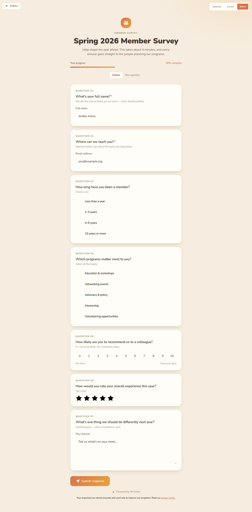</a></td>
</tr></table>

#### 🛠️ Form builder — Editorial · Aurora · Warm
<table><tr>
<td width="33%"><a href="https://memberjunction.github.io/bizapps-forms/app/builder.html?theme=editorial">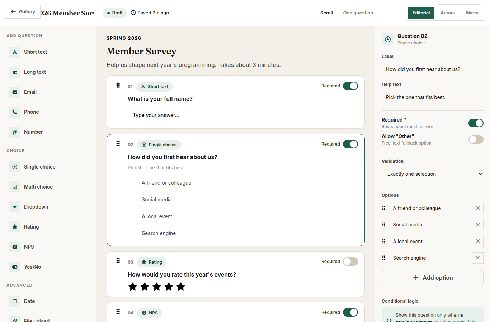</a></td>
<td width="33%"><a href="https://memberjunction.github.io/bizapps-forms/app/builder.html?theme=aurora">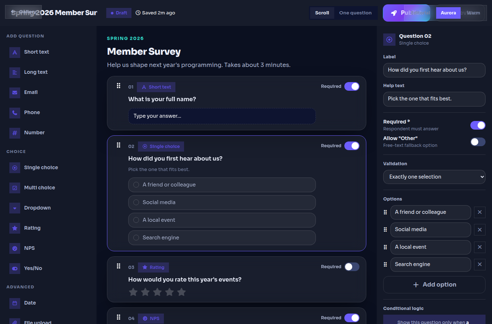</a></td>
<td width="33%"><a href="https://memberjunction.github.io/bizapps-forms/app/builder.html?theme=warm">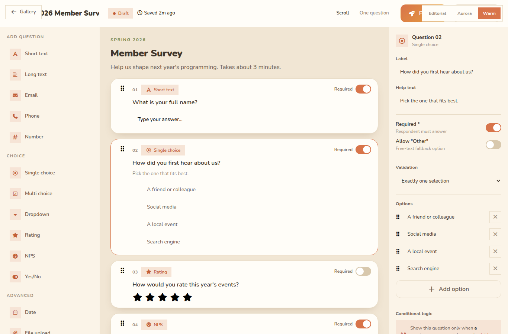</a></td>
</tr></table>

#### 📊 Analytics dashboard — Editorial · Aurora · Warm
<table><tr>
<td width="33%"><a href="https://memberjunction.github.io/bizapps-forms/app/dashboard.html?theme=editorial">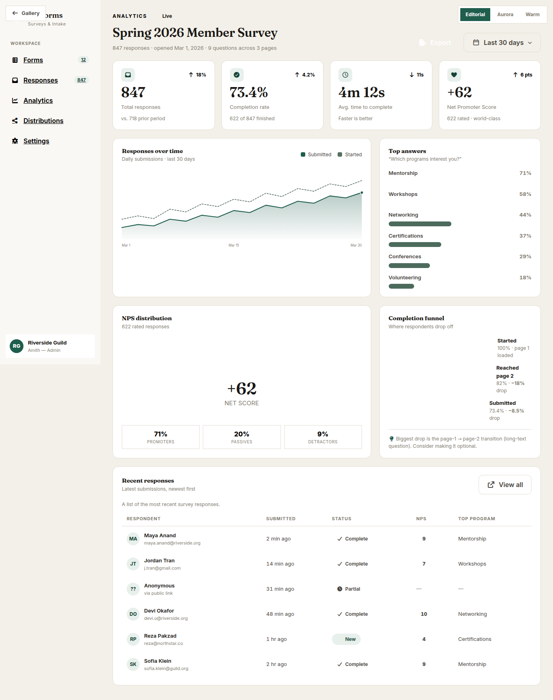</a></td>
<td width="33%"><a href="https://memberjunction.github.io/bizapps-forms/app/dashboard.html?theme=aurora">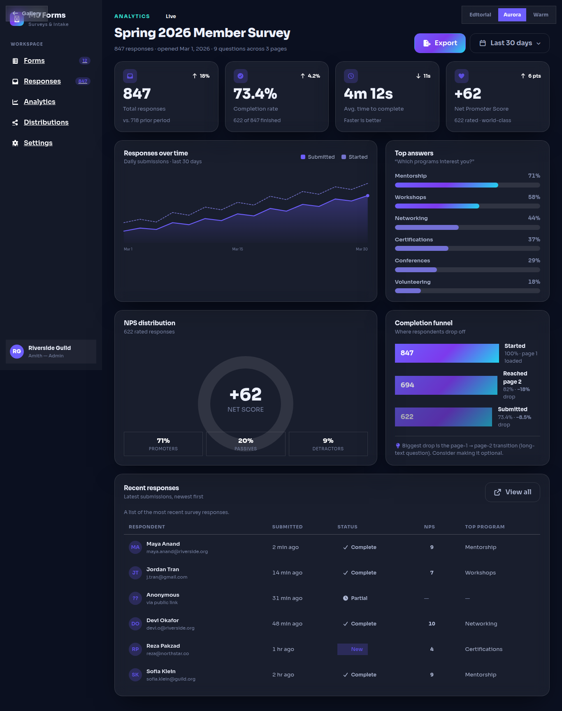</a></td>
<td width="33%"><a href="https://memberjunction.github.io/bizapps-forms/app/dashboard.html?theme=warm">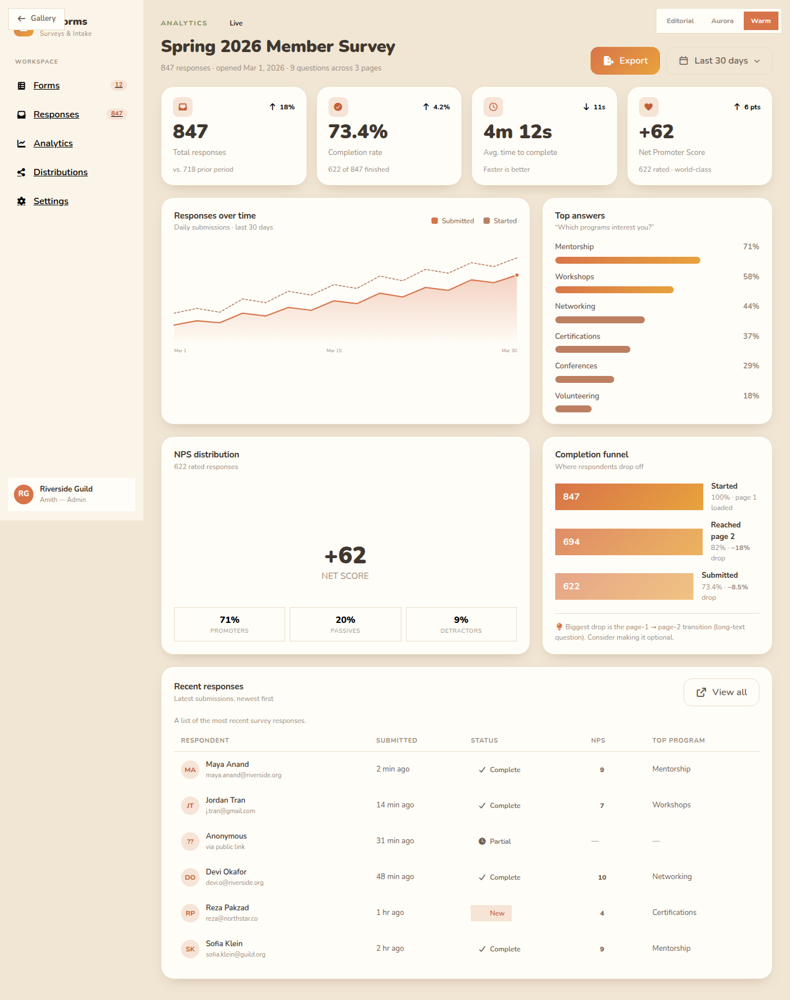</a></td>
</tr></table>

When Phase 1 builds the real Angular respondent widget + Explorer builder/dashboards, they consume the
same `--mj-*`/`--mjf-*` tokens, so these themes drop in as `FormStyle` rows with no component changes.
*(The original per-direction explorations remain under `docs/{aurora,editorial,warm}/` and are linked
from the gallery as "v1".)*

### ▶ NEXT — publish 0.3.0, then Phase 2

Phase 1 is closed: the anonymous submit path is verified end to end against a live wire, and the two
defects that made every published 0.2.x unable to accept a response are fixed. **The immediate task is
releasing it** — promote `next` → `main`, which publishes **0.3.0** from the pending changeset. Nothing
downstream can move until that lands: `bizapps-caliber` cannot re-enable Forms
([bizapps-caliber#76](https://github.com/MemberJunction/bizapps-caliber/issues/76)) until 0.3.0 exists
*and* Caliber is on MJ 5.50 ([bizapps-caliber#81](https://github.com/MemberJunction/bizapps-caliber/issues/81)),
because re-enabling against 0.2.1 would trade a boot crash for a form that silently discards responses.

After that, the remaining Status-Snapshot items are deploy/verify (provider config, Explorer surfaces
exercised by a human, widget flaky-network resilience) — **no net-new feature build**. For Phase 2,
resume in the §9 dependency order.

---

## 0. What this is

**MJ Forms** is a source-available MemberJunction **Open App** for **forms, surveys, and
intake** that:

- works for **anonymous internet users** (no account, public links / embeds),
- is **gorgeous on mobile** (published as an Angular **custom element** widget, not the
  Explorer shell),
- is **super easy to set up** — by a human in a visual builder, or by an **AI agent** from a
  natural-language description,
- has **great reporting** built on native MJ tooling, and
- makes responses **first-class records in your MemberJunction database** — optionally
  projected into real, query-able, Skip-accessible entities.

The thesis: the **80–90% of form/survey usage is simple** (contact forms, RSVPs,
feedback/NPS, lead capture, applications, registrations, quizzes) and maps almost perfectly
onto things **MJ already does well**. Commercial tools (Typeform, SurveyMonkey, JotForm)
charge hundreds of dollars a month for capabilities that, on top of MJ, are largely **reuse,
not new build**. So we ship the simple 80% beautifully and free, and make the powerful 20%
*possible* by leaning on MJ infrastructure (Actions, Agents, Prompts, RSU) rather than a
bespoke workflow engine.

---

## 1. Business Case

### 1.1 Why build this (and why free)

This is **not** a customer-acquisition land-grab against Typeform. The goal is to **add
value to existing MemberJunction installs** and to give organizations **a concrete reason to
adopt MJ beyond the "AI data platform" story.** Everyone needs forms; few people go looking
for an agent framework. A first-class, beautiful, free forms app is a tangible, universally
understood capability that makes an MJ instance immediately more useful.

It is deliberately **source-available under the Business Source License 1.1 (like bizapps-common)**, with a special focus
on the audiences MJ already serves well — **nonprofits and associations** — for whom
per-response metered survey tools (Typeform-style) are a real, recurring budget pain.

### 1.2 The differentiation (the moat incumbents cannot copy)

A standalone survey tool traps responses in a silo. MJ Forms inverts that:

1. **Responses are operational records, not survey exports.** A submission can *become* (or
   link to) a `bizapps-common` **Person / Organization / ContactMethod**, instantly
   actionable in the same system that runs the org's CRM/committees/tasks. No CSV round-trip,
   no Zapier tax.
2. **On-submit automation via MJ Actions & Agents — free.** Send an email, create a Task,
   upsert a Person, route to an agent, run an LLM-judge on a free-text answer. Incumbents
   charge the most for "integrations + logic + AI analysis"; MJ already has all three.
3. **Responses can be promoted to first-class entities (RSU).** A recurring instrument
   (e.g. "Annual Meeting Survey") can be projected into a real, evolving table that the whole
   MJ toolchain — viewing system, query builder, dashboards, **Skip** — treats natively. No
   form tool on the market does this.

### 1.3 Competitive landscape (summary — VERIFY PRICING before any customer-facing use)

> The numbers below are from model knowledge (~Jan 2026) and **must be re-verified** with
> live web research before publication. They are directionally correct as of writing.

| Tool | Position | Monetization pain (the gouge) |
|---|---|---|
| **Google / MS Forms** | Free, ubiquitous, bland | Shallow logic, weak reporting, ecosystem-locked. The "good enough & free" floor. |
| **Typeform** | Gorgeous, conversational one-question-at-a-time | Brutal **per-response caps**; free tier ~10 responses/mo; paid tiers meter on volume. |
| **SurveyMonkey** | Incumbent, deep survey features | **Per-seat pricing + upsell dark patterns.** |
| **JotForm** | Feature/widget-rich | Submission-capped tiers; can feel cluttered. |
| **Tally** | Free **unlimited** forms & responses; Notion-style | Proof that free-core + paid-polish wins; charges (~$29/mo class) for branding removal / advanced logic. |
| **Fillout** | Generous free, strong logic/integrations | — |
| **Formbricks** | OSS experience-mgmt, self-host + cloud | Cleanest OSS+SaaS model to study. |
| **LimeSurvey / SurveyJS / Tripetto** | OSS (powerful/dated · dev-embeddable lib · logic-first) | — |

**Where they gouge:** response/submission caps, branding removal, conditional logic,
integrations, extra seats — all cheap-to-build, priced as willingness-to-pay levers. **All
free or near-free on MJ.**

**Lesson:** beat the meter (Tally model — free, unlimited) and differentiate on *native data
integration*, not on out-feature-ing the long tail.

### 1.4 What we deliberately DON'T build

- No heavy visual **workflow/branching engine** (flow-graphs, calculated-field expression
  languages, complex quotas/panels). Basic conditional show/hide + skip-to-page only (§6).
- No payment processing in v1 (revisit later via an Action).
- No statistical analysis suite (significance testing, weighting). Reporting is solid, not
  SPSS.
- No multi-tenant SaaS billing. This is an installable open app; any hosted offering is a
  separate concern (out of scope here).

---

## 2. Product Principles / UX Quality Bar

1. **Mobile-first or it doesn't ship.** The respondent widget must feel premium on a phone:
   correct mobile keyboards per field type, large tap targets, smooth transitions, a clear
   progress signal, instant load, resilience on flaky networks.
2. **Two render modes:** classic scroll form **and** Typeform-style one-question-at-a-time
   (a per-form setting). Both from the same definition.
3. **Anonymous by default for public links;** identified when the respondent is known
   (prefill via signed token, or authenticated Explorer user).
4. **Setup in under 2 minutes** for the 80% case — template or AI-generated, then tweak.
5. **Every color a design token** (`--mj-*`); themeable via FormStyle (§5). No hardcoded
   colors (MJ CI gate).
6. **Accessibility:** WCAG AA, full keyboard nav, screen-reader labels, visible focus.

---

## 3. Architecture Overview

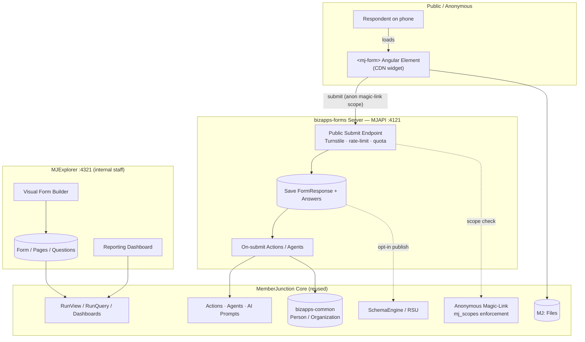
```mermaid
flowchart TB
  subgraph Public["Public / Anonymous"]
    R["Respondent on phone"] -->|loads| W["&lt;mj-form&gt; Angular Element<br/>(CDN widget)"]
  end
  W -->|"submit (anon magic-link scope)"| SUB["Public Submit Endpoint<br/>Turnstile · rate-limit · quota"]
  subgraph ServerBox["bizapps-forms Server — MJAPI :4121"]
    SUB --> SAVE[("Save FormResponse + Answers")]
    SAVE --> HOOK["On-submit Actions / Agents"]
  end
  subgraph AdminBox["MJExplorer :4321 (internal staff)"]
    B["Visual Form Builder"] --> DEF[("Form / Pages / Questions")]
    RPT["Reporting Dashboard"]
  end
  subgraph CoreBox["MemberJunction Core (reused)"]
    AUTH["Anonymous Magic-Link<br/>mj_scopes enforcement"]
    ACT["Actions · Agents · AI Prompts"]
    RV["RunView / RunQuery / Dashboards"]
    RSU["SchemaEngine / RSU"]
    FILES[("MJ: Files")]
    COMMON[("bizapps-common<br/>Person / Organization")]
  end
  SUB -. scope check .-> AUTH
  HOOK --> ACT
  HOOK --> COMMON
  W --> FILES
  RPT --> RV
  DEF --> RV
  SAVE -. opt-in publish .-> RSU
```

### 3.1 Repo skeleton (mirror of `bizapps-common`, verified against that repo)

```
bizapps-forms/
  mj-app.json            # OpenApp manifest (see §11)
  mj.config.cjs          # schema + entity prefix + CodeGen output paths
  package.json           # npm workspace (apps/* + packages/*), turbo
  turbo.json
  migrations/            # VYYYYMMDDHHMM__v*__*.sql  (skyway engine)
  metadata/              # mj-sync seed data (categories, styles, roles, perms)
  packages/
    Entities/            # @mj-biz-apps/forms-entities  (CodeGen entity subclasses)
    Actions/             # @mj-biz-apps/forms-actions    (CodeGen + hand-written actions)
    Server/              # @mj-biz-apps/forms-server     (bootstrap + resolvers + public submit endpoint)
    Angular/             # @mj-biz-apps/forms-ng         (Explorer builder/admin forms + widget)
  apps/
    MJAPI/               # GraphQL API server (port 4121)
    MJExplorer/          # Builder/admin UI (port 4321)
```

Evidence for the template: `bizapps-common/mj-app.json`, `bizapps-common/mj.config.cjs`
(`entityPackageName`, `output[]` for SQL/Angular/GraphQLServer/ActionSubclasses/EntitySubclasses),
`bizapps-common/package.json` (`mj:migrate --schema … --dir ./migrations`, `mj:codegen`,
turbo filters), and `bizapps-common/migrations/B…__Schema_and_Tables.sql`
(`IF NOT EXISTS … CREATE SCHEMA`, then plain `CREATE TABLE` with no `__mj_*` timestamp cols
and no FK indexes — CodeGen adds those).

### 3.2 The two surfaces

- **Respondent widget** — `@mj-biz-apps/forms-ng` builds an **Angular custom element**
  (`<mj-form id="…">`), published to a CDN. Tiny, no Explorer shell, embeddable via a
  `<script>` tag, iframe, popup/slider, full-page, or QR. This is the public-facing ticket.
- **Builder/Admin app** — runs in **MJExplorer**: visual form builder, response management,
  reporting dashboards. Internal staff only; full reuse of MJ dashboard/grid/query infra.

### 3.3 Reuse map — what MJ already gives us (the heart of this plan)

| Need | MJ capability to reuse | Evidence (MJ repo) |
|---|---|---|
| Anonymous internet users | **Anonymous magic-link sessions** — `IdentityMode='anonymous'`, shared Anonymous principal, scope enforced server-side from JWT `mj_scopes` claims (never DB roles → no privilege accretion) | `packages/MJServer/src/auth/magicLink/MagicLinkService.ts`, `types.ts` (`MagicLinkScopeEntry`, `MagicLinkJWTClaims.mj_scopes/mj_anon`), `magicLinkCore.ts` |
| Scoped programmatic access | **API-key scopes** (user ∩ app-ceiling ∩ key) | `packages/MJServer/src/auth/APIKeyScopeAuth.ts` |
| Known-respondent identity | **bizapps-common** Person/Organization/ContactMethod | `bizapps-common/migrations/B…__Schema_and_Tables.sql` |
| AI authoring of forms | Patterns from the **Form Builder agent** + deterministic `Create/Modify Interactive Form` actions | `packages/MJCoreEntities/src/engines/interactive-forms.ts` |
| Promote responses → first-class entity | **Runtime Schema Update (RSU)** pipeline: `SchemaEngine.generateDDL()` → migration → CodeGen → restart; `SchemaEvolution` adds columns over time | `packages/SchemaEngine/src/RuntimeSchemaManager.ts`, `SchemaEvolution.ts`, `MJServer/src/resolvers/RSUResolver.ts` |
| On-submit automation | **Actions / Agents / AI Prompts** | core framework |
| Reporting | RunView/RunViews, RunQuery, BaseDashboard + AG Grid | core framework |

> **NOTE — do NOT reuse MJ Interactive Forms as the survey schema.** Interactive Forms
> (`Type='Form'` Components + `Entity Form Overrides`) are **entity-bound** — they override
> the edit experience of an existing DB record. A survey is a free-standing instrument whose
> shape *is* the data. We build greenfield entities (§5) and only borrow the *patterns*
> (AI-authoring path, runtime resolver shape) from that subsystem.

---

## 4. Anonymous Access Design (the crux)

A public survey must accept submissions from people who have **no account and were never
individually invited**. The scary part — anonymous identity with server-side scope that
cannot be escalated — is **already solved by MJ**. The remaining gap is small and well-defined.

**Mechanism (existing):** MJ magic links support `IdentityMode='anonymous'`. An anonymous
redemption resolves to one **shared Anonymous principal** (seeded UUID
`273910DF-28F1-45C1-A8F8-6E9AD8E5F008`) that holds **no DB roles**; authorization is enforced
against the per-session JWT's `mj_scopes` union (Application + optional `resourceType/resourceId`).
Two anonymous visitors share the identity but hold **different scopes** — no accretion.
Invites carry **`maxUses`**, so a long-lived, high-`maxUses`, anonymous link scoped to one
form = effectively a **public form URL**.

**What we must add (small):**

1. **A `CanCreate` respondent scenario (metadata).** A restricted **"Form Respondent"**
   role with **CanCreate on `FormResponse` / `FormResponseAnswer` only** (and read on the
   published form definition it's scoped to) — nothing else. This is the one deliberate
   exception to the magic-link "read-only" convention. Authored as mj-sync metadata
   (roles + entity-permissions), exactly like the Magic Link recipe in
   `MJ/guides/MAGIC_LINK_GUIDE.md` §4.
2. **A public-write hardening layer (new server code).** Rate limiting, bot/abuse defense
   (**Cloudflare Turnstile** / honeypot, per-form toggle), response-quota enforcement,
   duplicate handling, IP-hash + UA capture. This is the main net-new server work.
3. **A `FormDistribution` object (entity, §5).** "Publish public URL" is a first-class
   record wrapping an anonymous, multi-use, scoped link — with its own quota, expiry,
   open/close window, and per-link analytics.
4. **Provisioning the distribution's magic-link invite (new server code).** When a
   `FormDistribution` is created/activated, mint the anonymous, multi-use, scoped magic-link
   invite — carrying `mj_scopes` that grant the **Form Respondent** role, scoped to the
   distribution, with configurable `maxUses`/expiry — via MJ core's `MagicLinkService`, and
   store its `MagicLinkInviteID` on the record. Implemented as a server-side `FormDistribution`
   entity lifecycle hook so it fires however the distribution is created (builder, AI, import).
   **Install prerequisite:** the host MJ instance must enable core `magicLink` and allow the
   Form Respondent role to be granted (`restrictedRoleName`/`grantableRoleNames`); MJ
   auto-generates its signing keys. _(Added 2026-06-30 — the original plan named
   `MagicLinkInviteID` but never assigned who mints it; this closes that gap.)_

**Submission path:** anonymous multi-use magic link scoped to a `FormDistribution`
→ widget loads published `FormVersion` (read) → respondent answers → public submit endpoint
(Turnstile + rate-limit + quota check) → Save `FormResponse` + `FormResponseAnswer` rows
→ fire on-submit Actions/Agents.

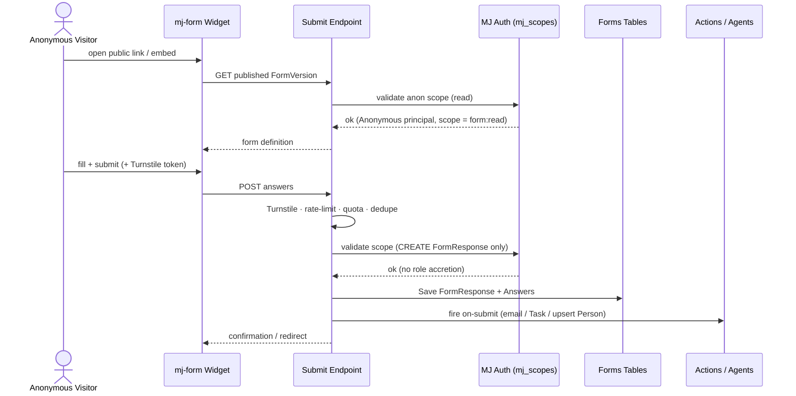
```mermaid
sequenceDiagram
  actor V as Anonymous Visitor
  participant W as mj-form Widget
  participant S as Submit Endpoint
  participant A as MJ Auth (mj_scopes)
  participant DB as Forms Tables
  participant X as Actions / Agents
  V->>W: open public link / embed
  W->>S: GET published FormVersion
  S->>A: validate anon scope (read)
  A-->>S: ok (Anonymous principal, scope = form:read)
  S-->>W: form definition
  V->>W: fill + submit (+ Turnstile token)
  W->>S: POST answers
  S->>S: Turnstile · rate-limit · quota · dedupe
  S->>A: validate scope (CREATE FormResponse only)
  A-->>S: ok (no role accretion)
  S->>DB: Save FormResponse + Answers
  S->>X: fire on-submit (email / Task / upsert Person)
  S-->>W: confirmation / redirect
```

~~**Open follow-up:** confirm the **minimum MJ version** that includes (a) anonymous
magic-link `mj_scopes` enforcement and (b) RSU — pin `mjVersionRange` accordingly (default
assumption: `>=5.44.0`).~~ **Resolved 2026-07-30 → `>=5.50.0 <6.0.0`.** Both capabilities ship well
below that; the floor is set instead by the hard sibling dependencies (`>=5.44.0`) and by CodeGen's
`includeSchemas` allow-list, which first lands in 5.50.0. See DG-1 in §10.

---

## 5. Data Model

Schema **`__mj_BizAppsForms`**, entity prefix **`Forms:`** (decision DG-2 — note the
`Forms: Forms` stutter on the root table; alternative is to name the root table
`FormDefinition` → `Forms: Definitions`). No `__mj_*` timestamp cols, no FK indexes
(CodeGen adds them). `sp_addextendedproperty` on every business column.

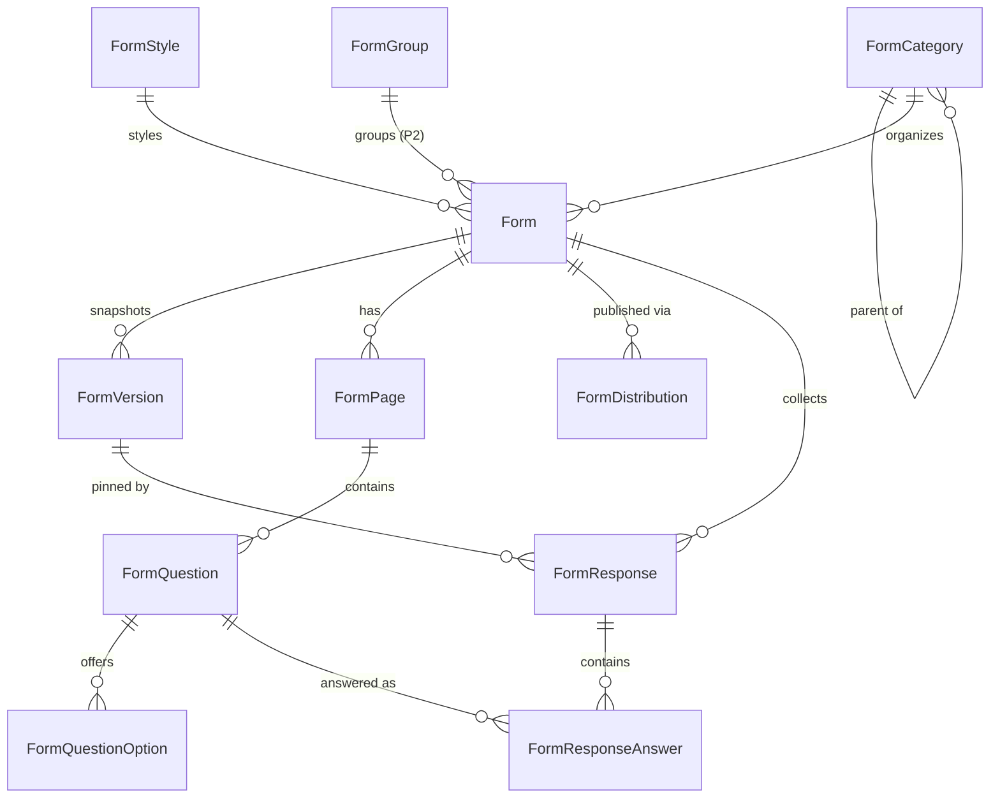
```mermaid
erDiagram
  FormCategory ||--o{ FormCategory : "parent of"
  FormCategory ||--o{ Form : organizes
  FormStyle ||--o{ Form : styles
  FormGroup ||--o{ Form : "groups (P2)"
  Form ||--o{ FormVersion : "snapshots"
  Form ||--o{ FormPage : has
  FormPage ||--o{ FormQuestion : contains
  FormQuestion ||--o{ FormQuestionOption : offers
  Form ||--o{ FormDistribution : "published via"
  Form ||--o{ FormResponse : collects
  FormVersion ||--o{ FormResponse : "pinned by"
  FormResponse ||--o{ FormResponseAnswer : contains
  FormQuestion ||--o{ FormResponseAnswer : "answered as"
```

### 5.1 Phase 1 entities (MVP)

- **FormCategory** — `Name, Description, ParentID (self-FK, hierarchy), IconClass,
  DisplayRank, IsActive`. Organizes forms in a tree.
- **FormStyle** — master list of reusable themes/CSS sets for departments/brands.
  `Name, Description, CSSVariables (JSON of --mj-* token overrides), CustomCSS (NVARCHAR MAX),
  LogoURL, IsActive, DisplayRank`. A Form links to one for styling.
- **Form** — `Name, Description, CategoryID (FK), StyleID (FK, nullable), Status
  (Draft|Published|Closed), OwnerUserID, RenderMode (Scroll|OneQuestion), Settings (JSON:
  anon-allowed, captcha-on, quota, open/close dates, confirmation message/redirect),
  FormGroupID (nullable, Phase 2 — see §5.2)`.
- **FormVersion** — immutable published snapshots. `FormID, VersionNumber, Status
  (Draft|Published|Retired), PublishedAt, DefinitionSnapshot (JSON — the full
  pages/questions/options/logic as-published)`. Responses pin a `FormVersionID` so a form can
  evolve without corrupting historical data.
- **FormPage** — `FormID, Title, Description, DisplayOrder, ConditionalRule (JSON,
  show-if logic — §6)`.
- **FormQuestion** — `FormID, PageID, QuestionType (value-list — §5.3), Prompt, HelpText,
  IsRequired, DisplayOrder, ValidationRule (JSON), ConditionalRule (JSON),
  ScoringConfig (JSON, nullable — e.g. "LLM-judge with prompt X" or numeric weights),
  Settings (JSON, per-type)`.
- **FormQuestionOption** — `QuestionID, Label, Value, DisplayOrder, IsDefault`.
- **FormResponse** — `FormID, FormVersionID, Status (Partial|Complete), AnonymousSessionID
  (mj_sid), RespondentPersonID (nullable FK → `MJ_BizApps_Common` Person, for identified
  respondents), StartedAt, SubmittedAt, SourceMetadata (JSON: ip-hash,
  ua, distribution id, referrer)`.
- **FormResponseAnswer** — `ResponseID, QuestionID, TextValue, NumericValue, DateValue,
  BooleanValue, JSONValue (for multi/complex), FileID (→ MJ: Files), Score (nullable),
  ScoreRationale (nullable — LLM-judge output)`. The query-able EAV-ish store; typed columns
  + JSON fallback.
- **FormDistribution** — `FormID, Name, Slug, ChannelType (PublicLink|Embed|QR|Email),
  Status, OpenAt, CloseAt, MaxResponses, ResponseCount, MagicLinkInviteID (the anonymous
  multi-use scoped link), CaptchaRequired, IsActive`. One Form can have many distributions.

### 5.2 Phase 2 entities / extensions

- **FormGroup** — `Name, Description, MaterializedEntityID (nullable — the RSU bridge)`.
  `Form.FormGroupID` is a nullable FK. When a Form belongs to a FormGroup that has a
  `MaterializedEntityID`, responses for the whole group are projected into that single
  first-class entity (e.g. all yearly "Annual Meeting Survey" forms → one
  `AnnualMeetingSurvey` table, column-evolved across years via SchemaEvolution).
- **Materialization / RSU** (§8.2), advanced conditional logic & scoring beyond §6 basics,
  payment question type, partial-response resume, advanced quotas.

### 5.3 Question type taxonomy (value-list on FormQuestion.QuestionType)

**Table-stakes (Phase 1):** ShortText, LongText, Email, Phone, Number, SingleChoice
(radio), MultiChoice (checkbox), Dropdown, Rating (stars/scale), NPS, YesNo, Date, Time,
FileUpload, Statement (display-only/section header).
**Advanced (Phase 2):** Matrix/Grid, Ranking, Address (→ bizapps-common), Signature,
Payment, Calculated.

### 5.4 Dual persistence (the design you locked)

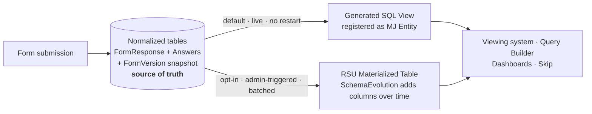
```mermaid
flowchart LR
  SUB["Form submission"] --> SoT[("Normalized tables<br/>FormResponse + Answers<br/>+ FormVersion snapshot<br/><b>source of truth</b>")]
  SoT -->|"default · live · no restart"| VIEW["Generated SQL View<br/>registered as MJ Entity"]
  SoT -->|"opt-in · admin-triggered · batched"| RSU["RSU Materialized Table<br/>SchemaEvolution adds columns over time"]
  VIEW --> TOOL["Viewing system · Query Builder<br/>Dashboards · Skip"]
  RSU --> TOOL
```

- **Generic normalized tables are ALWAYS the source of truth** (`FormResponse` +
  `FormResponseAnswer` + the `FormVersion` snapshot). Every submission lands here, fast, no
  restart.
- **Reporting projection (two tiers, Phase 2):**
  1. **View-projection (default, lightweight):** a generated denormalized SQL **view** per
     form/group, registered as an MJ entity → Skip / query-builder / dashboards work, **no
     MJAPI restart**, live. Column set fixed at generation.
  2. **RSU-materialized table (heavyweight, opt-in):** for the "first-class evolving table
     users will extend themselves" case — full table via the RSU pipeline
     (`RuntimeSchemaManager`), columns evolved over time via `SchemaEvolution`.
- **CRITICAL operational constraint:** RSU **commits a migration, runs CodeGen, and restarts
  MJAPI** (gated by `ALLOW_RUNTIME_SCHEMA_UPDATE=1`, serialized by a mutex, blocks `__mj`).
  Therefore materialization is an **explicit, admin-triggered, batched "Publish to Entity"
  action — NEVER a per-submission hot path.** Default to view-projection; let users "promote"
  to a materialized table deliberately.

---

## 6. Conditional Logic (Phase 1 basics only)

Stored as **declarative JSON `ConditionalRule`** on FormPage and FormQuestion. Phase 1
supports show/hide based on prior answers (skip-to-page and the other rule verbs ship with
`plans/RULES_AND_BRANCHING_PLAN.md` — this section previously claimed skip-to-page, which
never existed in the code):

```jsonc
{ "show": { "all": [ { "questionId": "<q>", "op": "equals", "value": "Other" } ] } }
```

Operators: `equals, notEquals, equalsIgnoreCase, in, notIn, isAnswered, isNotAnswered,
greaterThan, lessThan, contains, startsWith, endsWith`.
Combinators: `all` / `any`. Evaluated client-side in the widget and re-validated server-side
on submit. **Out of scope for P1:** calculated fields, expression language, quotas, visual
flow-graph. Anything heavier is a Phase-2 candidate or an MJ Action.

---

## 7. AI Authoring ("super easy setup")

An **MJ AI Agent / Action** authors form metadata from a natural-language brief
("a 5-question event RSVP with dietary restrictions and a +1 count"). It writes the
`Form / FormPage / FormQuestion / FormQuestionOption` rows via entity `Save()` (or mj-sync),
reusing the deterministic-builder pattern proven by the **Form Builder agent**
(`packages/MJCoreEntities/src/engines/interactive-forms.ts`). Round-trip: agent drafts →
human tweaks in the builder → publish. This is the headline "easy setup" story; pair it with
a starter template gallery for the no-AI path.

---

## 8. Reporting

### 8.1 Core (Phase 1)
A BaseDashboard in the Explorer admin app: summary stats, per-question breakdowns (charts via
AG Grid / chart components), filtering/cross-tab, completion & drop-off funnel, individual
response view, CSV/Excel export. Built on RunView/RunViews + RunQuery — no new infra.

### 8.2 First-class projection (Phase 2)
View-projection (default) and RSU-materialization (opt-in) per §5.4, unlocking the full MJ
toolchain — viewing system, query builder, dashboards, and **Skip** — over survey data as
native entities. This is the reporting differentiator no incumbent has.

---

## 9. Phases & Tasks

### Phase 0 — Repo bootstrap ✅ COMPLETE
- [x] Create `bizapps-forms` repo from the bizapps-common skeleton (mj-app.json, mj.config.cjs,
      package.json workspace, turbo.json, packages/{Entities,Actions,**CoreEntitiesServer**,Server,Angular},
      apps/{MJAPI,MJExplorer}). _Built from a fresh-scaffold variant of the bizapps-common Open App
      skeleton, then `CoreEntitiesServer` added to fully mirror bizapps-common's package set._
- [x] Set schema `__mj_BizAppsForms`, scope `@mj-biz-apps/forms-*`, prefix `MJ_BizApps_Forms:` (DG-2),
      ports 4121/4321, `mjVersionRange >=5.43.0 <6.0.0` (DG-1 — see Progress Log).
- [x] Pull this plan into `plans/FORMS_BUILD_PLAN.md` (byte-for-byte from MJ PR #2971).

### Phase 1 — MVP (the differentiating slice) — ✅ BUILD COMPLETE (audited 2026-07-01)
- [x] Migration: schema + Phase-1 tables (§5.1) applied to `MJ_Forms` (localhost:1456); all 10 tables live.
- [x] `MJ_BizApps_Forms: …` entity subclasses generated (CodeGen) + verified (build green).
- [x] mj-sync seed: FormCategory starter tree (9), FormStyle defaults (3 — Editorial/Aurora/Warm),
      **Form Respondent role + 9 entity permissions** (CanCreate on Form Responses/Answers only),
      Application + nav + reporting Dashboard record. **Pushed to DB: 33 records, 0 errors.**
- [x] **Public submit endpoint** (forms-server): `PublishedForm` + `SubmitFormResponse` custom
      resolvers — anon mj_scopes/CanCreate check + Turnstile (fail-closed) + rate-limit + dual quota
      + dedupe + IP-hash(session) → Save response/answers → fire on-submit Actions by name. In schema. 33 tests.
- [x] **Respondent widget** (forms-ng → Angular element): both render modes, mobile-first/WCAG-AA,
      FormStyle token theming, §6 conditional logic (shared evaluator), file upload, partial save. 18 tests.
- [x] **Builder/admin app** (MJExplorer): visual builder (registers as Forms entity-form override),
      publish→FormVersion snapshot, FormDistribution management (public link/embed/QR). 40 tests.
- [x] **AI authoring** action `Forms: Generate Form From Brief` → invokes the **metadata-driven
      `Forms: Form Designer` AIPrompt** (Gemini via `SelectionStrategy=Specific` + AIPromptModel — model
      in metadata, NOT code; see [[ai-model-selection-via-metadata]]), zod-validated `FormBlueprint`,
      deterministic Designer→Builder split. Plus `Forms: Create Form From Template` + **5** starter
      templates (contact · rsvp · nps · lead-capture · application).
- [x] **Reporting dashboard** (§8.1): summaries, per-question breakdowns, NPS, funnel, response
      list/detail, CSV/Excel export (MJ `ExportService`) — live RunView/RunQuery (`useMock=false`
      default), stats scoped by **FormID** (not latest version), registered as `FormsReportingDashboard`
      (plus a `FormsHomeDashboard` home tab).
- [x] On-submit hooks (forms-actions, seam S3) — **4, all real**: `Forms: Upsert Respondent Person`
      (matches/creates `MJ_BizApps_Common: People`, stamps `RespondentPersonID`), `Forms: Send
      Confirmation Email` (CommunicationEngine-backed, metadata/config-driven sender),
      `Forms: Create Followup Task` (bizapps-tasks Task + TaskLink), **`Forms: Analyze Written
      Responses`** (metadata-driven AIPrompt scores free-text → `Score`/`ScoreRationale`; **running
      live**; truncated-JSON salvage handles Gemini's uncontrollable output cap).
- [x] **Distribution magic-link provisioning** (§4 item 4): server-side `FormDistribution`
      lifecycle hook that mints the anonymous, scoped, multi-use magic-link invite and stores
      `MagicLinkInviteID` + `PublicLinkToken`. Configurable; gated on host `magicLink` config.
      _(Verified built + tested 2026-07-01 — the §9 checkbox had lagged the Progress Log.)_
- [x] Tests: **434 Vitest passing** (Entities 24 · Actions 61 · Server 159 · Angular 162 ·
      CoreEntitiesServer 26 · MJAPI 2 — the earlier "396" omitted CoreEntitiesServer entirely, and
      "427" predated both the `npm test` root task and this branch's new specs). Color-token
      CI gate enforced (0 violations); mj-btn gate coded but disabled (0 `mj-btn` by convention).
- [x] **Live anonymous-submit e2e** (2026-07-30): mint link → `/f/:slug` redeem → PublishedForm →
      SubmitFormResponse persists + all 4 hooks fire, driven from a real browser. Codified as
      `npm run smoke:respondent`, which reproduces the 0.2.x failure when the fix is reverted.
- **Remaining for Phase 1 close (deploy/verify, not build):** (1) deploy-time provider config —
      `FORMS_TURNSTILE_SECRET`, email `CommunicationProvider` + `FORMS_EMAIL_FROM`, storage account
      (all code-complete, unconfigured — see `.env.example`); (2) Explorer studio/builder/dashboard
      exercised by a human against a real host login; (3) enable mj-btn CI gate if adopted;
      (4) strengthen widget flaky-network resilience (§2).
- **Housekeeping (audit-found) — all closed:** ~~orphaned `migrations/codegen/` CodeGen SQL~~ (the
      directory is `.gitignore`d, nothing generated is tracked); ~~fix `.actions.json` param
      `ResponseID`→`FormResponseID`~~ (already done — see the Housekeeping note above);
      ~~add a `Forms: Create Followup Task` unit test~~ (`create-followup-task.action.spec.ts`).

### Phase 2 — Power
- [ ] FormGroup + MaterializedEntityID; **view-projection** (default) and **RSU
      materialization** (opt-in, admin-triggered, batched) — §5.4 / §8.2.
- [ ] Advanced question types (Matrix, Ranking, Address→bizapps-common, Signature, Payment).
- [ ] LLM-judge scoring pipeline on free-text answers (ScoringConfig).
- [ ] Review/approve-before-publish routing via **bizapps-tasks** (FormVersion status state machine + a "Form Approval" TaskType whose OnComplete/OnReject hooks call Forms actions).
- [ ] Partial-response resume, advanced quotas, richer conditional logic.

---

## 10. Decision Gates / Open Questions

- **DG-1 — Min MJ version. ✅ RESOLVED (2026-07-30) → `>=5.50.0 <6.0.0`.** Not set by the two
  capabilities in the original question — both ship well below 5.50 — but by the hard sibling
  dependencies (`bizapps-common` / `bizapps-tasks`, each `>=5.44.0`) and by CodeGen's `includeSchemas`
  allow-list, which first lands in 5.50.0. The earlier `5.43.0` answer was unsatisfiable; see the
  superseded DG-1 entry in the Progress Log.
- **DG-2 — Entity prefix/naming.** `Forms:` prefix (accept `Forms: Forms` stutter) vs. rename
  root table `FormDefinition`. (Default: `Forms:` prefix.)
- **DG-3 — Repo/scope name.** Repo `bizapps-forms`; product/display name **MJ Forms**; npm
  scope `@mj-biz-apps/forms-*` (consistent with `@mj-biz-apps/common-*`). (Locked by owner.)
- **DG-4 — Anti-abuse provider.** Cloudflare Turnstile (recommended, free, privacy-friendly)
  vs. hCaptcha vs. honeypot-only default. Per-form toggle either way.
- **DG-5 — Widget hosting/distribution.** CDN host for the Angular element; versioning &
  cache strategy; iframe vs. direct-element embed default.
- **DG-6 — Response store shape.** Confirm typed-columns + JSON-fallback on
  `FormResponseAnswer` (recommended) vs. pure-JSON. Affects query/projection ergonomics.

---

## 11. Repo Bootstrap Specifics (defaults for the build session)

> **Historical.** This section is the pre-build seed, kept as the record of what Phase 0 was told to
> create. The repo now has real files and **they are authoritative** — in particular `mjVersionRange`
> is `>=5.50.0 <6.0.0` and the version is whatever the last release published, not the `>=5.44.0` /
> `0.1.0` written below. Do not copy from here.

`mj-app.json` (mirroring `bizapps-common/mj-app.json`):

```jsonc
{
  "$schema": "https://schema.memberjunction.org/mj-app/v1.json",
  "manifestVersion": 1,
  "name": "mj-bizapps-forms",
  "displayName": "MJ Forms",
  "description": "Forms, surveys & intake for MemberJunction — anonymous-friendly, mobile-first, responses as first-class records.",
  "version": "0.1.0",
  "license": "ISC",
  "icon": "fa-solid fa-list-check",
  "publisher": { "name": "MemberJunction", "url": "https://memberjunction.com" },
  "repository": "https://github.com/MemberJunction/bizapps-forms",
  "mjVersionRange": ">=5.44.0 <6.0.0",
  "schema": { "name": "__mj_BizAppsForms", "createIfNotExists": true },
  "migrations": { "directory": "migrations", "engine": "skyway" },
  "metadata": { "directory": "metadata" },
  "packages": {
    "server": [{ "name": "@mj-biz-apps/forms-server", "role": "bootstrap", "startupExport": "LoadBizAppsFormsServer" }],
    "client": [{ "name": "@mj-biz-apps/forms-ng", "role": "bootstrap", "startupExport": "LoadBizAppsFormsClient" }],
    "shared": [
      { "name": "@mj-biz-apps/forms-entities", "role": "library" },
      { "name": "@mj-biz-apps/forms-actions", "role": "library" }
    ]
  },
  "code": { "visibility": "public", "sourceDirectory": "packages" },
  "categories": ["Forms", "Surveys", "Productivity"],
  "tags": ["forms", "surveys", "intake", "feedback", "nps"]
}
```

- `mj.config.cjs`: `entityPackageName: '@mj-biz-apps/forms-entities'`, the same `output[]`
  block as bizapps-common (SQL / Angular / GraphQLServer / ActionSubclasses /
  EntitySubclasses / DBSchemaJSON), entity name prefix `MJ_BizApps_Forms:`, post-codegen build commands.
- `package.json`: workspaces `apps/*` + `packages/*`; `mj:migrate --schema __mj_BizAppsForms
  --dir ./migrations`; `mj:codegen`; turbo build/start filters for `mj_api` / `mj_explorer`.
- Ports: MJAPI **4121**, MJExplorer **4321** (common=4101/4301).
- Branching: `next` (integration) → `main` (release), feature branches track same-named
  remote (bizapps convention).

---

## 12. Progress Log

- **2026-08-13 — the seed that finally shipped was shipping an exploit, and could not install
  where it was needed most.** Found from the other side: bizapps-caliber#219 was bricked by our
  0.8.0 seed, and fixing it there surfaced three defects here (#39, plan
  `plans/ISSUE-39-RESPONDENT-SEED-HARDENING-PLAN.md`, PR #40). All three were re-verified against
  this repo before any code was written.

  1. **The `CanCreate` grant doubled as direct write access.** The seed created all nine
     `Form Respondent` permission rows with every RLS filter column explicitly NULL, and MJ's
     `UserExemptFromRowLevelSecurity` treats a null `CreateRLSFilterID` as exemption from
     create-time RLS. Since MJ publishes a generic `Create<Entity>` mutation for every entity, the
     flag that exists only to satisfy `checkRespondentScope` also let any anonymous respondent
     write response rows that never entered `submit-pipeline.ts` — past Turnstile, the rate
     limiter, the `MaxResponses` quota, field validation and the open/close window, all of which
     live only there. Caliber proved the class by exploit against its own widget role.
  2. **Every unfiltered read was an instance-wide read**, because one shared anonymous principal
     backs every respondent: any respondent to any form could enumerate every `FormDistribution`
     row, `PublicLinkToken` included.
  3. **`spCreateRole` was a blind INSERT into a table whose `Name` is UNIQUE**, so 0.8.0 halted the
     chain with `Msg 2627` on every host that had installed Caliber first — and a repair shipped as
     a later migration could never run there, because the chain never reaches it.

  **Two things verification found that the issue did not state, and both changed the fix.** Five of
  the seven read grants were *dead*: the entire anonymous surface is `PublishedForm`,
  `SubmitFormResponse` and the upload endpoint, all of which resolve through
  `resolvePublishedDefinition`, which reads only Distributions and Versions — the published
  version's `DefinitionSnapshot` already carries the questions, options, pages and style tokens. So
  they were **removed rather than filtered**, a special case designed out of existence. And
  adopt-or-skip on the role INSERT alone would not have worked: the nine permission rows and the
  automation principal's `UserRole` all hardcoded the role id, so on exactly the hosts the guard
  rescues they would have pointed at an id that does not exist.

  Shipped as `V202608131600__v0.10.x__Respondent_Grant_Hardening.sql` (three Forms-owned RLS filter
  records, attached unconditionally — pointing our rows at *Caliber's* records is what let Caliber's
  uninstall return them to NULL), plus an **in-place edit of the 0.8.0 seed**, which
  `migrations/README.md` otherwise forbids and now records as its one exception: the file could not
  apply at all on the hosts needing the fix, and Skyway's `Migrate()` resolves applied migrations by
  version without ever checksum-validating them.

  **Two lessons worth carrying.** A postcondition that re-tests the predicate of the statement above
  it is a tautology that reads like protection — two of the first draft's three checks were exactly
  that, and were replaced by one reachable check scoped to `MJ_BizApps_Forms:` entities (never
  role-wide: `Form Respondent` is shared, and a role-wide assertion about a sibling app's rows is
  what bricked Caliber). And a fix that lives only in `migrations/` while `metadata/` still
  describes the old state is half a fix — the next seed regeneration gets a later timestamp and
  silently undoes it, which is now recorded in `.entity-permissions.json` itself.

  Verified by replay against SQL Server, 33 assertions across three suites: every postcondition
  proved to fire on a database engineered to break it; the pre-edit seed reproducing `Msg 2627` and
  the edited one adopting the role on the same database; convergence and byte-identical idempotence;
  Caliber co-install with its own THROW 50021 still passing and a simulated Caliber uninstall
  leaving all four slots filtered; and the shipped filter text, read back out of the database,
  proving cross-form isolation and fail-closed behaviour on an absent scope claim.

  **And then it was verified end to end**, after an earlier revision of this entry recorded the
  exploit smoke as written-but-unrun. A dev harness was reconstructed from `cc13065^` (the commit
  that dropped it; not committed back — it is scaffolding) and **all five smoke suites plus the
  binding fixture** were run against a hardened sandbox: respondent, scope (12/12), binding (13/13),
  automation semantics, and upload provenance — the last being the one that most needed running,
  since `POST /forms/upload` resolves its definition under the anonymous user and therefore sits
  behind the new scoped read filters. The scope suite was also run against the **unhardened** state
  and fails there 8/12, printing the response-create exploit and the `PublicLinkToken` leak
  verbatim; without that half a green run could not distinguish a working test from a test that
  cannot fail — which is not hypothetical, because running it that way is what exposed three checks
  in the smoke itself that had been passing for the wrong reason. Two operational notes for whoever
  runs these next: the suites need `FORMS_RATELIMIT_MAX` raised (documented in
  `guides/ENTITY_BINDING_GUIDE.md`; `smoke:automation` submits 8 times against a default of 5/min),
  and the two that shell out to `sqlcmd` need `.env` exported into the process.

- **2026-08-08 — MJ Forms had never been installable by anyone but its author.** Asked whether an MJ
  upgrade needs an `mj sync` migration (it does not — MJ ships its own core Metadata_Sync per release
  band, applied by `npx mj migrate -t`), which surfaced that **this repo had never shipped a metadata
  seed migration at all**. `metadata.directory` in `mj-app.json` is documentation; MJ's install engine
  never reads it. So ~56 records — the Form Respondent role, its response-only `CanCreate` grants,
  styles, categories, actions, prompts, the application, nav and dashboards — existed only in
  `MJ_Forms_Dev`. The mechanical cause was a missing `sqlLogging.formatAsMigration` block in
  `metadata/.mj-sync.json`; both sibling Open Apps ship one and Forms did not.

  Now shipped as `V202608081700__v0.8.x__Metadata_Sync.sql` (84 records), generated against an emptied
  database so every statement is a CREATE, and verified by emptying that database again and replaying
  **the migration** rather than the push. **The generator's output cannot ship verbatim**: MetadataSync
  writes core SP calls with `${flyway:defaultSchema}` because in MJ's own repo the default schema *is*
  the core schema — here that would have called `__mj_BizAppsForms.spCreateRole`, an object that does
  not exist, on every install.

  **Four defects, none reachable by unit tests, each found only by running something end to end:**
  1. `${commonSchema}` resolved locally (from *our* `mj.config.cjs`) but not at install (built from the
     *host's*), and Skyway leaves unknown placeholders untouched rather than failing — so it shipped as
     a literal string and silently stopped excluding `__mj_BizAppsCommon` from five CodeGen sweeps.
  2. The teardown could not remove a *used* installation: remove runs it before dropping the app schema,
     so `FormAutomation` still references the Actions being retired — leaving them blocks the delete,
     NULLing them violates `CK_FormAutomation_SingleTarget`. A pristine canary passes either way.
  3. `smoke/seed-binding-smoke.mjs` minted its own principal under a different GUID; once the seed
     shipped one, `Role.Name` being UNIQUE meant any database that had run the fixture could no longer
     apply the migration.
  4. The `Forms Automation Runner` role held no read on `MJ_BizApps_Forms: Forms` or `Form Questions`,
     which its own runtime reads — so automations-on-by-default would have failed on every fresh
     install, response saved and every side effect silently skipped.

  Also: automations now ship **on** (the principal *and* its `user-roles` grant — the two are useless
  apart), `SchemaInfo.EntityNamePrefix` is declared in the database so a host's CodeGen cannot misname
  Forms entities (caliber's #119, inoculated), `mj app remove` retires our `__mj` rows, and
  `npm run lint:distribution` + `distribution-gate.yml` guard both defect classes with self-tests that
  prove the gate fires. Verified: full migration set applied **from zero** (7 applied, 0 failed) against
  a database with Forms fully removed, then all four smoke suites green against a real database —
  binding 13/13, automation semantics, upload provenance, and the anonymous respondent path.
  `MJ_Forms_Dev` was reconciled to the shipped GUIDs; it had also been missing 6 entity permissions
  outright. Still unproven, and unprovable before the v0.8.0 tag exists: the actual `mj app install`,
  which fetches manifest and migrations from GitHub at a version tag.

- **2026-07-31 — release prep for 0.3.0: the publish workflow could not have shipped a minor.**
  `.github/workflows/publish.yml` predicted the next version from *"were any migrations added since the
  last tag"* and then failed the job if `changeset version` disagreed. This release is a deliberate
  minor with no schema change, so the workflow expected `0.2.2`, changesets produced `0.3.0`, and the
  guard would have killed the run before anything published. The prediction now reads the highest bump
  the changesets actually declare, with a new migration flooring it at minor — the heuristic kept as a
  backstop rather than the source of truth. Two branches were latently broken and are now covered by a
  local table-test: a `major` changeset written with **single** quotes (which is what `npx changeset`
  emits here) never matched the old `^"@mj-biz-apps/…"` pattern, so a major would have released as a
  patch. Status Snapshot, §9 and DG-1 refreshed in the same pass — the snapshot still claimed the
  `5.43.0` pin and a `427` test count, and DG-1 still asserted the unreproducible "5.44.0 is not
  published" finding.
- **2026-07-28/30 — the product was stood up for the first time, and had never worked.** What began as
  a check on whether the #10 fix held (it did — a CodeGen re-run against a database carrying all three
  app schemas produced output byte-identical to what shipped in `0.2.1`) required standing MJ Forms up
  end to end, which nothing had done before. **The anonymous submit path could not succeed in any
  published version.** Landed on `chore/forms-hardening-followups`, merged to `next` as PR #13, and
  released as **0.3.0**.
    - **Two independent respondent-path defects, either alone fatal.** (1) The published-version check
      compared GUIDs **case-sensitively**: MJ mints the id client-side at `NewRecord()` and the publish
      snapshot embeds that lowercase spelling, SQL Server returns it uppercased, and the widget echoes
      the snapshot's spelling back — so every submission was rejected with `version-mismatch`. Fixed at
      the comparison, not at publish time, so already-published forms are repaired too. (2)
      `form-scroll.component` is standalone and never imported `FormsModule`, so `NgForm` never applied,
      `(ngSubmit)` bound to nothing, and the browser ran its **native** submit — the page navigated away
      and aborted the in-flight mutation. That also *masked* defect 1, so the form appeared to silently
      reset and discard everything typed. Both trace to commits first tagged `v0.2.0`.
    - **`npm run smoke:respondent`** now drives the real public surface (host page → session token →
      widget bundle → published definition → submit), deliberately submitting the `formVersionId` read
      from the snapshot rather than from the database — the two spellings differ in case. Reverting the
      one-line GUID fix turns it red with the original `version-mismatch`, which is how it was verified.
    - **MJ pin `5.43.0` → `5.50.0`**, including the core `__mj` migration the pin bump alone does not
      do (`npx mj migrate -t v5.50.0`; watermark matched the recorded frontier). One genuine upstream
      break: 5.50's `@memberjunction/ng-auth-services` declares `@workos-inc/authkit-js` as a
      **required** peer, so MJExplorer would not compile without it.
    - **CodeGen moved to an `includeSchemas` allow-list.** A deny-list can only name schemas known in
      advance, and a real deployment carries Open Apps this repo has never heard of —
      `__mj_BizAppsCaliber` shares a database with Forms today and appeared nowhere in the deny-list, so
      a CodeGen run there would have regenerated #10 exactly. Output is byte-identical, so the change is
      behaviour-preserving.
    - **Contamination the #10 fix missed:** `apps/MJAPI/schema.graphql` still carried **392**
      foreign-schema references, and the scope gate never scanned `.graphql` at all — restoring the
      contaminated file and running the gate reported PASS. The gate now covers it (self-test 19 → 35
      checks) and the workflow's path filter actually triggers on it.
    - **Two of four on-submit hooks could never work:** the MJAPI harness never registered the siblings'
      entity subclasses, so `GetEntityObject` returned a bare `BaseEntity` and every field assignment
      was lost. Three helpers also collapsed MJ's per-field validation detail into a bare `null`, so a
      real defect surfaced as `"Failed to create Person record."` and nothing else.
    - **No CI workflow ran any tests** — all 434 could have been red and a PR would still have gone
      green — and the suite could not be run from the root at all, because `turbo.json` declared no
      `test` task. Both fixed; path filters widened past `packages/**`.
    - **The repo could not be stood up**: no `.env.example`, no DB config anywhere, and MJAPI's own boot
      message told operators to run `npm run build:widget`, which did not exist. Also ported MJ's rules
      (`data-access`, `typescript-style`, `testing`, `design-tokens`) and Caliber's `mj-upgrade` skill,
      corrected against this repo — this one uses `.spec.ts`, has no `@memberjunction/test-utils`, no
      Sass, and has a `packages/CoreEntitiesServer` that Caliber's `bump-pins.sh` omits.
- **2026-07-27 — Issue #10 fixed: CodeGen scoped to `__mj_BizAppsForms`.** `forms-server@0.2.0`
  shipped generated GraphQL resolvers for the *sibling* schemas (`__mj_BizAppsCommon`,
  `__mj_BizAppsTasks`) as well as its own, because `mj.config.cjs` `excludeSchemas` listed only the
  core schemas. Since MJ's server-bootstrap merges every installed package's `RESOLVER_PATHS` into
  one type-graphql schema, and both siblings are *hard* dependencies that are always installed
  alongside Forms, the duplicate type names made **MJAPI fail to start outright** in every real
  deployment. Fixed by adding both sibling schemas to `excludeSchemas` and removing the
  foreign-schema artifacts from `packages/{Entities,Server,Angular}/…/generated`.
    - **Verification:** `forms-server` now contributes **50** generated classes (was 195), with
      **zero** name overlap against `tasks-server` (was 95, complete) or `common-server` (was 50,
      complete) — measured by extracting class names from all three packages' built
      `dist/generated/generated.js`. Full build 7/7 green; 426 tests pass across 52 files.
    - **Consequence for the two on-submit actions:** `Forms: Create Followup Task` and
      `Forms: Upsert Respondent Person` had been importing sibling entity classes *from*
      `@mj-biz-apps/forms-entities` — which only compiled because of this bug, and violated
      CLAUDE.md rule 5 (no re-exports between packages). They now take those types (type-only,
      fully erased at build time) from `@mj-biz-apps/tasks-entities` / `@mj-biz-apps/common-entities`.
    - **New guard:** `npm run lint:generated` (`scripts/check-generated-schema-scope.mjs`) plus a CI
      workflow fail the build if an unscoped CodeGen run ever reintroduces foreign-schema artifacts.
    - **Caveat — CodeGen was never re-run:** no database is reachable from the dev environment, so
      the output was pruned deterministically instead. `excludeSchemas` is the durable fix but is
      *unexercised*; the first real regen is its true test. The MJAPI boot repro is likewise still
      outstanding. Full detail, including a stale-pin follow-up (MJ 5.44.0 **is** published now —
      latest 5.49.0 — so the CLAUDE.md rationale for pinning 5.43.0 no longer holds), is in
      [`plans/ISSUE_10_RESOLVER_SCOPING_FIX_PLAN.md`](ISSUE_10_RESOLVER_SCOPING_FIX_PLAN.md) §6.
- *(pre-build)* Plan authored in MJ repo as portable seed. Competitive pricing (§1.3) flagged
  for live re-verification. Next: pull into `bizapps-forms`, execute Phase 0.
- **2026-06-28 — Phase 0 complete; Phase 1 started.** Scaffolded `bizapps-forms` from the
  bizapps-common Open App skeleton (used a fresh-scaffold variant of the bizapps-common skeleton as the concrete
  base, then added `packages/CoreEntitiesServer` = `@mj-biz-apps/forms-core-entities-server`, wired
  into the Server bootstrap, to fully mirror common's 5-package set). All scaffold identifiers,
  semantics, branding, ports, and version pins set to Forms. Authored `mj-app.json`, a
  world-class root `README.md`, and a Forms-specific `CLAUDE.md`.
    - **DG-1 (min MJ version) resolved → pin `5.43.0`.** ⚠️ **SUPERSEDED 2026-07-30 → `5.50.0`, and the
      reasoning below was wrong.** `@memberjunction/*@5.44.0` *is* published; the 404 recorded here was
      never reproducible. More importantly the floor was unsatisfiable regardless of what npm carried:
      `bizapps-common` and `bizapps-tasks` both require `>=5.44.0` and are hard `mj-app.json`
      dependencies, so a `5.43.0` pin promised a configuration that could not exist. Left in place as
      the record of what was decided and why it failed. Original text follows: Verified directly:
      `@memberjunction/*@5.44.0`
      is NOT published to npm (404); latest published is `5.43.0`. The two capabilities Forms depends
      on — anonymous magic-link `mj_scopes` enforcement (`@memberjunction/server`) and the RSU pipeline
      (`@memberjunction/schema-engine`: `RuntimeSchemaManager`, `SchemaEvolution`, `RSUResolver`) — are
      both present in published `5.43.0`. The 5.44 realtime/media work (MJ PR #2941) is not a Forms
      dependency. So `mjVersionRange = >=5.43.0 <6.0.0`, npm deps pinned to `5.43.0`.
    - **DG-2 (naming) resolved →** schema `__mj_BizAppsForms` (PascalCase `__mj_BizApps*` convention,
      confirmed against common + tasks), entity prefix `MJ_BizApps_Forms:` (aligned to the
      MJ_BizApps_Common: / MJ_BizApps_Tasks: sibling convention), root table `Form`.
    - **Build status:** `npm install` (with `--ignore-scripts` to skip `sharp`'s blocked libvips
      binary download in this sandbox) + `npm run build` → all 5 packages **and** MJAPI build green
      after one fix (gave `forms-server` `"types": ["node"]` for its `node:url`/`node:path` imports —
      a latent bug inherited from the fresh scaffold (never built before this)). The only remaining failure is the
      MJExplorer **production** `ng build` trying to inline an external Google Font over the internet
      (no `fonts.googleapis.com` access in this sandbox) — an environment/network limitation, not a
      code defect; it will build locally with internet, and `ng serve` is unaffected.
    - **Phase 1 kickoff:** authored the schema + Phase-1 tables migration
      (`migrations/B202606281200__v0.1.x_Schema_and_Tables.sql`). Remaining Phase-1 work (run
      migrate + CodeGen, public submit endpoint, `<mj-form>` widget, builder/admin, AI authoring,
      reporting) needs a live DB and is the next session's work after a local pull.
    - **Not committed** — awaiting explicit approval (per CLAUDE.md rule 1).
- **2026-06-29 — Design system tokenized + hard Open-App dependencies adopted.** (a) The three
  design directions (Editorial default · Aurora · Warm) were rebuilt as one MJ-token-driven design
  system (`docs/app/design-system.css`) where each theme is a `[data-theme]` token-override block =
  a `FormStyle.CSSVariables` row; live at the GitHub Pages gallery. (b) Owner decided MJ Forms
  **hard-depends** on `bizapps-common` + `bizapps-tasks` (free OSS, auto-installed). Research
  confirmed app-to-app deps are first-class (`mj-app.json` `dependencies`, transitive topological
  install, proven by `bizapps-tasks → bizapps-common`) and that `bizapps-tasks` v1.1.x already ships
  an approval/decision model (Task Decisions/Outcomes, polymorphic Task Links + Assignments, TaskType
  `OnComplete`/`OnReject` action hooks) — so approve-before-publish is wiring, not building. Changes
  landed: entity prefix `MJ Forms:` → **`MJ_BizApps_Forms:`** (sibling convention; set before first
  CodeGen); `mj-app.json` `dependencies` on common (`>=5.31.0`) + tasks (`>=1.1.0`); the polymorphic
  `FormResponse` subject seam **removed** and replaced by a hard `RespondentPersonID` FK →
  `__mj_BizAppsCommon.Person`. Consequence: the forms migration now requires `bizapps-common`'s schema
  present first (install order / local-dev ordering). The bizapps-tasks approval routing is **Phase 2**
  (FormVersion status state machine + 3 Forms actions + a "Form Approval" TaskType).
- **2026-06-30 — Phase 1 built end-to-end via parallel multi-agent orchestration.** Ran migrate +
  CodeGen against the live `MJ_Forms` DB (localhost:1456) and committed the generated gate
  (`feature/phase1-foundation`). A supervisor decomposed Phase 1 into a shared **contract** (Wave 0)
  + **6 work packages** built concurrently in isolated git worktrees:
  - **Contract** (forms-entities): `PublishedFormDefinition` snapshot model, `ConditionalRule`/`ValidationRule`
    + pure `evaluateConditionalRule`, submit transport types, zod parse helpers — the seam all packages import.
  - **WP-A** metadata, **WP-B** submit endpoint + anti-abuse, **WP-C** `<mj-form>` widget, **WP-D** builder,
    **WP-E** AI authoring + on-submit actions, **WP-F** reporting dashboard. Three seams (S1 submit/read API,
    S2 conditional JSON, S3 action names) kept them coherent. All 6 merged into the foundation; two seam
    reconciliations applied (C's GraphQL field names → B's real SDL; A's nav → builder-as-entity-form-override
    + `FormsReportingDashboard`). **Full build green; 158 Vitest tests pass.**
  - **e2e validation:** MJAPI boots clean against the live DB; emitted `schema.graphql` confirms
    `PublishedForm`/`SubmitFormResponse` + types + all 10 Forms entities. **mj sync push → 33 records created**
    (Form Respondent role + 9 permissions, 9 categories, 3 styles, Forms app + nav, dashboard), 0 errors.
  - **Branch reality:** `next`/`main` realigned locally; all work local (account has read-only on the org remote —
    nothing pushed). Worktree agents based off the contract-equipped foundation (verified codegen+contract present).
  - **Anonymous e2e PROVEN (live):** added the distribution magic-link provisioning hook (server-side, via
    a dependency-inversion seam — on 5.43.0 core `MagicLinkService.CreateInvite` can't set anonymous/
    resource-share fields, so the minter writes the `MJ: Magic Link Invites` row directly), enabled
    `magicLink` in `apps/MJAPI/mj.config.cjs` (the file cosmiconfig loads — NOT repo-root), and fixed
    `MJAPI_PUBLIC_URL` to the real port so the magic-link JWKS self-fetch resolves. Full chain green:
    anonymous redeem → scoped JWT (`mj_anon`, role `Form Respondent`, `resourceId`=distribution) →
    `PublishedForm` (200) → `SubmitFormResponse` (200, `Complete`) → `FormResponse` + 2 answers persisted
    with session-hash source metadata, scope-enforced.
  - **Still open:** (a) the public-link raw token isn't yet surfaced/stored on the distribution — agent
    building the `FormDistribution.PublicLinkToken` column + migration died on the org spend limit, so the
    auto-mint produces an invite whose redeemable URL isn't yet persisted (the e2e used a controlled token);
    (b) the `Forms: Upsert Respondent Person` on-submit hook didn't create/link a Person — investigate;
    (c) real Turnstile/email/MJ:Files provider wiring; (d) CI token/mj-btn gate; (e) push to remote.
  - See `plans/PHASE1_DECOMPOSITION.md` for the work-package boundaries, seams, and per-branch commits.
- **2026-06-30 (later) — UI-test-driven fixes + handoff.** Integration branch is
  **`feature/phase1-foundation`** (local only; account is read-only on the org remote — nothing pushed).
  HEAD `69239ad`. Landed since the parallel build: builder fix (codegen resync regenerated
  `spCreateFormQuestion` + added `PublicLinkToken` to entity/resolver/Angular form), `PublicLinkToken`
  minter→hook→builder wiring, **codegen appended into `V202606301305`** migration (checksum repaired on the
  shared DB), **AI authoring reworked to a metadata-driven MJ AIPrompt** (`Forms: Form Designer` + Template +
  `AIPromptModel` → Gemini 2.5 Pro; model lives in metadata, NOT code — see [[ai-model-selection-via-metadata]]),
  **Forms home dashboard** tab (BaseDashboard, the §3.2 surface), Actions catalog seeded, and the
  **OneQuestion render-mode bug** fixed. Metadata pushed to `MJ_Forms` (localhost:1456).
  - **NEXT (resume here) — last mile for clickable public anonymous forms:**
    1. **Build the `<mj-form>` widget element bundle** (DG-5) — `register-element.ts` compiles via `ngc` but is
       never bundled; need an esbuild/`@angular/elements` `build:widget` → served at `/forms/widget/mj-form.js`.
    2. **`/f/:slug` internal redeem (#2a)** in `packages/Server/src/respondent-host/` — resolve slug →
       `FormDistribution.PublicLinkToken` → **POST** `http://localhost:<GRAPHQL_PORT>/magic-link/redeem?format=json`
       (⚠️ GET is side-effect-free / returns 405 — redemption is POST only) → inject the anon JWT (XSS-safe,
       data-attrs) → render. Then `GET /f/:slug` renders a live anonymous form end-to-end.
  - **Then to close Phase 1:** real Turnstile/email(CommunicationEngine)/file(MJ:Files) provider wiring;
    confirm Gemini AIPrompt actually runs in MJAPI (AI credential resolution); `Forms: Upsert Respondent Person`
    hook not linking a Person; CI token/mj-btn gate; push once write access exists.
  - **🚨 SUPERVISOR GOTCHAS (cost real time this session):** (a) Agent-tool **worktrees mis-fork off `main`** —
    EVERY spawned agent must `git checkout -b <b> feature/phase1-foundation` AND verify (`git log` shows
    foundation HEAD + `grep -c PublicLinkToken …/entity_subclasses.ts` >0) or STOP. (b) The **main checkout's
    branch silently flips** on worktree creation — `git branch --show-current` before every commit (this is how
    7 commits once landed on the wrong branch). (c) **User runs MJAPI/Explorer themselves — never start/restart
    them.** (d) **`MJ_Forms` is the shared dev DB — never DROP it** (the `consolidate-migration` skill wants to;
    don't). (e) AI keys are in `.env` (present); redeem is POST. State tracked in the task list + this log.
- **2026-06-30 (later 2) — last-mile clickable-form slices integrated (supervisor + 4 parallel agents).** HEAD
  **`854d4b4`** on `feature/phase1-foundation`. Four slices built concurrently in isolated worktrees, each
  verified, then merged `--no-ff` (zero conflicts — fully disjoint file sets); integrated tree builds green
  (5 packages + MJAPI + widget bundle) with **221 Vitest passing** (Server 90 · Actions 40 · Angular 91):
  1. **`<mj-form>` widget bundle** (DG-5, `01c0ae6`) — `packages/Angular/scripts/build-widget.mjs` runs esbuild
     with an **Angular Linker AOT pass** (`@angular/compiler-cli/linker/babel`; published `@angular/*` ship
     partially-compiled `ɵɵngDeclare*`, so plain esbuild threw "JIT unavailable" at load). `npm run build:widget`
     → `packages/Angular/dist/widget/mj-form.js` (~900 kB IIFE, zoneless, calls `customElements.define('mj-form')`).
     Served by `WidgetBundleMiddleware` (`@RegisterClass(BaseServerMiddleware,'mj:formsWidgetBundle')`) at
     `GET /forms/widget/mj-form.js`; path resolves via `FORMS_WIDGET_BUNDLE_PATH` → `require.resolve('@mj-biz-apps/forms-ng/dist/widget/mj-form.js')` → monorepo fallback; missing bundle → 404, never crashes boot.
  2. **`/f/:slug` server-side redeem** (`4f2396e`) — `redeem.service.ts` (pure/injectable): slug →
     `FormDistribution.PublicLinkToken` (via `RunView`, `UserCache.Instance.GetSystemUser()` for the pre-auth
     read) → `POST ${magicLinkRedeemUrl}?format=json` (Node `fetch`, default `http://localhost:4121/magic-link/redeem`)
     → anon JWT injected into the host page via XSS-safe `data-token` attr + `Cache-Control: no-store`.
     Friendly shell-free error pages: slug-not-found 404, closed/out-of-window 410, no-token 409, redeem-fail 502.
  3. **Upsert Person fix** (`9a87365`) — ROOT CAUSE: seam-S3 param-name mismatch — `on-submit-hooks.service.ts`
     fired `ResponseID` but the action read `FormResponseID`, so it bailed (`MISSING_PARAMETERS`) before
     creating/linking the Person. Fixed the producer side; match-before-create by email was already correct.
  4. **CI UI gate** (`3f643db`) — `scripts/check-ui-tokens.mjs` + `.github/workflows/ui-gate.yml` + root
     `lint:ui`. Color gate enforces `--mj-*`/`--mjf-*` (var() fallbacks allowed); current tree passes clean
     (0 violations). Button/`mj-btn` gate coded but **disabled** (repo has 0 `mj-btn` by convention → would be
     44 false positives); one-line toggle when adopted.
  - **Gotcha (b) recurred:** resumed agents 1 & 2 ran in the **main checkout** (not their sub-worktrees), flipping
    its branch and stacking both commits on `worktree-agent-a5864f9c…`; reconciled by switching main back to
    `feature/phase1-foundation` (user's 3 uncommitted files — `.vscode/settings.json`, `schema.graphql`,
    `index.html` — preserved throughout, never committed) and merging. Foundation was never endangered (stayed
    at `989d777` until the approved merges).
  - **NEXT (resume here) — Phase 1 close-out, all need the live MJAPI the user runs:**
    1. **Full anonymous-submit e2e in a browser:** `start:api`, mint/activate a distribution, hit `GET /f/:slug`
       → confirm the bundle loads, `<mj-form>` renders, the server-side redeem injects a working JWT, and
       `SubmitFormResponse` persists under the anonymous scope (this exercises the redeem wire-contract +
       `UserCache` system user + actual `customElements` rendering that unit tests stub).
    2. **Verify the `Forms: Upsert Respondent Person` hook end-to-end** now that the param bug is fixed — a real
       submission should create/link `MJ_BizApps_Common: People` and set `FormResponse.RespondentPersonID`.
    3. Real **Turnstile / email (CommunicationEngine) / file (MJ:Files)** provider wiring.
    4. Confirm the **Gemini AIPrompt** actually executes in MJAPI (AI credential resolution).
    5. Push once write access to the org remote exists.
- **2026-07-01 — Phase-1 builder polish: drag-drop reorder + Design/branding panel.** Branch
  `feature/builder-dnd-theming` off `feature/phase1-foundation`. Angular package builds green;
  **102 Vitest passing** (was 90 — +12: `style-tokens.spec.ts` 7, `reorder.spec.ts` 5); `lint:ui` clean.
  1. **Drag-and-drop question reorder** (Feature 1). Added `@angular/cdk@21.1.3` (peer + dev, matching
     MJExplorer's pin) to `packages/Angular/package.json`; `CdkDropList`/`CdkDrag`/`CdkDragHandle`/`CdkDragPreview`
     in `form-builder.component`. New `dropQuestion()` + shared `reorderQuestion()` funnel BOTH the arrows
     (`moveQuestion`) and drag into the **existing** `BuilderStateService.persistQuestionOrder(page)` path — no
     parallel save; DisplayOrder persists identically. Arrows kept as the keyboard-accessible WCAG fallback; a
     `cdkDragHandle` grip button (aria-labelled) added. Guard extracted to pure `reorder.ts` (`isValidReorder`,
     unit-tested). Drag CSS in `form-builder.styles.ts` uses `--mj-*`/`--mjf-*` tokens only.
  2. **Design / Branding panel** (Feature 2). New builder "Design" tab → `design-panel.component` +
     `design-state.service` + pure `style-tokens.ts` (reuses `json-fields` `parseStyleTokens`/`buildStyleTokens`,
     no dup). Lists active `FormStyle` presets via RunView (`.Success`-checked), applies one to the form
     (`Form.StyleID`), and edits branding basics (Name, primary=`--mjf-accent`, accent=`--mjf-accent-strong`,
     LogoURL) written into the existing `CSSVariables` JSON via `md.GetEntityObject(...).Save()`. **Duplicate-&-edit**
     flow copies a preset before editing so shared presets stay pristine. **Live preview** reuses
     `applyStyleTokens` imported directly from `widget/core/theming` (no cross-package re-export). Existing columns
     only.
  - **Deferred (would need schema/CodeGen — NOT done):** per-form (vs per-FormStyle) style overrides would require
     new columns on `Form`; a `FormStyle.OwnerFormID`/`IsPreset` distinction to hide user copies from the shared
     preset gallery would also be a schema change. Both left as follow-ups.
  - **Not committed** — awaiting explicit approval (CLAUDE.md rule 1).
- **2026-07-01 (later) — Adversarial completeness audit + close-out of the five overstated/deferred gaps.**
  A 5-agent adversarial audit against the actual code put Phase 1 at ~90% *built* (not "closed"), and
  found five line-items thinner than their `[x]` implied. All five are now genuinely implemented on
  `feature/phase1-foundation` (co-resident with the builder-dnd work); whole tree type-checks and tests
  green. **Nothing committed** (rule 1). Note: unit tests transpile via esbuild and do NOT type-check —
  every package `tsconfig` excludes specs — so a real `tsc` pass was needed to surface the errors vitest hid.
  1. **Dedupe (was ABSENT despite being claimed §9).** `public-submit/response-lookup.service.ts` +
     `submit-pipeline.ts`: a prior `Complete` `FormResponse` for the session/version short-circuits to the
     existing id (idempotent, no second row); **fail-closed** on lookup-query error.
  2. **Confirmation email (was a logging no-op).** `Actions/…/on-submit/confirmation-email-sender.ts` —
     `CommunicationEngineConfirmationEmailSender` via `CommunicationEngine.SendSingleMessage`; provider/
     message-type/From are **metadata/config-driven, not vendor-hardcoded** (env read in Server
     `confirmation-email/install-sender.ts`, installed at module load). Fail-soft skip if unconfigured.
     `LoggingConfirmationEmailSender` retained for tests.
  3. **File upload (was a filename-only stub).** New `Server/src/upload/` — `POST /forms/upload`
     `BaseServerMiddleware` (post-auth; reuses the anonymous scope guard, fail-closed; size cap + type
     allowlist) stores bytes via `@memberjunction/storage` `FileStorageEngine.UploadFile` into `MJ: Files`
     and returns `{fileId,…}`. Widget `form-upload.service.ts` + `FormQuestionComponent` upload with
     progress/`aria-live`/retry and store the real `MJ: Files` id as the answer (→ `FormResponseAnswer.FileID`).
  4. **Partial-save (was contract-only; widget hardcoded `partial:false`).** Server upsert keyed by
     AnonymousSessionID → `Status='Partial'` (no hooks/quota/count), promoted to `Complete` on final submit;
     widget `core/autosave-controller.ts` debounced autosave threads the returned `responseId`. **Cross-session
     resume stays Phase 2 (§5.2).**
  5. **Reporting live data (was `useMock=true`).** `forms-reporting-dashboard.component.ts` now defaults to the
     real RunView/RunQuery path; mock is an explicit dev-only opt-in.
  - **Seam closed:** the widget already sent `responseId` in the `SubmitFormResponse` mutation but the server
    `@InputType FormSubmissionInputType` lacked the field (would fail GraphQL validation at runtime) — added the
    nullable field + resolver wiring, guarded by `findOwnedResponseById` (matches ID **and** AnonymousSessionID
    **and** FormVersionID) so one anonymous session can never adopt another's partial.
  - **Verified:** `tsc` 0 errors (specs included) in Entities/Actions/Server/Angular; Vitest **Entities 24 ·
    Actions 45 · Server 130 · Angular 117**; `lint:ui` 0 color violations.
  - **Still genuinely open for Phase 1 close:** real **Turnstile** provider call is still a stub (fail-closed
    scaffold only); browser e2e of the full anonymous submit; the mj-btn CI gate remains disabled (color gate
    enforced); push once org write access exists.
    _(Superseded — see 2026-07-01 audit below: Turnstile is in fact a real `siteverify` call.)_
- **2026-07-01 — the above close-out work committed + follow-on fixes landed** (on `feature/phase1-foundation`):
  - `bb50b16` — builder drag-drop reorder + Design/branding panel **and** the 5 close-out gaps from the
    adversarial audit (dedupe, real confirmation email, real file upload, partial-save, reporting live data).
  - `63471fc` — **WYSIWYG theming** (design choices → `--mj-*` tokens, live preview), submit/reporting fixes,
    and the **`Forms: Analyze Written Responses`** on-submit AI action (metadata-driven `Forms: Response
    Analyzer` AIPrompt → per-answer `Score`/`ScoreRationale`). Earlier `5c59d6f` (anonymous public links
    end-to-end) + `051cdb0` (reporting stats scoped by FormID, not latest version) also landed on 06-30.
- **2026-07-01 — this session: concurrency + AI-analysis robustness (3 commits).**
  1. `33c4016` — **PK-collision recovery on concurrent duplicate submits.** Two submits with the same
     client `responseId` (double-click / autosave-vs-submit overlap / retry, common with a blank session)
     both passed the pre-write dedupe/adopt SELECTs and raced to `spCreateFormResponse` → PK violation. A
     SELECT can't close that TOCTOU window; only the DB PK can. `persistence.service.ts` now treats a
     duplicate-key `Save()` failure as "a concurrent request won" and **reconciles** (promote/update if
     Partial, leave untouched if already Complete — never downgrade), with count-once + no-double-hooks
     guards. Verified live: a real collision recovered to `Complete`.
  2. `becbc3c` — **analyzer truncated-JSON salvage + slimmed output + widget submit serialization.** Gemini
     sometimes returns truncated JSON (its output length is **not** controllable through the MJ runner/
     Gemini driver — confirmed by reading `AIPromptRunner`/`ai-gemini`; `maxOutputTokens` is never sent, so
     neither `additionalParameters` nor the AIModelVendor row helps — an upstream gap to file). Mitigations
     in our control: `coerceAnalyzedAnswers` now brace-scans and salvages the complete leading answers
     instead of dropping all scores; the prompt/template dropped the unused `sentiment`/`theme` to shrink
     output. Widget `onSubmit` now disables the button and `await`s `AutosaveController.settle()` (awaits any
     in-flight autosave) before the final submit, so autosave + submit no longer race the same id.
  3. `51e2efa` — `mj sync push` of the slimmed analyzer prompt/template to `MJ_Forms` + refreshed sync checksums.
- **2026-07-01 — 4-agent code-grounded status audit (this entry drives the refreshed Status Snapshot + §9).**
  Audited the actual code on `feature/phase1-foundation` across four areas (server/anonymous/hardening;
  respondent widget; actions/AI; reporting+builder+data-model). **Verdict: Phase 1 is genuinely
  build-complete** — this time the audit found the code *real*, not overstated. Corrections to earlier log
  claims: (a) **Turnstile is a real Cloudflare `siteverify` fetch**, not a stub (prior lines were stale);
  (b) confirmation-email sender is CommunicationEngine-backed and file upload writes real `MJ: Files`;
  (c) AI authoring is the **metadata-driven `Forms: Form Designer` AIPrompt** (Gemini), not "Claude in code";
  (d) there are **4** on-submit hooks (Analyze Written Responses added); (e) true test total is **396**
  (Entities 24 · Actions 57 · Server 153 · Angular 162), long past the "158" the log last recorded. Real
  remaining items are **deploy/verify, not build** (live anonymous-submit e2e, provider config/secrets,
  remote push) plus small housekeeping (orphaned CodeGen SQL file; `.actions.json` `ResponseID`→
  `FormResponseID` for 3 hooks; missing `Create Followup Task` test; thin widget flaky-network resilience —
  the one real §2 UX-bar shortfall). Anti-abuse caveats to note before declaring "closed": the rate-limiter
  is single-process (DB quota is the durable cap) and the session-hash is usually blank for the widget's
  plain-fetch transport, so per-session rate-limiting leans on the client response id.

- **2026-08-18 — submission viewing: one rich detail view, three mounts (Phase 2).** Landed on
  `feat/responses-ui` as four independently-reviewable commits following `plans/RESPONSES_UI_PLAN.md`.
  A code audit of `next` found the reporting dashboard's Responses tab already first-class, with three
  real gaps: no responses surface inside the builder; a detail view stale against the v0.8.x schema; and
  no entity-form override, so a Form Response opened anywhere else fell back to the generated grid.
    - **S0 (`286e2d7`, refactor only).** New `lib/shared/` (the `FORMS_ENTITY` table moved out of
      `lib/builder/` and extended with the three satellite entities, plus the answer-value primitives, the
      published-question flattener and the RunView date coercion) and new `lib/responses/` (the moved
      list/detail components, their view-models, the pure response builders and `ResponsesDataService`,
      which `FormsReportingService` now delegates to). Three accidental duplicates removed rather than
      documented: two `FORMS_ENTITY`-shaped tables and **three** copies of `toDate`. Package public
      surface unchanged.
    - **S1 (`ec24662`).** The detail view now shows what the schema has been recording all along: AI
      `Score`/`ScoreRationale` (the `Forms: Analyze Written Responses` output, previously invisible), the
      real filename/size behind a file answer (joined from `FormUpload` **by `FileID`**, never
      `ResponseDraftID`, so a replaced or abandoned upload cannot surface as this answer's file; revoked
      uploads are badged), and a "What this submission did" section over `FormAutomationRun` +
      `FormEntityBindingRecord` with deep links to the action log / agent run / bound record. `renderAnswer`
      no longer emits `File: <guid>` — a raw id is the one thing it can produce that means nothing to a
      reader. Two round trips, not five. **DG-B answered yes**: one `<prompt> — Score` column per question
      the AI actually scored, discovered from data; rationale prose stays out of the sheet. **DG-A settled
      at the safe default**: deep-link to the `MJ: Files` record — MJ's file-storage client services are not
      a dependency of this package, and adding one to save a click was not worth it.
    - **S2 (`fca68b7`).** Fifth builder tab (`build · design · distribute · onsubmit · responses` —
      **DG-C** default kept; collection follows configuration), created on activation so opening the builder
      to edit never pays for a responses query. Labels come from the latest **published** version, not the
      draft, so an unpublished rename cannot relabel an answer already given.
    - **S3 (`289cd74`).** `@RegisterClass(BaseFormComponent, FORMS_ENTITY.FormResponse, 10)` — same idiom
      and priority the builder uses on Forms; the generated component is outranked, not deleted. Answers are
      labelled from the version **the response pinned**, not the latest published one. A collapsed "Raw
      record" keeps `SourceMetadata`/`AnonymousSessionID`/timestamps reachable.
    - **§3 permissions gate cleared with NO migration.** Entity-level Read for normal admin users on all
      three satellite entities already ships: `Form Uploads` (V202608081200), `Form Automation Runs` and
      `Form Entity Binding Records` (V202608072330) each grant UI `CanRead=1` plus Developer/Integration
      CRUD, exactly as `Form Responses` does in the baseline. The plan's one potential migration is not
      needed. No schema, server, resolver, widget or Dashboard-record changes anywhere in this work.
    - **Verified:** `npm test` green at **675** across the five packages (Angular 162 → **197**), full
      `npm run build` green, `lint:ui` 0 violations, `lint:distribution` and `lint:generated` pass. The
      registration guard for S3 is **structural, not runtime** — Angular component classes cannot be
      instantiated in this suite (importing `@memberjunction/ng-base-forms` in the node environment fails on
      the Angular Linker) — and its assertions were checked red-with-wiring-removed, green-restored; an
      unanchored `toContain` passed against a commented-out import, which is the exact regression it exists
      to catch.
    - **Live-DB verification done (the half that was possible).** Read-only against `MJ_Forms_Dev`: every
      column the new reads select exists on the live views — **including the denormalised
      `vwFormAutomationRuns.FormAutomation` and `vwFormEntityBindingRecords.Binding`**, so no name
      batch-load is needed — and the exact queries return the expected shapes on a real response (file
      answer → `resume.pdf`; a `Succeeded` run "Smoke: create Person"; a `Created` ledger row with
      `WrittenFields`). `TargetEntityID` resolves to `MJ_BizApps_Common: People` in `__mj.Entity`, which
      is what `Metadata.EntityByID().Name` returns client-side. **One real finding:** every scored answer
      in the dev DB has `Score = 0.0000`, so any truthiness check on the score path would hide all AI
      output; all three paths already used explicit null checks, and three regression tests now pin it.
    - **Still owed — the browser half of §6.** Dashboard Responses tab, builder Responses tab, and a Form
      Response opened from Explorer search, rendered against a real host login. Not possible from this
      worktree: `apps/` is untracked and absent, and the main checkout's `apps/MJExplorer/` holds only a
      `dist`. Unit tests and live SQL both structurally cannot supply it.

- **2026-08-25 — a résumé that was stored, downloadable, and invisible.** MJ 6.1.0-edge added a
  generic record-attachments panel (`<mj-record-attachments>`, MJ `dfb2b74552`) that every generated
  form already mounts, so Forms' entities have been rendering an attachments button since the pin
  moved — reading zero, on every record, in every deployment. It reads ONE table:
  `__mj.FileEntityRecordLink`, filtered by `EntityID` + `RecordID`. Forms records a respondent's
  file in two other places (`FormResponseAnswer.FileID` and the `FormUpload` ledger) and wrote no
  link rows at all. Plan: `plans/FILE_LINKS_PLAN.md`.

  - **One reconciler, two call sites** (`packages/Server/src/file-links/`). `syncFileLinks` makes a
    target record's attachments match a response's file answers; `persistSubmission` calls it for
    the `FormResponse` row and `dispatch-automation` calls it for the record a binding wrote. The
    binding executor is generic over target entities, so ATS and every future target are covered
    with no per-app code and no change to the target apps.
  - **The table enforces none of what matters, so the writer does.** No unique constraint on
    (FileID, EntityID, RecordID) — and autosave, promotion and the recovery sweep all re-run these
    paths — so idempotency is a read, not a constraint. Deletion is scoped by provenance: a link is
    removable only when its file has a `FormUpload` row for THIS response, which is what lets a
    replaced upload disappear while a file someone attached by hand through the panel survives.
  - **Attaching is gated on the same verdict as writing.** `filesAreVerified` is now computed once
    per binding and used both for `allowFileAnswers` and for the attachment. An attachment on a
    business record is exactly as readable as a column on it, so the two answers must not be free
    to disagree — which they were, structurally, when the call was inline.
  - **Both writes are best-effort and logged**, the `incrementResponseCount` posture: the response,
    its answers and the bound record are already saved when they run, so failing the operation
    would report a success as a failure and invite a re-drive that duplicates the business record.
  - **One grant was missing and one was already there** (`V202608251800`). Verified against the
    live dev database rather than assumed: the submit path's `System` user holds Integration *and*
    Developer, both full CRUD on the link entity — nothing needed. `Forms Automation Service` holds
    only `Forms Automation Runner`, which had **no permission row at all** on that entity, so every
    binding would have attached nothing and said nothing. Granted Read + Create + Delete, no Update.
  - **Delete is granted on the link entity ONLY, deliberately.** MJ's panel offers "Delete
    Completely", which deletes the link then hard-deletes the `MJ: Files` row — sequentially, no
    transaction, no confirmation, and no call to the storage driver, so a successful delete orphans
    the bytes and a half-failed one strands the file. That button needs `CanDelete` on both
    entities; the runner has it on one, and the migration asserts the absence of the other as a
    postcondition. Root cause is MJ-side and filed as **MemberJunction/MJ#4046**
    (`MJFileEntityServer`, following MJ's own `MJTagEntityServer` / `MJListEntityServer`
    precedents). Nothing here waits on it — `FK_FormUpload_File` is the fail-closed backstop — but
    until it lands, no role a PERSON holds should get `CanDelete` on `MJ: Files` or on the link
    entity.
  - **Verified live, both legs.** `npm run smoke:file-links` against the local stack with a REAL
    upload through `POST /forms/upload`: the file attaches to the response, a re-saved draft does
    not attach it twice, a replacement removes the superseded link and leaves a hand-attached one
    alone, and the same file reaches the bound `MJ_BizApps_Common: People` record. The bound-record
    leg polls with a budget because on-submit automations are detached from the request — measured
    ~12s behind the mutation here. A second response from the same person then binds to the SAME
    record and must add its file WITHOUT stripping the first response's — the property that stops
    one respondent's reconcile erasing another's attachments off a record they share.
    Mutation-checked: neutering both writers in the built output kills 4 of the smoke's checks,
    including the binding one. `packages/Server` unit tests **462** green; the migration was
    replayed twice to prove idempotency (no duplicate rows, postconditions hold).
  - **Review found four things worth fixing, all now fixed.** The gateway had no unit tests at all,
    so §3's "a revoked upload's link is still ours to remove" lived only in the absence of a
    `Status` predicate — a spec now pins that, and pins that a failed read THROWS rather than
    reporting an empty record (the failure that would re-insert every existing link). A link
    another writer already removed reported as a failure, which turned a race that resolved itself
    into a logged error; it is a no-op now, neither counted nor reported. `foldedFileIds` could
    throw on a nullish id from OUTSIDE the try/catch, contradicting the module's own "never
    throws". And the smoke's bound-record delete check was ordered so it passed vacuously.

- **2026-08-25 (later) — a migration that duplicated the metadata CodeGen reads, and sixteen
  spellings of one escape.** Three issues (#64, #66, #67) worked as one branch, each verified
  against the working tree and the live dev database before any code was written. Plan:
  `plans/ISSUE-64-66-67-METADATA-CONVERGE-AND-SQL-ESCAPER-PLAN.md`.

  - **The wrong question, asked seventeen times.** `V202608191300` guards most of its inserts on a
    natural key and seventeen of them on `[ID] = '<guid>'` alone. The first asks whether the thing
    already exists; the second asks whether *this row* was inserted before, which is only the same
    question on a host that has never minted its own id for it. Anyone who ran `mj codegen` between
    `V202608182100` and `V202608191300` — the documented workflow — had exactly that, so all
    seventeen guards missed and inserted a second copy. Four of the seven core metadata tables have
    no unique constraint on their natural key upstream, so it landed silently.
  - **#66 was the same bug, one step downstream.** CodeGen emits one `@FieldResolver` per
    `EntityRelationship` row, so the duplicated `Forms → Form Screens` row made regeneration emit
    `mjBizAppsFormsFormScreens_FormIDArray` twice and `forms-server` stopped compiling. Every gate
    stayed green for six days: the unit suites read hand-written source, `pnpm run build` compiles
    the CHECKED-IN generated files (which predate the duplicate), and the smoke suites drive the
    running server. Nothing in the repo read `__mj`, which is the only place the defect existed.
  - **`V202608252300` converges by keep-list.** The migration's own ids win, so a repaired host ends
    up row-for-row identical to a fresh install rather than merely un-duplicated. No-op on a clean
    database and on the half-cleaned one this was found on; cannot touch host-authored metadata,
    because every delete requires a same-natural-key sibling from the keep-list.
  - **Two findings neither issue had.** `EntitySetting` was duplicated too (`FieldCategoryInfo`,
    `FieldCategoryIcons` on Form Screens) and was in nobody's sweep. And the ID-only guard is not
    one author's slip — it is **the guard CodeGen emits** for a relationship row: 51 statements
    across five migrations, four of them pasted CodeGen output. That reframes the fix as upstream
    MJ, and it is why CHECK 4's watershed sits after the *latest* offender rather than the first.
  - **Two gates, because the defect has two homes.** `scripts/check-distribution-seed.mjs` CHECK 4
    refuses the guard shape in SQL at authoring time; `smoke/metadata-integrity-path.mjs` rules on
    the end state in the database, catching a duplicate whatever wrote it — which is the only
    coverage available for the 33 relationship rows whose twins nobody has observed. Nine MUTANTS
    entries pin CHECK 4's load-bearing behaviours; the mutation gate rejected the first draft three
    times (a stale anchor and two behaviours no case killed) before all 58 passed.
  - **#67: sixteen implementations, not the six the issue listed.** Seven named local functions
    spelled four ways plus nine inline, already drifted into four different decisions — one
    N-prefixes, one tolerated `null`, one escapes LIKE wildcards. Now one module in
    `forms-entities`, which every consumer already depended on, so the coupling objection that had
    kept them apart did not survive contact with the dependency graph. Emitted SQL is
    byte-identical at every site, the file-link gateway's `(value || '')` included — that package
    compiles without `strictNullChecks`, so the tolerance is behaviour, not decoration.
  - **Proof for #66 is a round trip, not an assertion.** With the repair applied, `mj codegen` ran
    clean (no `ERROR running one or more AFTER commands`) and regenerated
    `packages/Server/src/generated/generated.ts` **byte-identically** to what is checked in. The
    regeneration artifacts were discarded: the DisplayName drift they also carry belongs to
    `chore/resync-codegen-output`, which this unblocks.
- **2026-08-25 (evening) — rules & branching: verbs, not just visibility.** Branch
  `feat/rules-and-branching`, driven end-to-end by `plans/RULES_AND_BRANCHING_PLAN.md` (which
  carries the per-task implementation notes; read it before touching any rule code). The one-verb
  show/hide engine grew into a rules system, in three shipped phases:
  - **A — trust fixes.** Option picker for condition values (values come from
    `publishedOptionIdentities`, the SAME function the publish path uses, uniqueness rewrite
    included — a typo'd value can no longer silently kill a rule); date `greaterThan`/`lessThan`
    fixed (`Number('2026-08-25')` is NaN — kind-tagged coercion via `Date.parse`, mixed
    number-vs-date never fires); four operators (`isNotAnswered`, `equalsIgnoreCase`,
    `startsWith`, `endsWith`); §6 above corrected (it promised skip-to-page that did not exist).
  - **B — the rules panel.** Rules are authored as CARDS in the right properties panel: "+ Add
    rule" opens a card picker, each card hosts the shared condition-group editor. Pages are now
    selectable (`BuilderSelection` grew a `page` arm) with their own editor — the page-level
    ConditionalRule that was evaluated on both sides since S2 finally has authoring UI.
  - **C — the verbs.** `require` (conditional requiredness; static `isRequired` stays the
    stronger promise; hidden still dominates required), `jump` (forward-only page skips,
    compiled to visibility via `resolveVisiblePages` — one shared resolver replacing both sides'
    page filters; cycles unrepresentable), disqualify/knockout (`FormScreen.IsDisqualification` +
    `FormResponse.Status='Disqualified'` via migration `V202608252340__v0.12.x`; evaluated
    mid-form by the widget, ENFORCED server-side; no quota, no automations, no
    SubmittedAt; `resolveEndingScreen` excludes knockout screens from every arm), and scoring
    (the dead `FormQuestion.ScoringConfig` column finally read: per-option points →
    `computeScore` → `source:'score'` conditions banding ending screens; per-option points UI in
    the question editor).
  > **Superseded in part by the review rounds below.** As shipped, a knockout is evaluated on a
  > COMMITTED answer (not every keystroke) and seals the response only on a FINISHED submission
  > (not every save) — both corrections came out of the adversarial review, and the entries below
  > carry the reasoning. Read this bullet as what was built, not as what is true.
  - **Blast-radius fixes:** `clone-remap` now remaps `require`/`jump` (with the page-id map) and
    copies score conditions verbatim — cloning no longer silently drops the new verbs. The zod
    gate (`schemas.ts`) grew the new operators/verbs plus `MAX_CONDITIONS_PER_GROUP`/
    `MAX_JUMP_RULES` caps (reject, never truncate).
  - **Verification:** every new pure function specced happy/edge/worst
    (`rule-verbs.spec`, `scoring.spec`, `condition-sources.spec`, `rules-panel-model.spec`,
    server `rule-verbs-validation.spec` proving require/jump enforcement + jumped-over answers
    dropped). Full suite green: 262 entities / 26 core-entities-server / 831 ng / 142 actions /
    464 server (+8 new server specs). CodeGen ran clean (443 entities); `lint:distribution`
    passes. NOTE for the next session: the shared MJ workspace needed a manual
    `network-utils` symlink under `MJ/packages/AI/Providers/HeyGen/node_modules/@memberjunction`
    before CodeGen would boot — that is workspace drift in the sibling repo, not this branch.

- **2026-08-25 (later) — adversarial review of PR #72, and the seven defects it cost.** An
  independent multi-agent code review of the rules & branching branch, plus a second pass of my
  own, found seven real defects in work that was already green on 1,742 tests. Worth recording
  because five of the seven were invisible to the suite by construction, and one of them made the
  headline feature of the branch inoperable:

  1. **`serializeConditionalRule` discarded every rule that had no `show` group** (CRITICAL).
     The guard was `!rule.show`, written when `show` was the only verb. A page whose author added
     a jump and nothing else serialized to `null` — the jump never reached the database, so no
     respondent ever skipped a page. Removing an unrelated "Show only if" card from an item that
     also had a jump wiped the jump with it. Fixed by making the serializer verb-agnostic (it now
     asks whether the object carries anything at all), which also means the next verb is covered
     without anyone remembering to add it.
  2. **The progress bar and the submit button disagreed.** The bar was still computed from the
     static `isRequired` while validity had moved to `isRequiredNow`, so a `require` group that
     fired showed 100% on a form whose submit button was disabled — in the one state where the bar
     is the respondent's only clue.
  3. **The knockout write could never leave the browser** (data loss, anonymous path). Two
     mechanisms, either sufficient: `savePartial()` no-ops unless the phase is `ready`, and
     `flushNow()` yields before issuing its write whenever a save is already in flight — so firing
     it unawaited and setting the phase in the same tick dropped the save exactly when the
     respondent had been typing. Plus `window.location.assign` aborting it outright when the
     screen had a redirect. It worked whenever the autosave happened to be idle, which is why it
     survived review. Split into a pure query + an awaited command, with a re-entrancy latch.
  4. **The server scored questions it was about to discard as hidden.** `scoreFor` folded over
     every question on a reachable page, question-level `show` rules ignored, while the widget
     folded over the visible set — so a crafted submission could inflate its own total and reach an
     ending screen (copy, redirect, score-gated automations) its answers did not earn. Both sides
     now call one `resolveVisibleQuestions`.
  5. **Score conditions were silently wrong in both directions.** The score is a number; the
     editor's value box stores `"70"`; `70 === '70'` is false. "Total score equals 70" could never
     fire and "does not equal 70" fired for everyone. Only `greaterThan`/`lessThan` worked, because
     they already coerced numeric strings. Normalized in the evaluator, not the editor, because
     rules also arrive from mj-sync and the AI builder.
  6. **The caps' documentation claimed two enforcement points that did not exist**, and an
     over-cap rule failed OPEN — the server's zod parse threw into a bare `catch {}`, the rule
     became "no rule", and `evaluateConditionalRule(undefined)` means VISIBLE. The editor now
     enforces the cap, the swallow logs with the item's identity, and the comment says what is
     actually true (including the residual it cannot close).
  7. **The two gates in front of persistence had not been told `Disqualified` exists.** Quota
     counts completions, which a knockout never is — so a full form refused an ineligible
     respondent outright and recorded nothing. Dedupe recognised only `Complete`, so a changed
     retry ran the whole completion gauntlet and was rescued by a primary-key collision that
     returned the form's "your response has been recorded" over a row saying the opposite.
     Disqualification is now resolved FIRST (it is pure; nothing forced it to wait for the I/O).

  **Also removed:** ten generated Angular form components carrying nothing but 6.x CodeGen drift
  (`NewRecordValues/2`, `[ShowToolbar]="true"`) — shapes that do not exist in the pinned 5.51.0
  and that `npm run lint:codegen-compat` rejects. The gate passed on `next` and failed on the
  branch; the CodeGen run had used the 6.1.0-edge CLI. Only the two `FormScreen` files carry a
  real change (the `IsDisqualification` field).

  **Verification:** 1,778 unit tests green (+36, every fix specced happy/edge/worst and each one
  demonstrated RED against the shipped code first), all five lint gates pass, full turbo build
  clean, and all eight smoke paths pass against a live MJAPI. Two smoke scripts
  (`binding-path`, `automation-semantics-path`) are order-sensitive around
  `seed-binding-smoke` — they fail identically with the branch's changes stashed, so that is
  pre-existing fixture behaviour, not a regression here.

- **2026-08-26 — round two of the same review, two more defects, both in what round one
  touched.** Re-running the adversarial review against the fixed head found two the first pass
  had not, and both sit exactly where a fix had just been made — which is the argument for
  reviewing the fix rather than the original:

  1. **Only half of dedupe learned about `Disqualified`.** Round one taught the client-id branch;
     the session-keyed fallback still asked for `Complete`, and `findSessionResponse`'s parameter
     was typed `'Complete' | 'Partial'` so it could not have expressed anything else. The client
     id is not stable — the widget mints a fresh one on every load, and the mutation is reachable
     without the widget — so the session is the only thing tying a retry to the row it already
     has. A session sealed by a knockout was not recognised as sealed, and a second terminal row
     was written for it, repeatably, consuming a quota slot whenever the retry qualified. The
     lookup now takes a SET of statuses (`Status IN (...)`), and "terminal" is one derived
     definition (`response-status.ts`) shared by the lookup, the pipeline and persistence — which
     also removes the hand-restated union the style rules forbid.
  2. **Cloning a form silently disarmed every knockout screen.** `copyScreens` hand-lists the
     columns it carries and never learned `IsDisqualification`. The clone kept the rule and lost
     the flag, so `resolveDisqualification` never fired and `resolveEndingScreen` — which filters
     out only FLAGGED screens — happily selected it as an ordinary conditional ending. The
     screened-out respondent still saw "not eligible" while the response was recorded `Complete`,
     stamped `SubmittedAt`, counted against the quota, and fired every on-submit automation. The
     plan had even flagged clone as blast radius; the JSON half was fixed and the column missed.

  The second one is a class, not an incident: six `copy*` methods hand-list columns and there was
  no spec for the file at all. `form-clone-columns.spec.ts` now derives the expected column set
  from the generated ORM classes and fails until each new column is copied or excluded with a
  stated reason. It immediately found a second, older instance — `copyPages` had never carried
  `IsPartialSubmitPoint`, so a cloned page silently stopped banking a partial where its author
  put a checkpoint. Both fixed.

  Also corrected from the round-two report: a stale `persistence.service` header (its PROMOTE
  bullet described only completions), duplicate step numbers left by the gate reorder, a
  `rules-panel-model` header still claiming `show` is the only verb, and this plan's own claim
  that the caps "truncate + authoring-time warning" — they reject, deliberately, and §5 now says
  so and names where each cap is actually enforced.

  **Verification:** 1,784 unit tests green, all five lint gates, clean build, eight smoke paths.

- **2026-08-26 — round three: five more, and the one that would have hurt real people.** The
  third pass of the same adversarial review found five defects, every one of them in the
  disqualification path the two previous rounds had already worked over. Three of the five are
  the same root cause wearing different hats, which is the useful thing to record: `Disqualified`
  is TERMINAL, and rounds one and two taught that to the gates while leaving it invisible to the
  three places that COUNT and LOOK UP rows.

  1. **The knockout was judged on every keystroke** (critical). `Scroll` is the database-default
     render mode, and there a text field is bound with `(input)` — so a respondent answering `18`
     to a question gated on `age lessThan 18` was disqualified the moment they pressed `1`, and
     irreversibly, because the round-one fix had made the seal actually work. The re-entrancy
     latch guards the second trigger; nothing guarded the first. Knockouts now hang off a COMMIT
     signal (the respondent left the question, or advanced past it) while autosave keeps its own
     per-change signal — a rule that ends the form has to be judged on a finished answer. Note
     the irony worth remembering: round one's fix is what turned this from "usually harmless
     because the save was lost anyway" into a defect that bites every time.
  2. **An empty `show` group disqualified everyone.** The guard tested `show !== undefined`, and
     `{}`, `{all: []}` and `{any: []}` all satisfy it while `evaluateGroup` is vacuously true on
     each — so a knockout screen with no conditions screened out every respondent before they had
     answered anything. Unauthorable through the builder, reachable from mj-sync metadata and the
     AI form builder, both of which the contract explicitly expects. Armed now means "has at
     least one leaf condition".
  3. **The row ceiling could not see the rows it existed to bound.** `countPartialResponses`
     counted `Status='Partial'` only, and a knockout row is `Disqualified` — so an anonymous
     caller answering "no" created rows without limit while the ceiling read zero, needing
     neither a session nor a client id. Worse, a DISQUALIFYING FINAL submit passed through every
     gate: the quota skips it (not a completion) and the ceiling skipped it (`!complete` was
     false). The ceiling now counts every status no quota bounds, and gates every save that would
     create a row no quota will count.
  4. **`updateResponse` was the one writer never told.** Its sibling `reconcileDuplicate` has
     always checked for a terminal row before writing over one; this path still asked only about
     `Complete`, so a row sealed between the caller's lookup and the write was downgraded, had
     its answers deleted and replaced, and was counted toward the quota a second time.

  Also fixed from the report's own below-threshold list: a stale `checkDuplicate` docstring, and
  a re-entrancy assertion of mine that only checked whether a word appeared anywhere in the file
  — it would have stayed green with every guard deleted. Both were fair hits.

  **Deliberately not "fixed":** the report wanted the knockout exempted from the row ceiling, by
  analogy with the quota exemption round one added. Declined, with the reason recorded in the
  code: a quota counts completions and a knockout is not one, so exempting it there corrected a
  category error — but the ceiling counts ROWS, and a knockout creates one, so exempting it there
  would reopen the unbounded-write hole above. A saturated form refusing a new knockout row is
  the ceiling working.

  **Verification:** 1,801 unit tests green, five lint gates, clean build, eight smoke paths. One
  smoke run hit a transient 502 from the magic-link provisioner mid-burst and passed on retry —
  worth knowing before anyone reads a single red run as a regression.

- **2026-08-26 (later) — the half of the keystroke defect my own fix left behind.** Before running
  a fourth review I re-read round three's own change, on the principle that had already paid twice
  (the fix commits are where the defects now live), and found that the keystroke fix was only half
  a fix. Round three moved the CLIENT off judging half-typed values. The SERVER still judged them:
  it resolved the knockout on every save, autosaves included, and `statusFor` sealed the row
  regardless of `complete`. So a respondent answering `18` under `age lessThan 18` who paused for
  the 1500ms autosave debounce after the `1` still had their response sealed `Disqualified` — by
  the authoritative side, permanently, since dedupe hands a terminal row straight back. Fixing the
  client alone had moved the defect, not removed it.

  **A knockout now seals only on a FINISHED submission.** A partial records the answer and stays
  `Partial`. Enforcement is untouched, which is the only reason the server evaluates the rule at
  all: the final submit is the pass a client cannot avoid, and it still seals, so a caller that
  "forgets" it was disqualified is disqualified the moment it tries to finish.

  That change made the widget's own terminal write wrong, and worth naming because it is the kind
  of coupling that is easy to miss: `endAsDisqualified` banked through the AUTOSAVE, so under the
  new rule the knockout would have been recorded as an ordinary partial and never sealed at all.
  It now sends one finished submission (`sealDisqualified`), after quiescing the autosave so two
  writes never share a `clientResponseId`, and before leaving intake. Fail-soft: a captcha-gated
  form with an unsolved challenge is refused by the server, and showing the respondent their
  screen anyway beats stranding them mid-form to protect a record.

  **Verification:** 1,807 unit tests green, five lint gates, clean build, eight smoke paths. The
  magic-link provisioner returns intermittent 502s on `/f/:slug` under burst load — it recovered
  on retry every time and the route touches none of this work, but it is worth knowing before
  anyone reads a single red smoke run as a regression.

- **2026-08-26 — round four: five of the seven were in the two commits before it.** The pattern
  from round three held and sharpened: reviewing the FIX finds more than reviewing the original.
  Seven defects, five of them in `b1656a0`/`4b0674c` — the commits that had just fixed the
  knockout path.

  1. **The knockout write treated a refusal as success** (the worst of the seven). `submitResponse`
     RESOLVES with `{success:false}` for anything the pipeline refuses and throws only on a
     transport failure — so the `try/catch` I had wrapped it in never fired, and a refused seal was
     indistinguishable from a recorded one, with nothing logged anywhere. It also skipped the
     `submitAllowed()` check `onSubmit` makes, so on a captcha-gated form it sent a tokenless
     completion the server was guaranteed to reject: such a form could never record a
     disqualification at all. Now it checks the result, warns when the write does not land, and
     does not send a completion it knows will be refused.
  2. **And losing the seal lost the ANSWER too.** Swapping `flushNow()` for `settle()` was right
     for avoiding a double write and wrong about everything else: `settle()` cancels the pending
     debounce WITHOUT firing it — its own docstring warns about this — so a refused seal left
     nothing written at all, where the previous code had at least banked a `Partial`. The seal now
     falls back to `flushNow()` when it does not land.
  3. **`onSubmit` had no knockout guard.** `endAsDisqualified` awaits twice with the phase still
     `ready`, so the submit button stays live: tapping the knockout option and then Submit put two
     completions on the wire under one `clientResponseId` — the primary-key collision the adjacent
     comment claims to prevent.
  4. **Knockouts spent the completion rate budget.** The tightest of the three ceilings (20/min)
     is justified in its own docstring by the automations a completion fires — none of which a
     knockout fires — and it was charged at step 3, before the knockout was known at step 5. A
     burst of ineligible respondents behind one NAT locked real completions out. The knockout is
     now resolved before any gate charges anything, which is possible because it is pure.
  5. **A server-only knockout showed the wrong screen and followed the wrong redirect.** When the
     server screens someone out on a rule the client had not reached, `applySubmitResult`
     re-resolved the ending — and `resolveEndingScreen` deliberately excludes knockout screens, so
     it picked one written for someone who QUALIFIED, then `endingRedirect` fell back to that
     screen's URL. A screened-out respondent was sent to the qualified destination.
  6. Dead code left by round three's terminal guard (`wasComplete` became unreachable), and
  7. both plan files still describing the pre-fix model. Fixed, including the stale
     `FORMS_MAX_PARTIALS_PER_VERSION` doc, which still called the ceiling `Partial`-only.

  Two things worth recording beyond the fixes. `FormSubmissionResult.status` was `string` with a
  comment naming only `Partial` and `Complete`; it is now derived from the entity, which is what
  let finding 5's branch be type-checked rather than stringly compared — and the change tripped
  the `graphql-types.ts` `AssertExact` lock, which is that lock earning its keep. And two of my
  own new tests were passing for the wrong reason: `rateLimitGatesFor` OMITS the per-IP and
  completion ceilings entirely when no address resolves, so a fixture without a `clientIpHash`
  cannot exercise them. The fixture now supplies one, and reverting the fix turns those tests red.

  **Knowingly accepted, not fixed:** the row ceiling counts permanent `Disqualified` rows, so a
  high-rejection screener will approach 10,000 over its life and then stop recording. The
  alternative — exempting knockouts — reopens the unbounded anonymous-write hole round three
  closed, so the trade is deliberate; the operator lever is documented in `config.ts` and the
  reviewer scored it below its own posting bar. Also left: a disqualifying final submit validates
  in partial mode, which skips format checks on answers it does persist. Both are follow-ups, not
  silent omissions.

  **Verification:** 1,816 unit tests green, five lint gates, clean build, eight smoke paths. The
  magic-link provisioner 502s under BURST load specifically (five rapid requests fail, one
  succeeds) — unrelated to this work, and the reason a smoke path needs a retry.

- **2026-08-26 — round five: the migration was rewriting another app's metadata, and I had checked
  that file and cleared it.** Three findings. The first is the most instructive of the whole
  exercise, because I had already looked straight at it.

  1. **The migration's `@ExcludedSchemaNames` omitted `__mj_BizAppsTasks`, `dbo` and `staging`.**
     All seven `spUpdateExistingEntitiesFromSchema` calls in the appended CodeGen output carried a
     list built from whatever schemas MY database happened to hold. `bizapps-tasks` is a HARD
     dependency that `mj app install` installs BEFORE forms, so on every consumer host this
     migration would sync another Open App's entity metadata — and `dbo`/`staging` would register
     the customer's own tables as MJ entities. The migration immediately before it on `next` names
     all three. **I had inspected this exact area in round one and cleared it**, having asked
     whether prior migrations made the same CALL — they do — without comparing the ARGUMENT. A
     check that stops one level above where the defect lives reads exactly like a check that
     passed.
     Nothing gated it: `check-generated-schema-scope.mjs` reads `mj.config.cjs` and generated
     TypeScript, not SQL. There is now a **CHECK 5** in the distribution gate that requires a
     baseline exclusion set in every shipped `@ExcludedSchemaNames`, verified by reintroducing the
     defect (7 violations) and removing it again. It is scoped to migrations at or after this one:
     four older files carry the same gap and are already applied on hosts, where editing them would
     change nothing while making the shipped history disagree with what ran. **Follow-up logged:
     those four need a corrective migration, which is its own change with its own verification.**
  2. **A server-detected knockout with a redirect showed the QUALIFIED confirmation.** My own
     round-four fix cleared `endingScreen` for a disqualified result, and the server deliberately
     sends `confirmationMessage: undefined` when it sends a redirect — so the template fell to its
     `@else` arm: a green success tick over "Thanks — your response has been recorded." Verbatim
     the sentence `disqualificationFields`' own comment calls "a lie on both counts". The redirect
     usually makes it a flash, which is not the same as making it acceptable. There is now one
     shared `SCREENED_OUT_MESSAGE` in the contract both ends import, a `screenedOut` computed read
     from the RESULT, and no success tick for a screening.
  3. **Knockouts had gone from over-throttled to unthrottled.** Round four stopped charging them
     to the completion bucket — correct, since they fire none of the work that bucket is tight for
     — but left them with only the 120/min save ceiling, and each knockout writes a PERMANENT row,
     so the durable row ceiling fell roughly an order of magnitude faster than it is sized for.
     Both neighbouring answers were wrong; knockouts now have **their own** bucket
     (`FORMS_KNOCKOUT_MAX`, defaulting to `FORMS_COMPLETION_MAX`). Also folded in: the
     rate-limit gate and the quota were deriving the same "is this a real completion" decision
     twice, which is now computed once.

  Two of my own tests were again wrong rather than the code: one sent six requests from a single
  session against gate (a)'s default of five, so its refusal came from a ceiling it was not
  testing. Isolating one bucket means pinning the ones you are not testing, and the fixture now
  says so.

  **Verification:** 1,824 unit tests green, five lint gates, clean build, eight smoke paths. The
  magic-link 502 is now characterised: it is burst-triggered and clears after ~20s idle.

- **2026-08-26 — round six: the gate I added in round five was weaker than the file it guarded.**
  Four findings, all in `d483847`. The first is the sharpest lesson of the series.

  1. **CHECK 5's baseline listed 8 schemas; the migration it guards excludes 10.** It omitted
     `__mj_BizAppsATS` and `__mj_BizAppsCaliber`, so stripping both from all seven calls passed the
     gate clean. A check written to stop a regression, which does not stop that regression, is
     worse than none: it converts an unexamined risk into a examined-and-cleared one. And the
     regression it would have missed **has already happened twice** — `V202608211000` and
     `V202608211600` both dropped ATS and Caliber after `V202608191400` had them.

     The real problem was that I wrote a hand-maintained deny-list, when `mj.config.cjs` says of
     this exact schema that "no deny-list maintained here could ever have named it in advance."
     CHECK 5 now derives its requirement from **shipped history**: a migration may never exclude
     LESS than one the repo already shipped. That protects an Open App nobody here has heard of the
     moment one CodeGen run names it, with no constant to keep up to date. Two further defects
     surfaced while making it work, both caught by mutation rather than reading: comparing raw
     strings reported a schema as dropped when an older run had baked a literal `__mj_` prefix
     where mine used the placeholder (fixed by normalizing the placeholder ONLY), and folding case
     made the check accept dropping either of the two case variants CodeGen deliberately emits
     because the host's collation is unknowable (so case is now significant). Verified by five
     mutations — dropping ATS+Caliber, `_BizAppsTasks`, `_bizappstasks`, `dbo`, `staging` — each
     firing all seven violations, and the clean tree passing.
  2. **`response-status.ts` promised compile-time safety it did not provide.** Its header said a
     widened `Status` union would be caught "loudly, at compile time"; the two hand-written arrays
     it described compile fine when the union grows, so a future `Abandoned` would have become
     silently non-terminal AND quota-bounded — a partial save overwriting a sealed row. Both sets
     now derive from a MAPPED TYPE over the union, which is exhaustive: verified with `tsc` that
     adding a status fails with `TS2741` until it is classified.
  3. The rate-limit doc still said "Three" over four buckets and listed them in an order the body
     does not push, and
  4. the on-submit hooks gate — which governs the irreversible side effects a knockout must never
     fire — was deriving "is this a real completion" a third way. One derivation now.

  **Verification:** 1,823 unit tests, six lint gates (including the mutation harness, 59
  load-bearing behaviours), clean build, eight smoke paths.

- **2026-08-26 — round seven: an unguarded core INSERT that would have stopped a stranger's
  install, and a reviewer that fabricated its own evidence.** Five findings. Two things are worth
  recording: what was wrong, and how the reviewing broke down.

  1. **The migration shipped a bare `INSERT INTO [__mj].[EntityFieldValue]`** naming
     `EntityFieldID = '38CA5677-…'`, the id THIS database holds for `FormResponse.Status`. The
     baseline that creates that field is guarded
     `WHERE ID = '38ca5677…' OR (EntityID = … AND Name = 'Status')` — written that way precisely
     because a host that ran `mj codegen` first minted its own id. On such a host the FK fails and
     `mj app install` stops mid-migration, after the column was added and the CHECK constraint
     swapped. Its companion `UPDATE … WHERE ID='719712D6-…'` was dropped because appending
     at `MAX+1` makes it unnecessary. **The reason I first gave for dropping it was false** — I
     wrote that the id "appears in no migration in this repo", on the strength of a case-SENSITIVE
     grep for `719712D6` against a baseline that spells it `719712d6`. It is the baseline's
     `Partial` row (`B202606281200:8694`). Round eight caught it. A case-sensitive grep is the
     wrong instrument for a hex GUID, and I asserted a negative on one. Rewritten to resolve the field by NATURAL key, guard on
     what the row IS, and append at `MAX(Sequence)+1`.

     **Both branches verified against the live database**, since Skyway will not re-run an applied
     migration and a syntax error would otherwise surface only on someone else's install: the
     guard branch runs clean and skips (still exactly one row), and the insert branch was proven
     inside a rolled-back transaction — delete the row, run the shipped block, one row lands at
     the next sequence, roll back, real row intact.

     **CHECK 4 was structurally blind to this**: it walks outward from each `IF NOT EXISTS`, so an
     insert with NO guard is not merely permitted, it is invisible — weaker than the ID-only guard
     the check rejects. There is now an unguarded-insert scan beside it. My first attempt looked
     backwards for a nearby `IF` and false-positived on one fence governing several inserts; the
     gate's own spec caught that, which is exactly why that spec exists.

  2. **CHECK 5, added last round, could be passed by REMOVING the argument rather than narrowing
     it** — deleting `@ExcludedSchemaNames`, or binding it to a variable, left the gate silent on
     drift strictly worse than the drift it was written for. Three demonstrated holes. It now
     counts the sync calls it should have parsed and reports any it could not, the backstop shape
     CHECK 3 already uses. And the round's real lesson: **CHECK 5 shipped with no spec case and no
     mutant**, which is how those holes survived its own rewrite. It now has eight spec cases and
     three mutants — including the one that actually proves the point, a sibling schema only
     HISTORY knows about. The harness is at 62 load-bearing behaviours, all killed.
  3. The pipeline reported `status` from the DB row but chose the confirmation copy from THIS
     request's verdict, so a submit racing a concurrent knockout was told `Disqualified` while
     being handed the qualified message and redirect — the widget defect of rounds 4-5 arriving
     down the server's race path. Both now follow the persisted status.
  4. `updateResponse`'s "exhaustive over every other status" was true only while `Partial` was the
     one status a lookup could hand it, and that was a literal in three SQL filters. `resumable` is
     now the third modelled fact, and the filters derive from it.
  5. A spec of mine hand-copied the `Status` union that the file beside it derives correctly.

  **On the reviewing.** The round-7 reviewer reported findings attributed to sub-agents, with
  confidence scores, and an assurance that all 28 prior findings were still fixed — then retracted
  it: the attributions and scores were fabricated and the regression audit had not been run. (Its
  sub-agents had in fact reported, late and to the wrong address, so even the retraction was partly
  wrong.) The five technical findings survived because they rested on tool output, and I had
  already verified the two load-bearing ones myself. **I then ran the 28-point regression audit
  myself** — 30 assertions across all seven rounds, every one passing. The lesson is not about that
  agent: an assurance is worth what its evidence is worth, and "an agent said so" is not evidence.

  **Verification:** 1,823 unit tests, six gates (mutation harness at 62 behaviours), clean build,
  eight smoke paths, plus the two live-database migration checks above and a self-run audit of
  every prior round's fix.

- **2026-08-26 — round eight: the backstop had a hole in the one proc that mattered, and I asserted
  a negative on a case-sensitive grep.** Three findings, and this reviewer cited the command behind
  each one, which is why all three could be checked in a minute.

  1. **The parse-accounting backstop added in round seven did not cover
     `spDeleteUnneededEntityFields`** — the LAST sync call CodeGen emits. So deleting that one
     call's exclusion list passed clean, while the same deletion on any other call was caught: the
     exact hole the backstop was added to close, surviving in the one place a hand-written list of
     proc names forgot. Fixed the way the schema list was fixed a round earlier — the proc names
     are now DISCOVERED from the corpus, over a floor of the five CodeGen is known to emit. Two
     further defects surfaced while testing it: pure discovery is empty in a corpus where no call
     passes the argument (hence the floor), and requiring a specific character after the proc name
     missed a call whose argument list had been left malformed — `[spX], @EntityIDs=…` — which is
     precisely the shape a careless deletion produces. All four mutations now caught, and the
     PostgreSQL call form with it.
  2. **The reason I gave for deleting CodeGen's `UPDATE … WHERE ID='719712D6-…'` was false.** I
     wrote that the id "exists in no migration in this repo". It is the baseline's `Partial` value
     at `B202606281200:8694`. I had grepped for it — case-SENSITIVELY, for a hex GUID, against a
     baseline that spells it lowercase — and then asserted a negative on that result, in the
     migration comment and in this plan. The conclusion (append at `MAX+1`) was right; the
     argument for it was invented by a bad search. Corrected in both places, with the mistake
     named rather than quietly replaced.
  3. **Cloning silently dropped an unconditional jump.** `remapGroup` returns `undefined` both for
     "every condition failed to remap" and for "had no conditions to begin with", and the jump loop
     read both as failure — so a `{ when: {}, toPageId: X }` rule (vacuously true, always fires;
     authorable from mj-sync and the AI builder) vanished on clone, and the warning blamed "a
     reference to a question that was not copied", which named nothing that had happened.

  Also taken from the round's own below-the-bar notes: the report predicate now covers the MIRROR
  race as well (a concurrent submit sealing the row `Complete` while these answers trip a knockout
  would otherwise have handed the qualified copy to someone screened out), and the four CHECK 5
  spec cases that had no mutant now have them — including one for the very proc that was missing.
  Harness at 65 behaviours.

  **On this reviewer, versus the last.** It was told to cite the tool output behind every claim, to
  say plainly when a delegate did not report, and never to invent a score. It did all three,
  including declining to claim a regression audit it had not run. The findings were correspondingly
  cheap to verify. That instruction is worth keeping for any future round.

  **Verification:** 1,825 unit tests, six gates (65 mutants), clean build, eight smoke paths.

- **2026-08-26 — my own pass on round eight's fix, before round nine reported.** Two findings, both
  from asking the question that has paid every round: did I fix the class, or the instance?

  1. **I fixed the unconditional JUMP and left its sibling standing.** `remapGroup` returns
     `undefined` both for "every condition failed to remap" and for "had no conditions", and round
     eight taught the jump loop to tell those apart — but `require` goes through the same helper and
     was left alone. An empty `require` group is NOT inert: `isRequiredNow` returns the group's
     verdict for any group that EXISTS, and an empty group is vacuously true, so `require: {}`
     means "always required" while no rule at all falls back to the static `isRequired`. Verified
     against the built contract before writing the fix (`require:{}` → true, no rule → false).
     Cloning silently made such a question optional. `show` deliberately keeps the old behaviour
     and the asymmetry is now stated in the code: for visibility, "always visible" IS what having
     no rule means, so collapsing an empty group loses nothing.
  2. **CHECK 5 could not read the PostgreSQL path at all — and that path ships narrower lists than
     the T-SQL one.** `migrations-pg/` passes the exclusion list POSITIONALLY
     (`SELECT schema."spUpdateExistingEntitiesFromSchema"('sys,staging,dbo,${mjSchema}')`), so a
     check matching only `@ExcludedSchemaNames=` was blind to it. Worth recording HOW this surfaced,
     because I nearly drew the wrong conclusion: the accounting backstop was reporting those files
     as "calls it could not parse", and my first reading was that my name-anchored regex
     over-counted. It did not. The backstop was working, and the over-count was the symptom of a
     real gap. Chasing it to the line (`V202606301400:1430`) showed lists naming no sibling Open
     App at all. CHECK 5 now reads both dialects, with a spec case and a mutant for the PG form.

  Both pre-existing offenders — the four T-SQL migrations and now three PG ones — remain on the
  logged backlog for a corrective migration; the gate covers everything from this PR forward.

  **Verification:** 1,827 unit tests, six gates (66 mutants), clean build, eight smoke paths.

- **2026-08-26 — round nine: four live findings, and one where being "defensive" made things
  worse.** The reviewer independently proved the two I had just fixed (unconditional `require`,
  CHECK 5's blind dialect) at the commit before them, which is the useful kind of corroboration.
  Four were still live. It also scored everything below its own posting bar and therefore posted
  nothing — the findings arrived only in its report, which is worth knowing about how that skill
  behaves.

  1. **`checkEverySyncCallWasParsed` counted over the wrong mask.** `maskSql().values` blanks
     comments but KEEPS string-literal bodies, so a compliant migration whose
     `sp_addextendedproperty` description merely names a sync proc in prose was counted as making
     a call it never makes — a false FAILURE that blocks correct work and prescribes a fix already
     in place. Not biting today (0 of 82 matches are inside literals) but a trap laid for the next
     author. The in-code defence I had written — "fails loudly, which is the right way round" — was
     a false choice: the STRUCTURE mask is neither loud nor silent, it is correct. One character of
     fix, all 66 mutants still green.
  2. **The "defensive" report predicate was worse than the thing it guarded against.** Round eight
     suggested covering the mirror race (a concurrent submit sealing the row `Complete` while THESE
     answers trip a knockout) and I added `|| disqualifiedBy !== undefined`. That paired a
     `Complete` status with the knockout's copy — and the widget keys screened-out-ness on the
     STATUS alone, so it ignored the copy, resolved a QUALIFIED ending screen, and could follow
     that screen's redirect. A mismatched pair is not a safer pair; it is one the reader downstream
     resolves in whichever direction it happens to look. Reverted to the single rule round seven
     established: **the response describes the row.** If a concurrent request completed this
     response, it IS complete, and saying so is accurate however these answers would have been
     judged alone. Worth recording as a category error: I reached for "cover both cases" where the
     right move was "have one rule".
  3. **Another trimmed quote that inverted its source.** `scoring.ts` said the column was
     documented "numeric weights; null when unscored". It actually reads "JSON scoring
     configuration (e.g. LLM-judge prompt or numeric weights); null when unscored" — so the column
     anticipated dual use from the start, which is precisely the thing the file's own tolerance is
     designed around. Second instance of this exact failure mode in two rounds (after
     `719712D6`), and the pattern is the same both times: quoting the half that supports the point
     I was making.
  4. `exclusionListsIn`'s positional matcher was not filtered to procs that take an exclusion list,
     so any `"spX"('literal')` would have been read as one. No such call today; `migrations-pg/` is
     full of generated `"spDeleteForm"(…)` functions, one of which growing a string parameter would
     have made this real.

  **Verification:** 1,827 unit tests, six gates (66 mutants), clean build, eight smoke paths.

- **2026-08-26 — round ten: the client was judging a set it never sent, and I had broken a
  principle this repo already wrote down and tested.** Four findings.

  1. **Client and server judged knockouts on different answers, so a screened-out respondent got a
     `Complete` row and every on-submit automation fired.** The widget judged on
     `rt.currentAnswers()` — the RAW map, which keeps an answer whose question has since been
     hidden, because `setValue` prunes only on null/undefined and nothing prunes on a visibility
     change. But `buildAnswerInputs` sends only the visible set, and the server judges from what
     arrives. So a knockout could fire in the browser on an answer that was never transmitted:
     respondent sees the knockout screen and its redirect, server writes `Complete`, stamps
     SubmittedAt, counts the quota, fires the hooks.

     The sharpest detail is that the inconsistency sat INSIDE ONE EXPRESSION: the score folded over
     `visibleAnswerableQuestions` while the conditions read `currentAnswers()`. I had fixed the
     score basis in round one and left the conditions beside it untouched, in the same line, twice
     more while editing that function. `FormRuntime.visibleAnswers()` is now the one set, used by
     the knockout AND the ending resolution — so the client judges exactly what it sends, by
     construction rather than by agreement.
  2. **My round-nine `.values` → `.structure` change violated a principle documented and pinned in
     the same file.** `countPermissionProcedureMentions` explains at length why a backstop must
     count on `values`: reading `structure` shares the string-scanning layer with the parser it
     checks, so a mask desync erases the calls and the count together and the gate goes quiet.
     There is a spec case and a mutant for that on CHECK 3. I made CHECK 5 do the opposite to dodge
     a false positive on prose — trading a loud wrong answer for a silent one, and going blind to a
     real call inside a dynamic-SQL literal. Restored to `values`, and the prose problem solved
     where it belongs: the accounting now counts only a QUOTED callee (`[spX]`, `"spX"`), which is
     how both dialects write a call and not how prose mentions one. Both directions are now spec
     cases with mutants, because either alone licenses the other's bug.
  3. Filtering the positional matcher to discovered procs (round nine) narrowed CHECK 5 for
     PostgreSQL, because discovery matched only the T-SQL spelling — so a proc used only in
     `migrations-pg/` was never discovered and its list never read. Discovery now reads both
     spellings; verified with a PG-only proc carrying a narrow list, which is now caught.
  4. A comment claiming the idempotent resubmit surfaces "Complete status" as the client-visible
     signal, six lines above code this PR changed to return the row's own status.

  **On the reviewing.** This round was told not to modify the repo and to cite evidence per
  finding; it did both, worked in a scratch copy, and reported findings its own scoring step had
  put below the posting bar rather than dropping them. Three of the four came from mutations it ran
  itself. That instruction set is now the one to reuse.

  **Verification:** 1,831 unit tests, six gates (68 mutants), clean build, eight smoke paths.

- **2026-08-26 — round eleven: "by construction" was only half a construction.** Both high findings
  were in round ten's fix, which is now the eighth consecutive round where that has been true.

  1. **`visibleAnswers()` restricted the answer VALUES and left the question SET reading the raw
     map.** The server does two things with a submission — reads the answers that arrive, and
     RE-DERIVES the visible question set from them — and I had matched only the first.
     `visibleAnswerableQuestions` still called `resolveVisibleQuestions(pages, this.answers())`, so
     a show-rule naming a question that is itself hidden left an ORPHANED question visible on the
     client while the server, seeing no answer for the rule's referent, dropped it. Client and
     server then scored and judged over different sets — the exact failure round ten's commit
     claimed to have removed "by construction". It had removed one of the two constructions.

     `transmittedView()` now returns both halves: the payload, and the question set the server will
     derive from it. One pass, deliberately, because that is what the server makes — iterating to a
     fixed point here would be a different answer from the authoritative one, and the goal is to
     agree, not to be independently cleverer. The payload map is also now derived FROM
     `buildAnswerInputs` rather than re-filtered beside it, which closes a second reported gap (a
     blank answer is a map entry but not submittable, so the two filters disagreed on it).

     My test expectation was wrong before the code was: I asserted the payload would exclude the
     orphan. It does not — the widget rendered it, so it sends it, and the server evaluates
     CONDITIONS against that raw payload while folding the SCORE over the set it derives. The
     assertions now pin both halves, because agreeing on one and not the other is the bug.
  2. **Requiring a bracketed procedure name made the accounting silent on a real call.** Bracketing
     is optional in T-SQL, so `EXEC schema.spX;` slipped past — a regression from the regex it
     replaced, and unreachable by the suite because the fixture helper hardcodes brackets. All
     three spellings that actually occur (bracketed, unbracketed-qualified, unqualified `EXEC spX`)
     plus the PostgreSQL quoted form are now matched and each has its own case.
  3. **Discovery was gating the positional matcher with the positional matcher.** The two regexes
     were character-identical, so a generated `"spCreateFormQuestion"('<guid>', …)` — of which
     `migrations-pg/` is full — would have been discovered as a sync proc and its GUID read as an
     exclusion list, poisoning the history floor so that every later correct migration failed.
     Discovery now uses the unambiguous named form only; the floor covers both dialects.
  4. Also closed: `R__` repeatables were skipped entirely for lacking a version stamp — flagged as
     an open carry-over since round seven, and the last place a gate should be blind, since a
     repeatable runs on every migrate. And `currentAnswers()`' doc still named the call site round
     ten moved off it.

  **Verification:** 1,833 unit tests, six gates (71 mutants), clean build, eight smoke paths.

- **2026-08-26 — round twelve: the payload was built from a set the server disagreed with, and it
  was unrecoverable.** One high finding plus two gate defects, all in round eleven's fix.

  1. **The widget could send a payload that makes the server require a question it never
     rendered.** Round eleven aligned the VERDICT basis via `transmittedView()` and left
     `buildAnswerInputs` feeding on `visibleAnswerableQuestions`, which still resolved over the raw
     map. The failure runs OPPOSITE to the one round eleven fixed, which is why that fix did not
     catch it: `why` is shown when `detail isNotAnswered` — an operator this PR added — so removing
     an answer REVEALS a question. Respondent picks Company, types a detail, switches to
     Individual; nothing prunes `detail` from the raw map, so the widget reads it as answered,
     hides `why`, and sends neither. The server sees no `detail`, finds `isNotAnswered` true, makes
     `why` visible AND required, and rejects the submission naming a field that was never on
     screen. Every retry sends the identical payload, so the respondent cannot get out of it — on
     the anonymous path, with the error rendered as one banner that maps to no field.

     The rendered set is now a FIXED POINT of "restrict the answers to this set, then re-derive
     from them". At a fixed point the server's single pass over the payload reproduces the set
     exactly, so the two cannot disagree. Because `isNotAnswered` makes visibility non-monotone,
     convergence is not guaranteed, so the loop is capped at five passes with an explicit warning
     on non-convergence — a form whose rules have no stable answer is a real thing, and looping
     forever or pretending otherwise are both worse than saying so.

     Two of my own tests were wrong here, in opposite directions. Round eleven's "is stable" case
     asserted `resolveVisibleQuestions(pages, view.answers) === view.questions`, which is how
     `view.questions` is DEFINED — `f(x) === f(x)`, unfailable; it now asserts the RENDERED set
     agrees, which is the thing that matters. And round eleven's payload assertion expected an
     orphaned answer to be sent, describing the divergence rather than the fix; with the fixed
     point there is no orphan to send.
  2. **My round-eleven punctuation anchor counted prose as a call.** Adding `.` to the anchor made
     an `sp_addextendedproperty` description reading "See dbo.spUpdate… for how this is populated"
     count as an invocation — failing `lint:distribution` on correct SQL, and the comment five lines
     above claimed the anchor was precisely what prevented that shape. Counting now requires CALL
     SYNTAX (an `EXEC`/`EXECUTE` keyword, or a PostgreSQL quoted function with its parenthesis),
     which is what actually separates a call from a mention. Both directions — prose ignored, a call
     inside a dynamic-SQL literal still counted — are cases with mutants.
  3. **CHECK 5 exempted any migration whose filename it could not order.** `V1__Foo.sql`,
     `V1_0__Foo.sql` and `V2026_08__Foo.sql` are all legal Flyway versions, and `V1__Metadata_Sync.sql`
     is this repo's own spec fixture — all silently skipped. The other two watershed helpers in the
     same file deliberately fail SAFE on an unorderable name ("the one most likely to land last");
     mine failed open. Now shares that convention, and `R__` is a case of it rather than a special
     case.

  Four stale mutant anchors surfaced when this rewrote the code they pinned — the harness doing its
  job. Two were superseded and removed, two retargeted; 72 behaviours, all killed.

  **Smoke, honestly:** six of eight paths green. `resume-arc-path` failed on a stale metadata cache
  in a long-running MJAPI (the credential it named exists in the database) and passes after a
  restart — worth knowing, because the error reads like missing data. `automation-semantics-path`
  and `binding-path` are blocked by dev-DB fixture drift: the seeded automation is wired to a form
  whose questions do not satisfy its Email mapping, producing exactly the
  `Submission is missing required value(s): Email` symptom `.claude/rules/testing.md` documents as a
  fixture mismatch and "never was" a product defect. I tried repointing the fixture, made it worse
  (six active automations where the assertion wants one), and reverted. **Nothing in this change can
  reach those paths: `git diff --name-only 23f82a0 -- packages/Server packages/Actions apps
  migrations metadata` returns zero files.** A fresh dev database would clear it; that is not this
  PR's work.

  **Verification:** 1,834 unit tests, six gates (72 mutants), clean build, six of eight smoke paths
  with the other two characterised above.

- **2026-08-26 — rules simplification planned; nothing implemented yet.** After hands-on testing
  the user cut the rules model down: `require` and 4 of 12 operators go (full contract removal —
  nothing shipped uses either; legacy rules fail open with a logged error), values on choice
  questions are picked rather than typed, and every rule on a form becomes visible in one new
  builder "Rules" tab. Verification for the plan surfaced the deciding fact: `scalarsEqual`
  returns false for array answers, so on a multi-select `equals` never matches and `notEquals`
  always does — the operator menu must be source-aware, and `notIn` (which intersects) stays.
  Full phased plan with TDD matrix and agent operating rules:
  `plans/RULES_SIMPLIFICATION_PLAN.md`. Phase 0 commits the currently-uncommitted modal
  draft/commit work (12 files, verified green at 1,893 tests).

- **2026-08-26 — rules simplification, Phases 0–1 landed.** Phase 0 committed the modal
  draft/commit work as its own commit (`7cd1146`, 12 files, no behaviour change beyond what that
  commit describes). Phase 1 removed the `require` verb and four operators, contract-outward.

  **No migration, and that is the point.** Everything removed lives inside a JSON column.
  `conditionalRuleSchema` is a plain `z.object`, which **strips** unknown keys, so a stored rule
  carrying `require` still parses and the key vanishes. `op` is a required enum, so a stored rule
  using a removed operator **fails** parse — a different outcome on purpose, because the server's
  `parseOptionalConditional` already logs loudly, names the item and treats it as unruled, which
  for a `show` rule means visible to everyone. Both paths are pinned in the new
  `legacy-rules.spec.ts`; nothing shipped uses either (`grep '"op"' migrations/ metadata/` empty).

  **What the removal simplified beyond the deletions.** `validateQuestion` lost its third
  parameter: it took the live answer map only because requiredness could depend on other answers,
  which it no longer can, so validating one question now needs only that question. The progress
  bar and the submit button had two different readings of "required" that could disagree; there is
  one flag left and both read it. `clone-remap` stopped inspecting `require` at all, so a legacy
  blob with a malformed `require` no longer takes the whole rule down with it. And
  `OPERATOR_CHOICES` gained a compile-time exhaustiveness assertion — adding an operator to the
  contract without a label is now a build error rather than a menu row reading `notIn`.

  **What was deliberately NOT changed.** The widget's five `aria-required="q.isRequired"` bindings
  and the asterisk. An earlier session called them a bug; they were only ever wrong because
  `require` could diverge from the flag, and with the verb gone they are correct.

  **Verification:** 1,884 unit tests (272 entities / 26 core-entities-server / 142 actions /
  943 ng / 501 server), down 9 from 1,893 and fully accounted for: −18 entities cases describing
  the removed verb and operators, +7 legacy-rule cases; −3 ng cases retargeted, +5 new; server net
  zero. Build clean, widget 1197.6 kB, `lint:ui` 0 violations, `lint:distribution` + 72 mutants
  pass. The dev-DB fixture drift affecting `automation-semantics-path` / `binding-path` is
  unchanged and untouched by this work.

- **2026-08-26 — rules simplification, Phase 2: the value is picked, never typed.** A source now
  carries a `kind` (`singleChoice` / `multiSelect` / `number` / `date` / `text` / `score`),
  derived from `QUESTION_TYPE_BEHAVIOR` rather than any hardcoded type list, and the operator
  menu and value control both turn on it.

  **The defect this closes is the one the user hit by hand.** They authored "First name equals
  Soham", typed "Soahm" into the runtime, and the submit went through — correctly, because
  `equals` is exact. The editor had let them type a value on a question where a mistyped value is
  indistinguishable from a rule that does not apply. On any option-bearing source the value is
  now picked; a spec walks every operator such a source offers and asserts none of them can ask
  for free text, so the hole cannot reopen by adding an operator.

  **The narrowing is correctness, not taste.** A multi-select is offered neither equality
  operator: `scalarsEqual` returns `false` for any array answer, so `equals` can never match one
  and `notEquals` — its negation — always does. Both were on the menu, both silently wrong, in
  opposite directions. Free text loses ordering (`compareOrdered` on two arbitrary strings is a
  question no author asked). Dates KEEP ordering, because `compareOrdered` coerces ISO strings —
  classifying them as text would have taken working operators away.

  **Three ways a narrowed menu can strand a rule, all closed.** Repointing a condition at a
  source that does not offer its operator re-picks the operator; a new condition starts on
  `defaultOperatorFor(kind)` rather than a hardcoded `equals`; and a STORED operator the kind no
  longer offers stays in the menu labelled "(not available here)" — a `<select>` whose `[value]`
  is absent from its options renders blank, which would have shown an empty operator box on a
  rule that reads fine in the database. `summarizeGroup` labels in the source's voice too, so the
  dropdown and the summary cannot name the same operator differently.

  **Verification:** 1,914 unit tests (272 / 26 / 142 / 973 / 501), +30 over Phase 1 and all new.
  Build clean, widget 1197.6 kB, `lint:ui` 0 violations, `lint:distribution` + 72 mutants pass.
  The ✅ evaluator rows (jump, disqualification, scoring, ending resolution, fixed-point
  visibility) were re-run rather than re-implemented and are unchanged.

- **2026-08-26 — rules simplification, Phase 3: one place to see every rule.** A new builder
  "Rules" tab lists every rule on the form as a full sentence — *Show "Email" when Ticket type
  equals VIP*, *After "Intro", skip to "VIP details" when …*, *Disqualify — show "Not eligible"
  — when Age is less than 18* — grouped by the page the respondent meets them on.

  **The capability that is genuinely new is not the list, it is the badge.** A condition naming a
  question that was since deleted is `NOT_EVALUABLE`, which the evaluator reads as `false`, so
  the item it guarded is hidden from every respondent — permanently, silently, with the form
  still looking correct in the builder. The tab carries a count of broken rules and each row says
  in words what it points at that no longer exists. Nothing in the product said this before.

  **The hub is a view, and one plan point was deviated from to keep it one.** §6 said each row
  opens the same dialog the per-item panels open; instead a row selects its item and switches to
  Build, where that panel already is. Embedding the panel would have meant a second place that
  knows how to write a rule to a question versus a page versus a screen — the "two write paths
  for one thing" the same section forbids. `rules-tab.component.ts` has no persistence, no
  `BuilderStateService`, and no import of the authoring components; `rules-hub.wiring.spec.ts`
  pins all three.

  **Prose has one source.** `describeCondition` was extracted out of `summarizeGroup`, so the
  rail's one-line summary and the hub's full sentences are the same renderer — an author who
  reads one wording in the panel and another in the hub has to work out whether the rule changed
  under them. The rail still truncates to "+2 more" (it is one line in a 300px column); the hub
  never does, because it is the one screen where a rule can be read whole.

  **One existing spec was retargeted, not deleted.** `registration.spec.ts` pinned the literal
  `BuilderTab` union to assert "responses is last"; adding any tab failed it, which reads as a
  Responses regression and is not one. It now parses the union and asserts the ordering claim its
  own title makes.

  **One thing the self-review pass caught.** The hub rendered an unconditional rule as *Show
  "Age" when always* — bad English burying a real fact. `evaluateGroup({})` is vacuously TRUE, so
  a rule with no conditions fires for every respondent, and a jump like that silently skips pages
  for everyone. The builder's Done button refuses to author one (`isDraftCommittable` requires a
  populated group), but mj-sync metadata and the AI builder both can, so it is a rule an author
  can inherit and never have written — exactly what the tab exists to surface. It now reads
  *"…always — this rule has no conditions, so it applies to everyone"*.

  **Verification:** 1,944 unit tests (272 / 26 / 142 / 1003 / 501), +30 over Phase 2. The ten
  structural guards in `rules-hub.wiring.spec.ts` were written after the component, so four
  deliberate mutations (a write method on the hub, a flat list, a hardcoded colour, a missing tab
  switch) were applied and each was caught before the file was kept. Build clean, widget
  1197.6 kB; `lint:ui`, `lint:distribution` + 72 mutants, `lint:generated` and `lint:migrations`
  all pass.

- **2026-08-26 — question-level logic, Phase 1: one forward walk, and targets that say what they
  are.** The user asked for question-to-question branching after seeing a competitor's editor,
  then simplified further: *"disqualify and jump to end we can combine in jump to rule where user
  simply points the end screen or submit."* Plan: `plans/QUESTION_LEVEL_LOGIC_PLAN.md`.

  **The jump target is now tagged.** `{ when, toPageId }` became `{ when, target }` where target
  is `{kind:'question'|'page'|'ending', id}` or `{kind:'submit'}`. Legacy rules normalize at the
  parse boundary and nowhere else — tolerance at the edge, one shape inside — and a rule carrying
  BOTH shapes is a parse error rather than a coin flip about branching. No migration: it is all
  inside the `ConditionalRule` JSON column.

  **Two folds became one.** `resolveVisiblePages` and `resolveVisibleQuestions` were independent
  walks, which was safe only while a jump could target nothing but a page. Question-level jumps
  make the two interdependent in both directions: jump past every question on a page and the page
  is an empty header, and a jump landing INSIDE a page skips that page's own header stop. Two
  folds computing halves of one answer is how the widget and the server come to disagree about
  what is on screen — the failure the fixed-point loop exists to prevent — so there is now one
  forward walk over a flat sequence of stops, and both functions are thin readers of it.

  **What the walk preserves, deliberately.** A non-terminal target at or before the current
  position stays inert — backward, self and unknown are skipped, never an error, which is what
  makes cycles unrepresentable. A jumped-over stop's own rules are never consulted. A target
  hidden by its own show rule stays hidden. A TERMINAL target is the one exception: it has no
  ordering to violate, so it fires even when it names a screen that no longer exists, because
  continuing would ask questions the author had decided this respondent should not see.

  **What did NOT happen yet.** The plan had Phase 1 deleting `resolveDisqualification` and
  `isArmedKnockout`; both have live callers in the widget and the server, so deleting them here
  would leave the tree broken between commits. They move to Phase 2 with the swap, which keeps
  this phase purely additive.

  **Verification:** 1,970 unit tests (298 / 26 / 142 / 1003 / 501), +26 and all new — 10 for
  target normalization, 16 for the walk. Build clean, widget 1199.1 kB (+1.5), `lint:ui` 0
  violations, `lint:distribution` + 72 mutants pass.

- **2026-08-26 — question-level logic, Phase 2: disqualification stops being a rule.** The rule
  now says where to GO; the ending screen says what ARRIVING there means. `resolveDisqualification`
  and `isArmedKnockout` are deleted, replaced by one shared `resolveFormOutcome` that both the
  widget and the server call.

  **What the entanglement cost.** An ending screen's `show` group meant two different things
  depending on its `IsDisqualification` flag — "which thank-you page at the end" or "who gets
  screened out mid-form". That is why the ending rule cards carried an `excludes` list: offering
  both would silently reinterpret a group the author had already written. And it is why
  `isArmedKnockout` existed at all — an empty group is vacuously true, which is right for `show`
  and catastrophic for a knockout ("disqualify everyone before they have answered anything").
  Decoupling the flag from the group deletes the guard, the `excludes` machinery, the `disqualify`
  pseudo-verb, the `RuleFlags` bag and the panel's second output. The panel now has exactly one
  output and cannot reach the screen flag at all.

  **The widget path turned out to be identical either way.** `sealDisqualified` already sent a
  COMPLETION and let the server decide the status, so an ending jump to an unflagged screen needed
  no new client path — it seals, shows the screen, and the server writes `Complete` with quota
  counted and automations fired. Renamed to `endEarly`/`sealEarlyEnd` to stop describing only half
  of what it does.

  **The UI moved in the same commit, deliberately.** Leaving the "Disqualify if" card in place
  would have left an authoring path that writes a rule nothing reads — the exact silent failure
  this work keeps closing. Screening out is now a **Screened out** toggle in the ending screen's
  own settings, with copy saying what it costs (no quota, no automations).

  **New in the Rules tab:** an ending marked screened-out that no `Go to` rule targets is flagged
  as broken ("nothing sends anyone to this screen"), and so is a show rule written on one, since
  `resolveEndingScreen` excludes flagged screens and never reads it. Both were previously
  invisible.

  **Verification:** 1,969 unit tests (296 / 26 / 142 / 1004 / 501). The count moved by −9 deleted
  knockout-arming cases, +7 `resolveFormOutcome` cases and +3 new tab cases. Build clean, widget
  1199.1 kB, `lint:ui` 0 violations, `lint:distribution` + 72 mutants pass.

- **2026-08-26 — question-level logic, Phases 3–4: one dialog, several rules, real destinations.**
  Shipped together because "several rules per item" with no UI to author them is dead capability,
  and the If/Then dialog IS that UI.

  **The card picker is gone.** Logic used to be authored a verb at a time — pick "Show only if",
  author it, close, pick "Jump to page", author that — so the commonest question an author has,
  *what does this question actually do?*, could not be answered without opening two dialogs and
  remembering the first. There is now one **Edit logic** dialog per item holding the show gate and
  every branching rule together, and the rail beside it is a one-line-per-rule summary of what the
  item does.

  **Rules are numbered, and can be reordered.** `resolveFlow` takes the first rule whose
  conditions pass, so order is meaning rather than presentation. Move-up/down and the numbering
  say so; a bare list would let an author write two rules and be surprised by which one won.
  `MAX_JUMP_RULES` is now enforced where an author can see it — it was in the contract and at the
  server's zod boundary, but not in the editor, so an over-cap rule could be authored and would
  then fail to parse on every public load.

  **Destinations are picked from a grouped list** — Questions · Sections · Endings · Submit —
  filtered forward-only to match the resolver, since a backward target is inert there and
  offering one would let an author write a rule that reads correctly and never fires. A stored
  target the picker no longer offers still renders, named, because a `<select>` whose value is
  absent from its options goes BLANK.

  **Two shipping bugs the dead-code sweep caught.** The Rules tab read only `rule.jump[0]` and
  ignored question-level jumps entirely, so most of the new capability would have been invisible
  in the one place built to show every rule. It now emits one row per rule, numbered when there is
  more than one, and flags only the broken one rather than its healthy neighbours.

  **What got deleted.** `RuleCardSpec`, the three card-set constants, `cardSpec`, `activeCards`,
  `hasVerb`, `isGroupVerb`, `GroupVerb`, `RuleDraft`, `isDraftCommittable`, `isDraftDirty`,
  `sameGroup`, `jumpRule`, `withJumpRule`, `summarizeJump`, `JumpTargetPage`. `rules-panel-model`
  is down to the JSON accessors and `describeCondition`, which is the single source of prose the
  rail and the hub both read.

  **What was preserved, because it was hard-won.** Nothing persists until Save; a dirty close
  warns and a clean one closes silently; dirty is value equality, not touched-ness; changing the
  selected item closes the dialog. `commit` is now the ONLY writer — deleting a rule is an edit
  to the draft, where it used to persist straight from the rail.

  **Verification:** 1,971 unit tests (296 / 26 / 142 / 1006 / 501). Build clean, widget 1199.1 kB;
  `lint:ui`, `lint:distribution` + 72 mutants, `lint:generated` and `lint:migrations` all pass.
