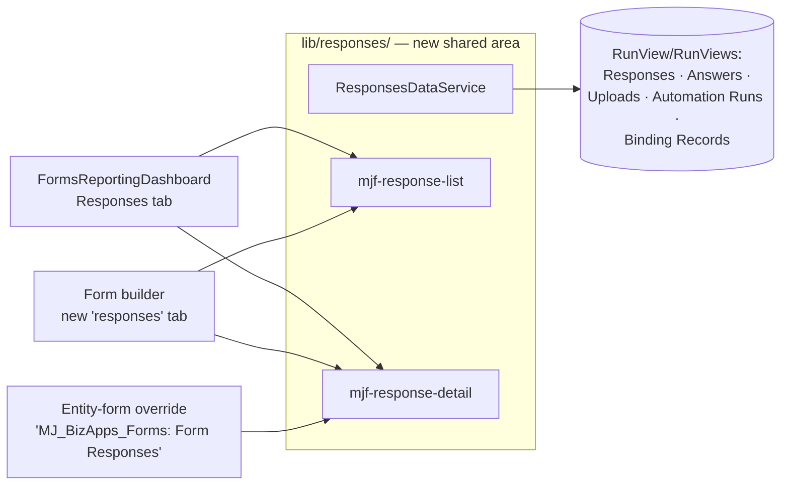

# Submission Viewing UI — Build Plan

*Authored 2026-08-18 from a code audit of `next` (clean @ 7a8c228). Companion to
[FORMS_BUILD_PLAN.md](FORMS_BUILD_PLAN.md) — tracked there as a Phase-2 item.*

> **Status: implemented 2026-08-18** on `feat/responses-ui` as S0 `286e2d7` · S1 `ec24662` ·
> S2 `fca68b7` · S3 `289cd74`. See the FORMS_BUILD_PLAN Progress Log entry for what each slice
> landed, how the decision gates resolved, and the one item still owed (the §6 human-in-the-loop
> pass). Deviations from this document are noted inline as **[as built]**.

## 0. Context: what the audit found

**The Forms app already has a first-class submission-viewing UI.** The "Responses &
Analytics" nav item (Forms Application `DefaultNavItems` → Dashboard record
`EB23CCFD-AAF5-48BE-8B81-33A3944AD898` → `@RegisterClass(BaseDashboard, 'FormsReportingDashboard')`)
carries a **Responses tab**: a searchable/filterable response list
(`packages/Angular/src/lib/dashboard/components/response-list.component.ts`) and a
per-submission detail view labelled by question prompt
(`.../response-detail.component.ts`), plus CSV/Excel export. Data is live
`RunView`/`RunViews` over Form Responses + Form Response Answers, correctly scoped by
**FormID** (not FormVersionID — responses pin the version live at submission; this was a
fixed bug, keep it fixed).

**Three confirmed gaps** (the dashboard §8.1 build predates the v0.8.x schema work):

1. **No Responses surface inside the builder.** `BuilderTab = 'build' | 'design' | 'distribute' | 'onsubmit'` (`form-builder.component.ts:44`) — you must leave the form
   you're editing and find the app-level dashboard to see its submissions.
2. **The detail view is stale against the schema.** The answers queries
   (`forms-reporting.service.ts:173–174, 221, 257–258`) never select `Score` /
   `ScoreRationale`, so the `Forms: Analyze Written Responses` AI output is invisible.
   File answers render as a literal `File: <guid>` (`reporting-aggregations.ts:397–398`)
   — `FormUpload` holds `FileName`/`ContentType`/`SizeBytes` and is never joined.
   `FormAutomationRun` (what the submission triggered) and `FormEntityBindingRecord`
   (what business record it created/merged) are shown nowhere.
3. **Opening a Form Response record directly shows the stock generated property grid.**
   There is no entity-form override for `MJ_BizApps_Forms: Form Responses` the way the
   builder overrides `MJ_BizApps_Forms: Forms` — so from any generic list, search
   result, or deep link, the bespoke UI is unreachable.

**Non-goals:** no schema changes; no server/resolver work; no changes to the respondent
widget; no new Dashboard records (avoids the `.mj-sync.json` `DriverClass` pull-filter
gap entirely — see §5 footnote).

## 1. Architecture: one rich detail view, three mounts

The three features share one core: a response list + an enriched response detail. Build
them once in a shared area and mount them three ways.

- **`lib/responses/`** (new): the moved list/detail components, a `ResponsesDataService`
  (the response-reading methods extracted from `FormsReportingService`), and the
  detail-view models. Barrel side-effect-imported from `public-api.ts` like the other
  `lib/*` areas so the S3 `@RegisterClass` fires at bootstrap.
- **Dashboard** keeps its aggregation/chart/export services in `lib/dashboard/` and
  consumes `lib/responses/` for the Responses tab — it gets the enriched detail for free.
- **Builder** gains a fifth tab mounting the same list/detail pre-scoped to the loaded
  form.
- **Override** subclasses `BaseFormComponent`,
  `@RegisterClass(BaseFormComponent, 'MJ_BizApps_Forms: Form Responses', 10)` — same
  idiom and priority as the builder's Forms override — rendering the detail view for the
  opened record. Pure code registration; zero metadata changes.

**[as built]** The existing component selectors were kept (`mj-forms-response-list` /
`mj-forms-response-detail`); the `mjf-` names above were this document's shorthand, and
renaming them would have made S0 a behaviour-touching change for no gain. A third shared
area, `lib/shared/`, was added alongside `lib/responses/` for what the builder needs too
(the `FORMS_ENTITY` table, answer-value primitives, the RunView date coercion).

## 2. Slices

Each slice is independently shippable, lands as its own PR → `next`, and follows
refactor-separate-from-behavior.

### S0 — Extract the shared responses area (refactor, no behavior change) · size S

- Create `lib/shared/entity-names.ts`: move `FORMS_ENTITY` from
  `lib/builder/entity-names.ts` (mechanical import updates within the package), **add
  the missing entries** — `FormUpload: 'MJ_BizApps_Forms: Form Uploads'`,
  `FormAutomationRun: 'MJ_BizApps_Forms: Form Automation Runs'`,
  `FormEntityBindingRecord: 'MJ_BizApps_Forms: Form Entity Binding Records'` — and
  delete the duplicate local `ENTITY` const in `forms-reporting.service.ts:35–40`
  (both files self-describe as the same "PHASE1_DECOMPOSITION entity-name table";
  the duplication is accidental, so per the design rules it goes).
- Create `lib/responses/`: move `response-list.component.ts`,
  `response-detail.component.ts`, the `ResponseListRow`/`ResponseDetail`/
  `ResponseAnswerView` models, and extract `loadReport`'s response paths +
  `loadResponseDetail` + `answersForFormFilter` into `ResponsesDataService`.
  `FormsReportingService` delegates to it. Keep the two hard-won invariants **with
  their comments**: schema-qualified `__mj_BizAppsForms.vwFormResponses` in IN-subquery
  filters (bare names resolve against `dbo` and throw), and FormID scoping.
- Conventions unchanged: standalone + OnPush, component-provided services, `signal()` in
  presentational children, `Fields` + `ResultType: 'simple'` for reads.
- **Acceptance:** all existing Angular specs pass unmodified except import paths;
  dashboard behaves identically; `npm run build` green.

**[as built]** A third duplicate surfaced during the move — `toDate` existed in
`reporting-aggregations.ts` *and* `home-aggregations.ts`. It went to
`lib/shared/runview-dates.ts` rather than being documented as intentional. The shared
spec fixtures live in `lib/shared/testing/`, excluded from the package build.

### S1 — Enrich the response detail (lands in the dashboard immediately) · size M

Extend `ResponsesDataService.loadResponseDetail(responseId, questions)` to batch one
`RunViews([...])` call:

| Query | Filter | Fields |
|---|---|---|
| Form Response Answers | `ResponseID='…'` | existing + **`Score`, `ScoreRationale`** |
| Form Uploads | `FileID IN (<answer FileIDs>)` (skip when none) | `FileID, FileName, ContentType, SizeBytes, Status` |
| Form Automation Runs | `FormResponseID='…'` | `FormAutomationID, Status, AttemptCount, StartedAt, CompletedAt, ErrorMessage, OutputSummary, ActionExecutionLogID, AIAgentRunID` (+ the base view's automation-name virtual field if present, else batch-load names) |
| Form Entity Binding Records | `FormResponseID='…'` | `BindingID, TargetEntityID, TargetRecordID, Outcome, WrittenFields` |

Detail view additions (all `--mj-*`/`--mjf-*` tokens, Font Awesome, mobile-friendly):

- **Per-answer:** score chip + expandable rationale on scored free-text answers; file
  answers show `FileName (SizeBytes)` with a `Revoked` badge when `Status='Revoked'`,
  linking per DG-A below. Match on the answer's `FileID` (unique in `FormUpload`), not
  `ResponseDraftID` — revoked/orphaned drafts must not surface.
- **"What this submission did" section:** automation runs as status-pill rows
  (`Pending/Running/Succeeded/Failed/Skipped` are semantic-colored states, distinct from
  the accent) with attempt count, duration, error message, and deep links to the
  `ActionExecutionLogID`/`AIAgentRunID` records; binding-ledger rows showing
  Outcome + target entity name (resolve `TargetEntityID` via `Metadata` — it is
  deliberately not an FK) + a deep link to the created/merged record. Section renders
  nothing (not an empty shell) when both sets are empty.
- **Navigation:** in the dashboard, deep links use the existing
  `OpenEntityRecord.emit({ EntityName, RecordPKey: CompositeKey.FromID(id) })`.
  Implementation checkpoint for S2/S3: verify what `BaseFormComponent` exposes for
  record-open navigation; if nothing equivalent, render the info without links there
  rather than inventing a routing hack.
- **Parity obligations:** extend `forms-reporting-mock.ts` with scores, an upload, runs,
  and binding rows (the `useMock` escape hatch must not drift); per DG-B, add
  `<question> — Score` columns for scored questions to
  `forms-reporting-export.service.ts`'s pivot.
- **Acceptance:** a live submission with a scored free-text answer, a file answer, ≥1
  automation run, and ≥1 binding record renders all of it; a minimal submission renders
  exactly as today; specs cover the new pure aggregation paths
  (`buildResponseDetail` growth stays in `reporting-aggregations.ts`-style pure
  functions) and the service's batched query shapes.

**[as built]** The navigation checkpoint resolved in the affirmative:
`BaseFormComponent` exposes `Navigate: EventEmitter<FormNavigationEvent>` with a
`{ Kind: 'record', EntityName, PrimaryKey }` variant, so all three mounts have links. The
detail component therefore emits a host-agnostic `ResponseRecordLink` and each mount maps
it to its own idiom. The binding ledger's `targetEntityName` resolves to the entity's
**canonical `Name`**, not its `DisplayName` — the value is what a deep link navigates by —
and is `null` when metadata cannot name the id, so the row renders labelled by the id with
no link rather than a broken one. Two round trips, not one: the uploads join needs the
answers' `FileID`s. The export pivot moved to a pure `dashboard/services/export-pivot.ts`
so the exported file's shape is unit-testable.

### S2 — Responses tab in the builder · size M

- Add `'responses'` to `BuilderTab` (`form-builder.component.ts:44`), a fifth
  `role="tab"` button in the `fb-tabs` nav (`form-builder.component.html:46ff`), and a
  tab panel mounting `<mjf-response-list>` / `<mjf-response-detail>` scoped to
  `tree.form.ID` — same pattern as `<mjf-automation-tab>` (`:82`).
- Lazy-load: fetch responses on first tab activation, not on builder open (the builder's
  hot path is editing); a refresh affordance re-queries.
- Empty states are content: never-published form → "Publish and distribute this form to
  start collecting responses" with a nudge toward the distribute tab; published but
  zero responses → count-zero state. (Responses are possible only via a distribution,
  but scoping stays by FormID.)
- **Acceptance:** open a form with live submissions → tab shows its responses and
  drill-down without leaving the builder; a fresh form shows the empty state; existing
  builder specs untouched; new specs for tab activation + scoping.

**[as built]** The tab panel is one `mjf-responses-tab` component owning load/refresh/
empty-state/drill-down, following the `mjf-automation-tab` pattern of being created on
activation — which is what makes the load lazy. Question labels come from the latest
**published** version, never the draft being edited. Tab activation is not unit-testable
here (Angular components are not instantiated in this suite); scoping is, via the exported
`responsesForFormFilter` / `uploadsForFileIdsFilter`.

### S3 — Entity-form override for Form Responses · size S

- `lib/responses/response-form.component.ts`:
  `@RegisterClass(BaseFormComponent, 'MJ_BizApps_Forms: Form Responses', 10)`, loading
  the record's detail via `ResponsesDataService` and rendering `<mjf-response-detail>`
  with a header (form name, status, submitted-at, respondent) — replacing the generated
  property grid everywhere a Form Response record opens.
- Registration fires via the `lib/responses/` barrel already imported in
  `public-api.ts` (S0). Note for reviewers: the generated
  `FormResponse` form component remains declared in `generated-forms.module.ts` and is
  simply outranked by priority — identical to how the builder outranks the generated
  Form component.
- Keep an escape hatch: a "Raw record" affordance (collapsed section or link) for the
  audit fields the detail view doesn't editorialize (`SourceMetadata`,
  `AnonymousSessionID`, timestamps) — admins debugging dedupe/session issues need them.
- **Acceptance:** opening a Form Response from any Explorer list/search shows the rich
  view; the raw fields remain reachable; a spec asserts the registration
  (class-registrations manifest pattern) so tree-shaking regressions fail loudly.

**[as built]** Answers are labelled from the version **the response pinned**
(`record.FormVersionID`), not the form's latest published one — the response was given
against that definition. A version with no snapshot renders with an explicit banner rather
than failing the page or silently showing zero answers. The registration spec is
**structural** (source-level, line-anchored), not runtime: Angular component classes cannot
be instantiated in this node-environment suite, as the package's own vitest config states.

## 3. Permissions verification (pre-S1 gate, ~30 min)

Dashboard reads run as the logged-in Explorer user. The v0.8.x/v0.10.x migrations
focused grants on the `Form Respondent` (deny-all-write RLS) and `Forms Automation Runner` roles; DB-level `SELECT` on the `vw*` views is granted to `cdp_UI`/`cdp_Developer`/
`cdp_Integration`, but **entity-level Read on the three satellite entities (Form
Uploads, Form Automation Runs, Form Entity Binding Records) for normal admin users must
be verified** before S1 renders them. If missing: add `EntityPermission` rows in
`metadata/entity-permissions/` **and** a `V…__Metadata_Sync.sql` migration (both, per
the migrations-are-the-only-thing-that-ships rule + `npm run seed:manifest` +
`npm run lint:distribution`). This is the only potential migration in the whole plan.

**[as built] Gate cleared; no migration needed.** All three entities already ship the
grants, in the migrations that create them — `Form Uploads` in
`V202608081200__v0.8.x__Form_Upload_Provenance.sql`, `Form Automation Runs` and `Form
Entity Binding Records` in `V202608072330__v0.8.x__Automation_And_Entity_Binding.sql`. Each
grants role UI `CanRead=1` and Developer/Integration full CRUD, byte-identical in shape to
the `Form Responses` grants in the baseline `B202606281200` — which is why the dashboard
already reads responses as an admin today. This plan therefore ships **no** migration.

## 4. Decision gates

- **DG-A — File download UX.** Safe default: deep-link to the `MJ: Files` record via
  `OpenEntityRecord`. Upgrade if cheap: check at S1 time whether MJ's file-storage
  client services expose a download-URL resolution usable from Explorer context; if
  yes, a direct download affordance. Never block S1 on this.
  **[resolved]** Kept at the safe default. MJ's file-storage client package is not a
  dependency of `forms-ng`, and taking one on to save a click was not worth it.
- **DG-B — Export gains score columns?** Default **yes**: one `<question> — Score`
  column per scored question in the CSV/Excel pivot; rationale text stays out of the
  export (width/noise) unless asked for.
  **[resolved]** Yes, as specified. Which questions are scored is discovered from the
  answer rows rather than declared, so a form with no AI scoring gets no extra columns.
- **DG-C — Where does the builder tab sit?** Default: fifth tab after `onsubmit`
  (`build | design | distribute | onsubmit | responses`) — collection follows
  configuration. Revisit only if usage says responses deserve first position.
  **[resolved]** Default kept.

## 5. Constraints ledger (carry into every slice)

- Entity names only from the (moved) `FORMS_ENTITY` const — never inline literals.
- `RunViews` (plural) batching; `ResultType: 'simple'` + explicit `Fields` for reads;
  check `.Success` — RunView doesn't throw. No `any`, no `.Get()`/`.Set()` weak typing.
- Schema-qualify `__mj_BizAppsForms.vw*` inside IN-subquery filters; scope by FormID.
- Standalone components, `@if`/`@for`, `inject()`, OnPush + `markForCheck()` via the
  existing `beginLoad()`/`endLoad()`/`fail()` triad; no Explorer-shell leakage into
  `lib/widget/` (untouched by this plan).
- All colors via design tokens; semantic status colors are not the accent.
- Every slice: build the package, run its Vitest suite (`.spec.ts` convention), keep
  the color-token CI gate at 0 violations.
- *Footnote:* if any future slice **does** add a Dashboard record, first widen
  `metadata/dashboards/.mj-sync.json`'s `"filter": "DriverClass='FormsReportingDashboard'"`
  (it already fails to round-trip `FormsHomeDashboard`).

## 6. Verification beyond unit tests

Unit tests can't prove registration wiring or live data flow (per
`.claude/rules/testing.md`). Close each slice with the human-in-the-loop check the
Phase-1 close-out already owes: against a real host login, exercise dashboard →
Responses tab (S1), builder → responses tab (S2), and a Form Response opened from
Explorer search (S3), on a submission produced by `npm run smoke:respondent` so scores,
uploads, automation runs, and binding records are all present.

**[as built] Partially done — the SQL half is verified; the browser half is still owed.**

What was verified, against the live `MJ_Forms_Dev` (localhost:1456) on 2026-08-18, read-only:

- **Every column the new reads select exists on the live views** — including the two
  denormalised virtual fields this plan was unsure about (`vwFormAutomationRuns.FormAutomation`,
  `vwFormEntityBindingRecords.Binding`), so the "else batch-load names" fallback in §2/S1 is
  not needed. This is the check `ngc` structurally cannot do: a mistyped column name is a
  runtime failure, not a type error.
- **The exact queries `responseDetailQueries` emits return the expected shapes** on response
  `DF11CE1C-…`: a file answer joining to `resume.pdf` (`application/pdf`, 32 bytes, Active),
  one `Succeeded` automation run named "Smoke: create Person", and one `Created` binding-ledger
  row with `WrittenFields = ["Email","FirstName","LastName","PhotoURL"]`.
- **`TargetEntityID` resolves**: the ledger's target maps to `MJ_BizApps_Common: People` in
  `__mj.Entity`, which is exactly what `Metadata.EntityByID(...).Name` returns client-side.
- **Live status coverage** exercises the pills: runs are `Succeeded` ×82 / `Failed` ×13;
  outcomes are `Created` ×39 / `Merged` ×12 / `Unchanged` ×29.
- **One real finding, now guarded by tests.** Every scored answer in the dev DB has
  `Score = 0.0000` (the analyzer scores junk text zero). A truthiness check anywhere on the
  score path would therefore hide *all* AI output. All three paths use explicit null checks
  and were confirmed correct; three regression tests now pin that.

What is **still owed**: the browser half — dashboard Responses tab, builder Responses tab, and
a Form Response opened from Explorer search, rendered against a real host login. It could not be
done here: `apps/` is untracked and absent from this worktree, and the main checkout's
`apps/MJExplorer/` holds only a `dist`. No amount of green SQL or unit tests substitutes for
seeing the three surfaces render.
